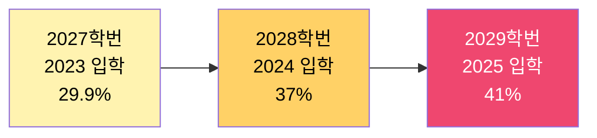

# 어퍼머티브 액션 폐지 2년 — 한인 학부모만 손해 본 진짜 통계 2026

2023년 6월 미국 연방대법원이 하버드 사건(Students for Fair Admissions v. Harvard)에서 인종 기반 어퍼머티브 액션(소수자 우대 입학 정책)을 위헌으로 판결한 지 거의 2년이 지났습니다. 한인을 비롯한 아시안 학부모들은 이 판결을 '드디어 공정한 입시가 시작될 것'이라며 환영했지만, 2026년 봄 기준 발표된 입학 통계는 그리 단순하지 않습니다. 학교마다 다르게 나타난 실제 결과를 살펴봅니다.

## 1. 하버드 — 29.9% → 37% → 41%

SFFA 판결 이전 마지막으로 어퍼머티브 액션이 적용된 **2027학번**(2023년 가을 입학)의 아시안계 비율은 29.9%였습니다. 판결 직후 입학한 **2028학번**(2024년 가을 입학)은 37%였고, **2029학번**(2025년 가을 입학)은 41%까지 늘었습니다. 하버드 매거진(Harvard Magazine) 공식 발표 기준으로 2년 만에 약 11%p 상승한 셈입니다.

이는 SFFA 측이 주장해 온 "하버드가 아시안 지원자를 인종적으로 차별해 왔다"는 명제가 통계상으로 어느 정도 입증되었음을 보여줍니다. 즉, 인종을 입학 사정에서 배제하자 아시안 학생의 합격률이 자연스럽게 올라간 것입니다.

## 2. 아이비리그 전체로 보면 결과는 들쭉날쭉

그러나 이 흐름이 모든 명문대에서 일관되게 나타난 것은 아닙니다. NBC 뉴스와 골드씨(Goldsea) 등 매체 보도에 따르면 2028학번 기준:

- **컬럼비아·브라운**: 아시안계 비율 **증가**
- **예일·프린스턴**: 아시안계 비율 **소폭 감소**
- **MIT**(STEM 중심·인종 비중 낮음): 큰 변화 없음

학교마다 결과가 다른 이유는 각 학교가 어퍼머티브 액션 대신 도입한 새로운 사정 방식(에세이의 비중 강화, 가족 배경·우편번호 기반 다양성 평가 등)이 다르기 때문입니다. 즉, '인종'을 직접 묻지 않더라도 다른 우회로를 통해 이전과 비슷한 인종 구성을 유지하려는 학교들이 존재한다는 분석입니다.

## 3. 한인 학부모만 손해 봤다? — 무엇이 진짜 손해인가

판결 직후 일부 한인 커뮤니티에서는 "이제 아시안이 유리해질 것"이라는 기대가 컸습니다. 하지만 2년이 지난 지금, 다음 세 가지 측면에서 한인 학부모가 오히려 손해 본 부분도 있다는 평가가 나옵니다.

### (1) 에세이·과외활동의 '인종적 신호' 강조

학교들이 인종을 직접 묻지 못하게 되자, 에세이에서 학생의 인종적·문화적 배경을 더 상세히 묘사하도록 유도하는 경향이 생겼습니다. 이는 "내가 한국계로서 어떤 차별을 겪었는가" 같은 서사를 강요받게 만들어, 한인 1.5·2세 학생에게 새로운 부담을 줍니다.

### (2) 'Asian = 학업 외 활동 부족'이라는 편견의 잔재

판결 이전 하버드 내부 자료에서 아시안 지원자의 '개인 평가(personal rating)' 점수가 다른 인종에 비해 일관되게 낮았다는 사실이 드러난 바 있습니다. 이 편견 자체가 한 번의 판결로 사라지지는 않으며, 사정관들의 무의식적 판단에 여전히 영향을 줄 수 있습니다.

### (3) 사립고·과외 시장의 비용 폭등

판결 이후 '에세이 컨설팅·연구 활동(research)·창업 경험' 등의 비중이 더욱 커지면서 입시 사교육 비용이 폭등했습니다. 보스턴·뉴저지·LA의 한인 입시 컨설팅 시장은 시간당 300~800달러 수준의 고가 서비스가 표준화되어, 중산층 한인 학부모의 부담이 오히려 커졌다는 지적이 있습니다.

## 4. 2026년 한인 학부모가 취해야 할 전략

- **에세이는 '한국계 정체성'을 도구화하지 말 것**: 사정관들이 흔히 본 패턴(이민 1세대 부모, 한식·언어 갈등 서사)은 오히려 감점 요소가 될 수 있습니다.
- **STEM 외 영역의 깊이 있는 활동**: 글쓰기·음악·사회봉사 등 비전형적 영역에서 5년 이상 일관성 있는 활동이 더 강력한 차별화 포인트입니다.
- **테스트옵셔널 → 테스트 제출 회귀 추세 주목**: 하버드, MIT, 다트머스, 예일 등이 SAT/ACT 제출을 다시 의무화했습니다. 표준화 시험 점수가 다시 중요해지고 있습니다.
- **주립대(UC·UMich·UVA) 재평가**: 비용 대비 가치, 학과 경쟁력 측면에서 한인 학부모의 합리적 대안으로 떠오르고 있습니다.

## 자주 묻는 질문 (FAQ)

**Q1. SFFA 판결로 입시에서 인종이 완전히 빠진 건가요?**
A. 학교가 인종을 입학 사정의 '독립 변수'로 사용할 수는 없지만, 지원자가 에세이에서 자신의 인종 경험을 자발적으로 언급하는 것은 여전히 허용됩니다. 즉, 인종 정보가 우회 경로로 입학에 영향을 줄 수 있습니다.

**Q2. 한인은 아시안 카테고리 안에서 어떻게 구분되나요?**
A. 대부분의 대학은 'Asian' 단일 카테고리로 집계합니다. 일부 학교(예: UC 계열)는 한국계·중국계·인도계 등을 세분화해 공개하지만, 아이비리그 대부분은 그렇지 않습니다. 그래서 '한인만'의 정확한 합격률 통계는 공개된 자료로 확인하기 어렵습니다.

**Q3. 자녀 입시에서 인종을 어떻게 다뤄야 하나요?**
A. 정답은 없습니다. 다만 '한국계라서 차별받았다'는 서사를 억지로 만들 필요는 없으며, 자신의 진짜 관심사·성장 경험을 진솔하게 풀어내는 것이 더 좋은 결과로 이어진다는 것이 대학 컨설턴트들의 공통된 조언입니다.

## 마무리

어퍼머티브 액션 폐지 2년의 통계는 한인 학부모에게 단순한 승리도, 분명한 패배도 아니었습니다. 하버드처럼 아시안 비율이 크게 늘어난 곳도 있지만, 새로운 사정 방식과 사교육 비용 부담이라는 또 다른 벽이 생겼습니다. 결국 중요한 것은 정책의 변화가 아니라, 내 자녀가 진짜로 좋아하고 깊이 파고든 분야가 무엇인지입니다. 통계는 참고일 뿐, 답은 아이의 진정성 안에 있습니다.

---

**출처(Sources):**
- [Harvard's Class of 2029 Reflects Shifts in Racial Makeup After Affirmative Action Ends - Harvard Magazine](https://www.harvardmagazine.com/university-news/harvard-admissions-class-2029-admissions-data-ethnicity)
- [Admissions after Affirmative Action - Harvard Magazine](https://www.harvardmagazine.com/2024/09/admissions-after-affirmative-action)
- [How SFFA Changed Asian American Enrollment in Leading Universities - Goldsea](https://goldsea.com/article_details/how-the-sffa-decision-changed-asian-american-enrollment-in-leading-universities)
- [Asian Americans see mixed results in enrollment after end of affirmative action - NBC News](https://www.nbcnews.com/news/asian-america/affirmative-action-enrollment-asian-americans-rcna170716)
- [Students for Fair Admissions v. Harvard - Wikipedia](https://en.wikipedia.org/wiki/Students_for_Fair_Admissions_v._Harvard)
- [Did Harvard Intentionally Discriminate? - The Harvard Crimson](https://www.thecrimson.com/article/2023/7/20/sffa-decision-asian-american-discrimination/)
