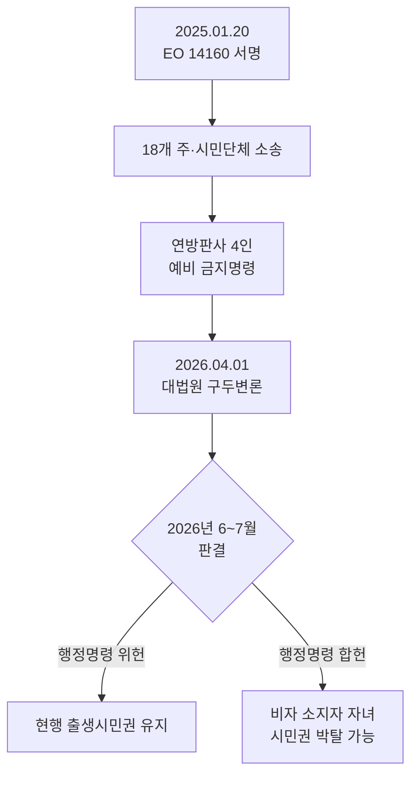

# 출생시민권 폐지 행정명령 — 대법원 6월 판결 임박

미국에서 태어나면 자동으로 시민이 된다는 원칙이 흔들리고 있습니다. 트럼프 대통령이 2025년 1월 20일 서명한 행정명령 14160호에 대한 연방대법원 구두 변론이 **2026년 4월 1일** 마무리됐고, **판결은 6월 말에서 7월 초**로 예상됩니다. F-1·H-1B·관광 비자로 미국에 체류 중인 한인 임산부에게 직접 영향이 가는 사안입니다.

## 1. EO 14160이 바꾸려는 것

행정명령 14160의 정식 명칭은 "Protecting the Meaning and Value of American Citizenship"입니다. 핵심 내용은 다음 두 경우에 태어난 아기에게 시민권을 부여하지 않겠다는 것입니다.

- **어머니가 미국에 불법 체류 중**이고, 아버지가 시민권자나 영주권자가 아닌 경우
- **어머니가 합법이지만 일시 체류**(F-1, H-1B, B-2 등) 중이고, 아버지가 시민권자나 영주권자가 아닌 경우

즉 F-1 유학생 부부, H-1B 부부, 관광 비자 출산(이른바 원정출산) 모두 대상입니다. 미국 이민협회(American Immigration Council) 추산에 따르면 매년 약 **15만 명**의 아기가 이 행정명령의 영향을 받을 수 있습니다.

## 2. 소송 구도와 대법원 사건 Trump v. Barbara

뉴저지주 등 22개 주 검찰총장, ACLU, Asian Law Caucus 등이 즉각 소송을 제기했고, 2025년 2월까지 연방 판사 4명이 행정명령 시행을 차단하는 예비 금지명령을 내렸습니다. 사건은 *Trump v. Barbara*라는 명칭으로 연방대법원에 올라갔으며, 트럼프 대통령은 4월 1일 구두 변론에 직접 참석해 화제가 됐습니다(현직 대통령으로는 사상 첫 사례).

SCOTUSblog는 구두 변론 후 분석에서 "대법원이 트럼프 행정부에 불리한 결론을 내릴 가능성이 높아 보인다"고 평가했지만, 최종 판결 전까지는 예단할 수 없는 상황입니다.

## 3. 한인 임산부에게 미치는 실질 영향

현재 시점(2026년 5월)에는 **출생시민권이 여전히 유지**되고 있습니다. 연방판사들의 금지명령으로 행정명령 시행이 막혀 있기 때문입니다. 따라서 지금 미국에서 태어나는 아기는 부모의 신분과 무관하게 시민권을 받습니다.

그러나 대법원이 행정명령을 합헌으로 인정할 경우 ▲F-1 학생 부부 자녀 ▲H-1B 부부 자녀 ▲단기 방문비자 출산 자녀의 시민권이 인정되지 않을 수 있습니다. 조지타운대 어린이가족센터 분석에 따르면 시민권을 받지 못한 신생아는 메디케이드, CHIP 같은 공공 의료 혜택에서 제외돼 신생아 의료 접근성에도 큰 타격이 예상됩니다.

> **전문가 상담 권장**: 출산 예정일이 6~7월 전후라면, 출생증명서 발급과 여권 신청 시점이 판결 결과에 따라 중요해질 수 있습니다. 이민 전문 변호사 또는 출산 예정 주의 영사관과 사전 상의를 권장합니다.

## 4. 출산 전후 체크리스트

판결을 기다리는 동안 비자 소지자 임산부가 점검할 사항입니다.

- **출생증명서 신속 발급**: 출산 직후 카운티 보건국(Vital Records)에 신청
- **사회보장번호(SSN) 신청**: 병원에서 출생신고와 동시에 신청하는 것이 가장 빠릅니다
- **미국 여권 신청**: 출생증명서 원본 수령 후 즉시 신청. 판결 변동에 따른 리스크 최소화
- **한국 출생신고**: 가까운 한국 영사관에서 출생신고 가능. 이중국적 관련 의무사항은 별도 확인 필요
- **부모 신분 서류 보관**: 출산 당시 본인의 합법 체류 상태를 증명할 수 있는 비자·I-94 사본 백업

## 자주 묻는 질문 (FAQ)

**Q1. 지금 미국에서 태어나는 아기는 시민권을 받나요?**
A. 받습니다. 연방판사들의 금지명령으로 행정명령 시행이 막혀 있기 때문에 현행 14수정헌법 해석이 그대로 적용됩니다.

**Q2. 영주권자 부모 사이에서 태어나면 영향이 있나요?**
A. 행정명령은 "부모 중 한 명이 시민권자 또는 영주권자"인 경우는 대상에서 제외됩니다. 부모 중 한 명이라도 영주권자라면 자녀는 시민권을 받습니다.

**Q3. 판결이 합헌으로 나오면 소급 적용되나요?**
A. 행정명령은 서명일 이후 30일이 지난 시점 이후 출생자에게 적용되는 형태로 설계됐습니다. 다만 대법원이 어떤 형태의 판결을 내릴지에 따라 적용 시점이 달라질 수 있습니다.

**Q4. H-1B 부부인데 곧 출산입니다. 미리 무엇을 해야 하나요?**
A. 출생증명서·SSN·미국 여권 신청을 최대한 빠르게 진행하는 것이 권장됩니다. 동시에 한국 영사관 출생신고도 병행해 두는 것이 안전합니다.

**Q5. 원정출산도 같은 적용을 받나요?**
A. 어머니가 B-1/B-2 단기 방문비자로 입국해 출산한 경우 행정명령상 '일시 체류'에 해당해 영향을 받게 됩니다. 이미 출생시민권을 받은 자녀는 판결 결과에 따라 별도 검토가 필요합니다.

## 마무리

대법원 판결까지 약 한 달여 남았습니다. 결과에 따라 미국 이민 정책의 근간이 바뀌는 만큼, 비자 소지 임산부와 가족은 출산 행정절차를 미리 정리해 두는 것이 중요합니다. 판결이 나오면 본 블로그에서 후속 분석을 올리겠습니다. 비슷한 상황에 계신 분들은 댓글로 경험을 공유해 주세요.

---

**출처(Sources):**
- [Trump v. Barbara — Congressional Research Service](https://www.congress.gov/crs-product/LSB11423)
- [Supreme Court Arguments Wrap in Landmark Challenge — ACLU](https://www.aclu.org/press-releases/supreme-court-arguments-wrap-in-landmark-challenge-to-trump-birthright-citizenship-executive-order)
- [Supreme Court appears likely to side against Trump on birthright citizenship — SCOTUSblog](https://www.scotusblog.com/2026/04/supreme-court-appears-likely-to-side-against-trump-on-birthright-citizenship/)
- [Breaking Down Trump's Attempt to End Birthright Citizenship — American Immigration Council](https://www.americanimmigrationcouncil.org/blog/breaking-down-trump-end-birthright-citizenship/)
- [The Supreme Court's Birthright Citizenship Decision Could Dramatically Impact Newborns' Access to Health Care — Georgetown CCF](https://ccf.georgetown.edu/2026/04/10/the-supreme-courts-birthright-citizenship-decision-could-dramatically-impact-newborns-access-to-health-care/)
