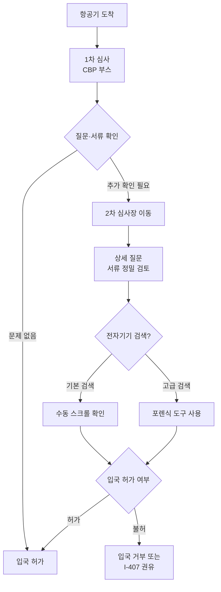

# 입국 심사 강화 2026 — 한국 다녀온 뒤 재입국 시 주의사항

여름 휴가철과 추석을 앞두고 한국 방문을 계획하는 분들이 늘어나는 시기입니다. 그런데 2025년 하반기부터 **미국 세관국경보호국(CBP)의 입국 심사가 전례 없이 강화**됐습니다. 유효한 비자가 있어도 2차 심사(secondary inspection)나 전자기기 검색을 당하는 사례가 늘고 있어, 한국 출국 전 반드시 준비해야 할 사항들이 있습니다.

## 1. 무엇이 어떻게 강화됐나

VisaVerge와 Fragomen의 2026년 분석을 종합하면, 변화의 핵심은 다음과 같습니다.

- **2025년 6월 이후**: 국무부, F·J·M 비자 신청자의 소셜미디어 전면 심사 시작
- **2026년 봄 학기 오리엔테이션**: 미국 대학들이 국제학생 대상으로 SEVIS·소셜미디어 사전 점검 안내 강화
- **CBP 2차 심사 증가**: 모든 외국인 입국자에 대한 보다 까다로운 질문, 서류 확인 빈도 증가
- **전자기기 검색**: FY 2025 기준 약 55,318명 검색(전체 2차 심사의 약 0.47%)

비자 소지자뿐 아니라 영주권자, 심지어 시민권자까지 2차 심사 대상이 될 수 있습니다.

## 2. 입국 심사 흐름도

2차 심사에 회부되면 평균 30분에서 수 시간이 소요됩니다. CBP 요원은 ▲여행 목적 ▲체류 기간 ▲미국 내 주거·직장·가족 관계 ▲재정 상태 등을 상세히 묻고, 정부 데이터베이스 조회, 지문·사진 채취까지 진행할 수 있습니다.

## 3. 반드시 알아야 할 5가지 주의사항

**① SEVIS 사전 점검 (F·J 비자 소지자)**

출국 30일 이내에 학교 DSO(Designated School Official)로부터 **I-20(F-1) 또는 DS-2019(J-1) 여행 서명**을 반드시 받아야 합니다. SEVIS 기록이 활성 상태(Active)인지도 사전 확인이 필수입니다. 2025년부터 미국 대학들이 학생들에게 SEVIS 상태와 SNS 공개 설정까지 사전 점검하라고 안내하고 있습니다.

**② 영주권자는 180일 규칙에 유의**

영주권자가 한 번에 180일(약 6개월)을 초과해 해외에 체류하면 **연속 거주(continuous residence) 요건이 초기화**됩니다. 또 1년을 초과하면 영주권 자체가 포기로 간주될 수 있습니다. 6개월 이상 체류가 불가피한 경우 사전에 Re-entry Permit(I-131) 신청을 권장합니다.

**③ I-407(영주권 포기 동의서) 절대 서명 금지**

CBP가 영주권자에게 Form I-407(Record of Abandonment of Lawful Permanent Resident Status) 서명을 권유하는 경우가 보고되고 있습니다. **서명할 법적 의무가 없으며**, 일단 서명하면 영주권 회복이 매우 어렵습니다. 반드시 변호사 상담 후 결정해야 합니다.

**④ 전자기기 검색 대비**

CBP는 영장 없이 휴대폰·노트북을 검색할 권한이 있습니다(국경 검색 예외). 기본 검색은 단순 스크롤 확인이지만, 고급 검색은 포렌식 도구로 데이터를 추출합니다.

- 민감한 업무·의료·법률 파일은 클라우드에 백업 후 기기에서 삭제
- 비즈니스 노트북은 가능한 한 별도 출장용 기기 사용
- 비밀번호·암호화 키 제공 요구는 신분에 따라 권리가 다름(시민권자·영주권자는 거부해도 입국 자체가 거부되지는 않지만, 기기가 압수될 수 있음)

**⑤ 소셜미디어와 입국 의도 일치 확인**

SNS 게시물이 비자 목적과 어긋나면 의심받을 수 있습니다. 예를 들어 B-2 관광비자 소지자가 인스타그램에 "미국에서 일자리 알아본다"는 게시물을 올렸다면 입국 거부 사유가 될 수 있습니다. F-1 학생도 학업과 무관한 풀타임 근로 정황이 있으면 문제가 될 수 있습니다.

> **전문가 상담 권장**: 본인 신분 또는 과거 입국 기록에 우려 사항이 있다면, 한국 출국 전 반드시 이민 전문 변호사와 상담하시기 바랍니다. 특히 과거 비자 거절 이력, 형사 기록, 장기 해외 체류 이력이 있는 경우 더욱 그렇습니다.

## 4. 신분별 권장 서류 체크리스트

**F-1·J-1 학생**
- 유효한 여권(귀국 후 최소 6개월 잔여)
- 유효한 F-1 또는 J-1 비자
- DSO 서명된 I-20 또는 DS-2019 (최근 1년 이내 서명)
- 재학·풀타임 등록 증빙(transcript, enrollment verification)
- 재정 증빙(I-20 상 financial information 일치 여부)

**H-1B 등 취업비자**
- 유효한 여권·비자
- 유효한 I-797 승인서 사본
- 최근 급여 명세서(pay stubs) 3매
- 고용주 재직 증명서

**영주권자**
- 유효한 영주권(I-551) 또는 만료된 경우 ADIT 스탬프
- 유효한 여권
- 미국 내 거주·근무·납세 증빙(세금 보고서, 임대계약, 공과금 등)
- 6개월 이상 체류 시 사유 설명 가능한 서류

## 자주 묻는 질문 (FAQ)

**Q1. 영주권자도 2차 심사를 받을 수 있나요?**
A. 네. 특히 180일 이상 해외 체류한 경우 거주 이탈 의심으로 2차 심사를 받을 수 있습니다.

**Q2. CBP가 휴대폰 비밀번호를 요구하면 거부할 수 있나요?**
A. 시민권자와 영주권자는 거부해도 입국 자체가 거부되지는 않습니다(다만 기기가 압수될 수 있음). 비자 소지 외국인의 경우 거부 시 입국 거부 가능성이 있습니다.

**Q3. SEVIS 등록 상태는 어디서 확인하나요?**
A. 본인의 DSO 또는 학교 국제학생 사무실(ISSC, OIS 등)을 통해 확인할 수 있습니다. 출국 30일 이내 점검이 권장됩니다.

**Q4. Global Entry가 있으면 2차 심사를 피할 수 있나요?**
A. Global Entry는 1차 심사를 키오스크로 신속 처리하지만, 시스템이 추가 확인이 필요하다고 판단하면 똑같이 2차 심사로 회부될 수 있습니다.

**Q5. CBP에서 입국이 거부되면 어떻게 되나요?**
A. expedited removal(즉시 추방) 대상이 되어 5년간 미국 입국이 금지될 수 있습니다. 따라서 1차에서 문제가 발생하면 즉시 영사관 연락 및 변호사 요청을 시도해야 합니다.

## 마무리

한국 방문은 즐거운 일이지만, 미국 재입국까지가 여행의 끝입니다. 출국 전 SEVIS·서류·SNS를 점검하고, 영주권자라면 체류 기간 관리에 특히 신경 써야 합니다. 본인의 최근 입국 심사 경험을 댓글로 공유해 주시면 다른 분들이 준비하는 데 큰 도움이 됩니다.

---

**출처(Sources):**
- [SEVIS Travel — ICE](https://www.ice.gov/sevis/travel)
- [Traveling as an International Student — Study in the States (DHS)](https://studyinthestates.dhs.gov/students/study/traveling-as-an-international-student)
- [United States: 2026 International Travel Planning for F-1 Students — Fragomen](https://www.fragomen.com/insights/united-states-2026-international-travel-planning-for-f-1-students.html)
- [Spring 2026 Orientation: Immigration, SEVIS, and Social Vetting — VisaVerge](https://www.visaverge.com/immigration/spring-2026-orientation-immigration-sevis-and-social-vetting/)
- [Border Search of Electronic Devices at Ports of Entry — U.S. CBP](https://www.cbp.gov/travel/cbp-search-authority/border-search-electronic-devices)
- [Inspection of Green Card Holders at U.S. Ports of Entry — Miller Mayer](https://millermayer.com/cbp-inspection-green-card-holders/)
- [Know Your Rights: What to Do if You Are Detained at a U.S. Port of Entry — Harter Secrest & Emery](https://hselaw.com/news-and-information/legalcurrents/know-your-rights-what-to-do-if-you-are-detained-at-a-u-s-port-of-entry-for-lawful-permanent-residents/)
