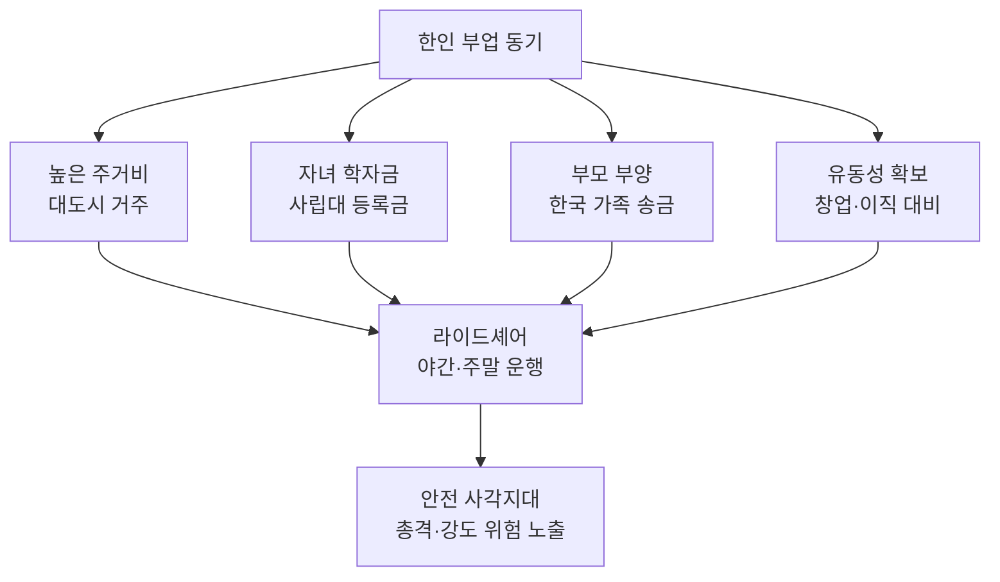

# 시카고 한인 우버 기사 사망 — 38세 가장의 비극과 한인 부업의 현실

2026년 5월 7일 저녁, 시카고 웨스트사이드에서 한인 우버 기사 재슨 조(Jassen Cho·38) 씨가 손님과 함께 총격으로 숨지는 안타까운 사건이 발생했습니다. 재슨 씨는 디폴대학교를 졸업한 금융 분석가로 본업이 따로 있었지만, 부업으로 우버를 운전하다가 변을 당했습니다. 한인 사회 전체가 깊은 슬픔에 잠긴 가운데, 이 사건은 미국 한인의 부업 현실을 다시 돌아보게 합니다.

## 1. 사건 개요 — 5월 7일 저녁, 가필드파크

시카고 경찰에 따르면 사건은 5월 7일 목요일 오후 8시 30분 직전 시카고 웨스트사이드 가필드파크 지역 호만 애비뉴(N. Homan Avenue) 200블록에서 발생했습니다. 재슨 조 씨는 자신의 흰색 혼다 시빅(Honda Civic)으로 18세 고등학생 데마리온 존슨(Damarion Johnson)을 태우고 운행 중이었습니다.

당시 회색 쉐보레 SUV가 옆으로 다가왔고, 뒷좌석에 타고 있던 인물이 갑자기 차량을 향해 총격을 가했습니다. 두 사람 모두 현장에서 사망했습니다. 시카고 경찰은 미시간주 번호판으로 보이는 가해 차량을 추적 중이며, 쿡 카운티 크라임 스토퍼스(Crime Stoppers)는 1만 달러의 현상금을 내걸었습니다.

## 2. 재슨 조는 누구인가 — '평범한 한인 1.5세 가장'

재슨 조 씨는 시카고 한인 밀집지역인 올버니 파크(Albany Park) 출신으로, 디폴대학교(DePaul University)를 졸업한 금융 분석가였습니다. 본업이 따로 있었음에도 추가 수입을 위해 우버 운행을 부업으로 하고 있었습니다. 가족과 친구들에 따르면 그는 사망 며칠 후 여자친구와 1주년 기념일을 앞두고 있었던 것으로 전해졌습니다.

가까운 지인들은 그를 "조용하고 성실했던 친구", "주변 사람을 챙기던 가장"으로 기억하고 있습니다. CBS 시카고와 ABC7의 추모 인터뷰에서도 본업과 부업을 병행하며 가족을 부양했던 평범한 한인 1.5세 가장의 모습이 그려졌습니다.

## 3. 한인 부업의 현실 — 왜 우버를 뛰는가

재슨 씨의 죽음은 미국 한인 사회의 '투잡 문화'를 다시 한번 수면 위로 끌어올렸습니다. 본업이 안정적인 사무직이라도 부업으로 라이드셰어(Uber·Lyft)나 도어대시(DoorDash) 같은 긱(gig) 노동을 병행하는 한인이 적지 않습니다.

특히 라이드셰어 운전은 우범 지역으로 호출되는 경우가 많고, 차량 내에서 낯선 승객과 단둘이 있어야 하기에 강도·총격에 노출되기 쉽습니다. 본업이 끝난 야간 시간대에 운행하는 한인들은 더 위험한 환경에 놓입니다.

## 4. 한인 라이드셰어 기사를 위한 안전 수칙

전문가들과 한인 커뮤니티가 권하는 기본적인 안전 수칙을 정리했습니다.

- **저녁 8시 이후 우범 지역 호출 거절**: 시카고 웨스트사이드, LA 사우스센트럴, 뉴욕 브롱크스 일부 지역 등은 야간 호출을 신중히 판단하셔야 합니다.
- **대시캠(Dashcam) 설치**: 앞·뒤 모두 녹화 가능한 듀얼 캠은 증거 확보뿐 아니라 범죄 억제 효과도 있습니다.
- **가족·지인에게 위치 공유**: 우버 앱의 'Share Trip Status' 기능 또는 구글 맵스 실시간 위치 공유를 활용하세요.
- **현금 소지 최소화**: 현금은 강도의 주요 표적입니다.
- **승객 평점 확인**: 4.5 미만의 신규 계정 승객은 더욱 주의하세요.

## 자주 묻는 질문 (FAQ)

**Q1. 우버 기사가 운행 중 사망하면 보상은 어떻게 되나요?**
A. 우버는 미국 내 운행 중인 기사에게 최대 100만 달러까지 책임 보험을 제공합니다. 다만 사망 보상금 등은 사건 경위와 주(州) 법에 따라 다르므로, 변호사 자문을 받으시는 것이 좋습니다.

**Q2. 한인이 운영하는 부업 안전 커뮤니티가 있나요?**
A. 시카고·뉴욕·LA 등 주요 도시 한인회와 한인 라이드셰어 운전자 단체가 SNS 그룹을 운영하고 있습니다. 한인회 공식 사이트나 한인 페이스북 그룹에서 검색해 보시면 됩니다.

**Q3. 부업 수입은 세금 신고를 어떻게 해야 하나요?**
A. 우버·리프트 등은 1099-K 또는 1099-NEC 양식으로 IRS에 신고됩니다. 본업 W-2와 합산해 신고해야 하며, 차량 마일리지·유류비·보험료 등은 비용으로 공제 가능합니다.

## 마무리

재슨 조 씨의 죽음은 한 가정의 비극이자, 미국 한인 1.5·2세 가장이 짊어진 경제적 압박의 한 단면을 드러내는 사건입니다. 부업이 생존 수단이 된 사회에서 안전은 더 이상 개인이 알아서 챙겨야 할 문제가 아닙니다. 시카고 한인 사회의 추모와 함께, 라이드셰어 기사들의 안전 대책이 정책 차원에서 마련되기를 바랍니다. 고인의 명복을 빕니다.

---

**출처(Sources):**
- [Uber driver, high school basketball player killed in West Side shooting - Chicago Sun-Times](https://chicago.suntimes.com/crime/2026/05/08/high-school-senior-and-man-38-gunned-down-in-garfield-park-neighborhood)
- [Chicago shooting: Police talking to person of interest - ABC7 Chicago](https://abc7chicago.com/post/chicago-shooting-talking-person-interest-killings-18-year-old-damarion-johnson-uber-driver-jassen-cho/19101267/)
- [Longtime friend remembers Jassen Cho - CBS Chicago](https://www.cbsnews.com/chicago/news/longtime-friend-remembers-jassen-cho/)
- [High School Student, Uber Driver Killed In Garfield Park Shooting - Block Club Chicago](https://blockclubchicago.org/2026/05/10/teen-uber-driver-killed-in-garfield-park-shooting-as-tributes-pour-in/)
- [$10,000 reward offered in murder - CWB Chicago](https://cwbchicago.com/2026/05/10000-reward-offered-in-murder-of-uber-driver-passenger-in-east-garfield-park.html)
