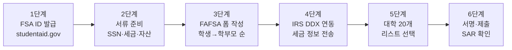

# FAFSA 한국어 가이드 2026 — 한인 학부모 단계별 신청법

자녀를 미국 대학에 보내는 한인 학부모에게 가장 큰 부담은 학비입니다. 그 부담을 덜어주는 것이 바로 연방 학자금 지원 신청서(FAFSA: Free Application for Federal Student Aid)입니다. 2026-2027 학년도 FAFSA는 한국어를 포함한 11개 언어 가이드를 제공하며, 신청 양식도 더 짧고 간소화되었습니다. 한인 학부모가 꼭 알아야 할 주요 변경사항과 단계별 신청법을 정리했습니다.

## 1. 2026-2027 FAFSA 주요 변경사항

2026-2027 학년도 FAFSA는 지난해 대비 여러 가지 핵심 개선이 있었습니다.

| 항목 | 변경 내용 |
|------|----------|
| 지원 학교 수 | 기존 10개 → **최대 20개**로 확대 |
| 언어 지원 | 한국어 포함 **11개 언어** 가이드 제공 |
| 양식 길이 | 더 짧고 간소화됨 |
| 본인 확인 | SSN 보유자는 **즉시 자동 확인** |
| IRS 자료 | DDX 도구로 IRS 세금 정보 직접 전송 의무화 |
| 가족 자영업 | 직원 100명 이하 가족 사업체 순자산 SAI 계산 **제외** |
| 마감일 | 2027년 6월 30일까지 제출 |

특히 한국어 가이드는 영문 신청서와 완전히 동일한 번역본이 아니라, 영문 신청서를 보조하는 **참고용 정적 가이드(static companion guide)** 입니다. 실제 신청은 영문 또는 스페인어 폼으로 진행해야 하지만, 한국어 가이드를 옆에 두고 항목별 의미를 확인할 수 있습니다.

## 2. FAFSA 신청 전 준비물 체크리스트

신청 전에 다음 서류와 정보를 준비해 두시면 시간을 크게 절약할 수 있습니다.

- 학생과 학부모(또는 'Contributor')의 **소셜 시큐리티 넘버(SSN)**
- **FSA ID** (학생·학부모 각각 별도 필요 — studentaid.gov에서 사전 발급)
- 학생과 학부모의 **연방 세금 신고서(1040)** — 2년 전 자료 사용 (2026-2027 신청은 2024년 세금 자료)
- 학생과 학부모의 **은행 잔고·투자 자산 정보**
- 자녀가 지원할 **대학 리스트** (최대 20개)
- 미국 영주권자라면 **A-Number(영주권 카드 뒷면 번호)**

## 3. 단계별 신청 절차

### 1단계. FSA ID 발급

학생과 학부모(Contributor)는 각자 본인 명의의 FSA ID를 studentaid.gov에서 사전 발급받아야 합니다. SSN 보유자는 즉시 자동 확인되지만, 영주권자의 경우 사회보장국(SSA) 데이터 매칭에 1~3일 정도 걸릴 수 있습니다.

### 2단계. 학생이 먼저 신청서 시작

FAFSA는 학생이 먼저 로그인해 신청서를 시작하고, 학부모(들)에게 자신의 부분을 작성하도록 초대(invite)하는 구조입니다. 학부모는 이메일로 받은 링크를 통해 본인 FSA ID로 로그인하여 학부모 섹션을 작성합니다.

### 3단계. IRS DDX(Direct Data Exchange) 동의

2026-2027 신청부터는 모든 신청자가 **DDX(Direct Data Exchange)** 도구를 통해 IRS 세금 정보를 FAFSA로 직접 전송해야 합니다. 수동 입력은 더 이상 허용되지 않습니다. 동의(Consent)를 거부하면 신청 자체가 불가합니다.

### 4단계. 대학 리스트와 서명

자녀가 지원할 대학을 최대 20개까지 선택할 수 있습니다. 모든 contributor가 전자 서명(Sign)하면 제출이 완료되며, 며칠 내 SAR(Student Aid Report)을 통해 SAI(Student Aid Index) 결과를 확인할 수 있습니다.

## 4. 한인 학부모가 자주 놓치는 부분

- **한국 내 자산도 신고 대상**: 한국에 보유한 부동산·예금·증권도 신고해야 합니다. 단, 본인 주거용 주택은 제외됩니다.
- **부모 이혼·재혼 가정**: 학생과 더 많은 시간을 함께한 부모(custodial parent)의 정보만 입력합니다. 새 배우자(stepparent)의 소득도 합산됩니다.
- **시민권자 자녀 + 비시민권 학부모**: 학부모가 SSN이 없어도 신청 가능합니다. 학부모는 ITIN을 사용해 별도 절차로 등록합니다.
- **마감일은 6월 30일이지만 빠를수록 유리**: 연방 마감은 2027년 6월 30일이지만, 각 대학·주(state) 마감은 훨씬 빠르므로(보통 1~3월) 가능한 한 일찍 제출해야 학교 재정지원 풀이 남아 있습니다.

## 자주 묻는 질문 (FAQ)

**Q1. 영주권자 자녀도 FAFSA 신청 가능한가요?**
A. 네. 미국 시민권자뿐 아니라 영주권자(LPR), 망명자, 난민 등 '적격 비시민(eligible noncitizen)'도 FAFSA 신청과 연방 학자금 수혜가 가능합니다. 학부모의 영주권 여부는 자녀의 자격과 무관합니다.

**Q2. F-1 학생 비자 자녀는 FAFSA를 신청할 수 있나요?**
A. 신청할 수 없습니다. F-1, J-1 등 학생 비자 보유자는 연방 학자금 지원 대상이 아닙니다. 다만 일부 사립대학은 자체 재정지원을 위해 CSS Profile 또는 학교 자체 양식을 요구할 수 있습니다.

**Q3. 한국어 FAFSA 가이드는 어디서 다운로드하나요?**
A. studentaid.gov 또는 fsapartners.ed.gov에서 'FAFSA Guide Korean'으로 검색하시면 PDF 가이드를 다운로드할 수 있습니다. 실제 신청은 영문/스페인어 폼으로 진행하면서 한국어 가이드를 참고용으로 사용하시면 됩니다.

## 마무리

FAFSA는 한 번 신청해 두면 매년 갱신만 하면 되는 시스템이고, 신청하지 않으면 받을 수 있는 지원금도 받지 못합니다. 자녀가 사립대를 가든 주립대를 가든, 심지어 커뮤니티 칼리지를 가든 일단 FAFSA부터 제출하는 것이 원칙입니다. 한국어 가이드가 정식 지원되는 2026-2027 학년도, 더 이상 언어 장벽을 핑계 삼지 마시고 자녀의 학자금 길을 미리 열어 두시길 권합니다.

---

**출처(Sources):**
- [Application and Verification Guide | 2026-2027 Federal Student Aid Handbook](https://fsapartners.ed.gov/knowledge-center/fsa-handbook/2026-2027/application-and-verification-guide)
- [2026-2027 Federal Student Aid Handbook - Knowledge Center](https://fsapartners.ed.gov/knowledge-center/library/dear-colleague-letters/2026-04-02/2026-2027-federal-student-aid-handbook-application-and-verification-guide-now-available)
- [Federal Student Aid - studentaid.gov](https://studentaid.gov/announcements-events/fafsa-support)
- [FAFSA Updates - Financial Aid Toolkit](https://financialaidtoolkit.ed.gov/tk/learn/fafsa/updates.jsp)
- [FAFSA for 2026-2027 Now Open - Vaughn College](https://www.vaughn.edu/blog/fafsa-for-2026-2027-now-open-important-updates/)
- [Free Application for Federal Student Aid (FAFSA) - USAGov](https://www.usa.gov/fafsa)
