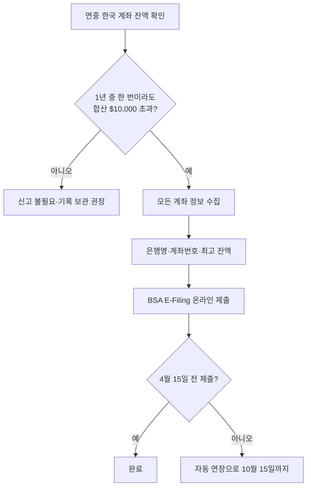

# FBAR 4월 15일 마감 — 한국 계좌 1만달러 이상 보고 의무 2026

한국에 둔 적금, 부모님께 보내드린 생활비 통장, 전세금 명목의 예치금 — 합계가 1년 중 단 하루라도 1만 달러를 넘었다면 FBAR 신고 대상입니다. 많은 한인 1세대가 "내 돈도 아닌데", "한국 세금 다 냈는데"라며 놓치지만, 미신고 시 페널티는 계좌당 최대 1만 달러를 넘을 수 있습니다. 2026년 기준 의무·예외·실수 방지 포인트를 정리합니다.

## 1. FBAR란 무엇이고 누가 내야 하나

FBAR(Report of Foreign Bank and Financial Accounts)는 IRS가 아닌 **FinCEN(재무부 금융범죄단속국)**에 제출하는 보고서로, 양식 번호는 **FinCEN Form 114**입니다. 다음 조건을 모두 만족하는 US Person이 대상입니다.

- 미국 시민권자, 영주권자, 또는 미국 세법상 거주자
- 해외 금융 계좌에 대해 **금융 이해관계(financial interest)** 또는 **서명 권한(signature authority)** 보유
- 본인 명의·공동 명의·서명 권한 보유 계좌들의 **연중 최고 잔액 합산이 어느 시점에라도 $10,000 초과**

여기서 핵심은 "합산"과 "최고 잔액"입니다. 계좌 A에 $6,000, 계좌 B에 $5,000이 있다면 합계 $11,000으로 신고 대상이 됩니다. 또한 잠시 부동산 매도 대금이 들어왔다가 빠져나간 경우라도, 그 순간 잔액이 1만 달러를 넘었다면 신고해야 합니다.

## 2. 2026년 마감일과 신고 방법

| 항목 | 일자/내용 |
|---|---|
| 2025년 회계연도 신고 마감 | **2026년 4월 15일** |
| 자동 연장 마감 | **2026년 10월 15일** (별도 신청 불필요) |
| 신고 양식 | FinCEN Form 114 |
| 신고 방법 | BSA E-Filing System (온라인 전자제출만 가능) |
| 비용 | 무료 |

FBAR는 세금 신고서(1040)와 **별개**입니다. CPA가 1040은 IRS에, FBAR는 FinCEN에 별도 제출합니다.

## 3. 한국 계좌에서 자주 발생하는 이슈

**1) 부모님 명의 계좌에 서명 권한이 있을 때**
부모님 통장이라도 본인이 인터넷뱅킹 OTP를 가지고 출금 가능하면 "서명 권한"으로 간주됩니다. 본인 소유가 아니어도 보고 대상이 될 수 있어, 한미 세법 차이로 자주 누락됩니다.

**2) 청약저축, 적금, ISA 계좌**
일반 예금뿐 아니라 적금, 청약저축, ISA(개인종합자산관리계좌), 펀드 계좌, 증권 계좌 모두 포함됩니다.

**3) 환율 계산**
연중 최고 잔액은 신고 연도 12월 31일 미국 재무부 공시 환율로 환산합니다. 2025년 보고분은 2025년 12월 31일 환율을 사용합니다.

**4) 공동 명의 계좌**
배우자 공동 명의는 한쪽이 보고하면 다른 쪽은 면제 가능합니다(특정 조건 충족 시). 부모-자녀 공동 명의는 각자 보고해야 합니다.

## 4. 미신고 페널티와 자발적 시정 프로그램

페널티는 고의성 여부에 따라 크게 달라집니다.

- **비고의(non-willful)**: 위반 건당 최대 **약 $16,000**(2024년 물가연동 후 기준, 매년 조정)
- **고의(willful)**: 위반 건당 최대 **$129,000 또는 계좌 잔액의 50% 중 큰 금액**
- 형사 처벌 가능성도 존재(고의의 경우)

다행히 IRS는 **Streamlined Filing Compliance Procedures(간이 시정 절차)**를 운영하고 있어, 비고의 미신고자가 자발적으로 신고하면 페널티 면제 또는 감면이 가능합니다. 다만 IRS 감사 통지 후에는 적용 불가합니다.

> FBAR 관련 페널티는 매우 무겁고 사례별 판단이 필요합니다. 본인이 신고 대상인지 불확실하거나 과거 누락이 있다면 **국제 세무 전문 변호사 또는 CPA 상담 권장.**

## 자주 묻는 질문 (FAQ)

**Q1. 한국에서 이미 이자소득세를 냈는데도 신고해야 하나요?**
A. 네. FBAR는 세금 납부가 아닌 "정보 신고"입니다. 한국에 세금을 냈는지와 무관합니다.

**Q2. 1만 달러를 넘지 않으면 신고 안 해도 되나요?**
A. FBAR 의무는 없지만, IRS Form 1040 Schedule B Part III에 해외 계좌 보유 여부를 표시해야 합니다.

**Q3. 한국 비트코인 거래소 계좌도 포함되나요?**
A. 현재 FinCEN은 가상자산 전용 계좌를 FBAR 대상에 포함시키는 규정 제정 절차 중입니다. 2026년 5월 기준 명확한 의무 규정은 아직이지만, 보수적으로 신고하는 것을 권장하는 전문가가 많습니다.

**Q4. 신고하지 않은 과거 5년치를 한 번에 정리할 수 있나요?**
A. Streamlined Procedures를 통해 보통 직전 6년 FBAR + 3년 세금 수정 신고로 정리합니다. 변호사 상담 필수.

**Q5. FBAR와 Form 8938(FATCA)은 다른가요?**
A. 다릅니다. Form 8938은 IRS에 제출하며 한도가 더 높고(독신 거주자 $50,000 등) 1040과 함께 제출합니다. 두 신고는 별개로 모두 의무일 수 있습니다.

## 마무리

FBAR는 세금이 늘어나는 신고가 아니라 정보 신고이므로 부담이 적지만, 누락 시 페널티가 가혹합니다. 한국에 작은 통장 하나라도 있다면 4월 15일 이전에 잔액을 확인하고, 합산 1만 달러 초과 여부를 점검하시기 바랍니다.

---

**출처(Sources):**
- [IRS: Report of Foreign Bank and Financial Accounts (FBAR)](https://www.irs.gov/businesses/small-businesses-self-employed/report-of-foreign-bank-and-financial-accounts-fbar)
- [FinCEN: Report Foreign Bank and Financial Accounts](https://www.fincen.gov/report-foreign-bank-and-financial-accounts)
- [BSA E-Filing System — File FBAR](https://bsaefiling.fincen.gov/file/fbar)
- [FinCEN Form 114 Line Item Filing Instructions (PDF)](https://www.fincen.gov/system/files/shared/FBAR%20Line%20Item%20Filing%20Instructions.pdf)
- [KLR: 2026 FBAR Deadline Reminder & Filing Tips](https://kahnlitwin.com/blogs/tax-blog/2026-fbar-deadline-reminder-filing-tips)
