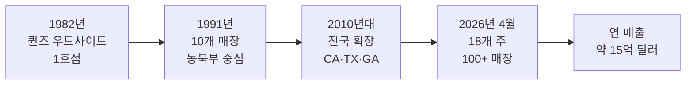

# H마트 100호점 돌파 — 18개 주 점령한 한인의 자존심 2026

미국에 사는 한인이라면 한 번쯤 들러본 곳, 바로 H마트입니다. 2026년 봄, H마트는 미국 18개 주에 100개가 넘는 매장을 운영하는 미국 최대 아시안 슈퍼마켓 체인으로 자리매김했습니다. 1982년 뉴욕 퀸즈 우드사이드의 작은 식료품점에서 시작한 한인 1세대 기업이 어떻게 연 매출 15억 달러 규모의 거대 체인으로 성장했는지 살펴보겠습니다.

## 1. 1982년 퀸즈 '한아름'에서 시작된 이야기

H마트의 출발점은 1982년 뉴욕 퀸즈 우드사이드의 작은 코너 식료품점이었습니다. 한국에서 이민 온 권일연(Il Yeon Kwon) 회장이 '한아름(韓아름)'이라는 이름으로 문을 열었고, 이 이름이 줄어 오늘날의 'H Mart'가 되었습니다. '한아름'은 두 팔로 가득 안을 만한 양이라는 뜻으로, 풍성한 먹거리를 한국 이민자에게 전하겠다는 창업자의 마음이 담긴 이름입니다.

1982년부터 1991년까지 H마트는 동북부를 중심으로 10개 매장을 추가했고, 이후 캘리포니아·텍사스·조지아·일리노이 등 한인 인구 밀집 지역으로 빠르게 확장했습니다. 현재 권 회장의 전 부인과 두 자녀가 공동 대표로 회사를 이끌고 있는 가족 기업이기도 합니다.

## 2. 2026년 현재 — 18개 주, 100개 매장

2026년 4월 기준 H마트는 미국 18개 주에 100개 이상의 매장을 운영하고 있습니다. 단일 한인 기업으로는 미국 내 가장 광범위한 오프라인 네트워크를 가진 회사이며, 연 매출은 약 15억 달러 규모로 추산됩니다.

특히 2026년 4월 23일 재개장한 뉴저지 체리힐(Cherry Hill, 1720 NJ-70) 매장은 H마트의 새로운 모델을 보여줍니다. 2층 규모로 확장된 매장에는 푸드홀(Food Hall)이 들어서 단순한 식료품점을 넘어 '한식 다이닝 허브'로 진화하고 있습니다.

## 3. 비(非)한인 고객도 잡았다 — 케이푸드 열풍의 거점

H마트의 성장은 한인만의 힘으로 이뤄진 것이 아닙니다. 2020년대 들어 케이팝(K-pop)·케이드라마와 함께 케이푸드(K-food)가 미국 주류 문화로 진입하면서, 비한인 고객이 H마트의 핵심 고객층으로 떠올랐습니다. 라면·김밥·떡볶이·삼겹살·소주가 미국인 식탁에 오르는 통로 역할을 한 곳이 바로 H마트입니다.

또한 매장 내 푸드코트는 한인 자영업자에게 입점 기회를 제공해 한인 외식업 생태계의 인큐베이터 역할도 하고 있습니다. 한 매장에 평균 6~10개의 한식·아시안 음식점이 입점하는 구조입니다.

## 4. 한인 1세대 성공 스토리, 그 너머의 의미

H마트의 100호점 돌파는 단순한 비즈니스 성과가 아닙니다. 1965년 이민법 개정 이후 미국에 정착한 한인 1세대가 만들어낸 가장 가시적인 성공 사례 중 하나이며, 한인 2·3세에게 '우리도 미국에서 거대 기업을 일굴 수 있다'는 메시지를 전합니다.

펜실베이니아 랜스데일 쇼핑센터 인수, 캘리포니아 더블린 이스트베이 진출 등 2026년에도 H마트의 확장은 멈추지 않고 있습니다. 다음 10년, 200호점을 향한 행보가 시작됐습니다.

## 자주 묻는 질문 (FAQ)

**Q1. H마트는 한국 회사인가요, 미국 회사인가요?**
A. 미국에서 설립된 미국 법인입니다. 1982년 뉴욕 퀸즈에서 한국 이민자 권일연 회장이 창업했고 본사는 뉴저지 리지필드(Ridgefield)에 있습니다.

**Q2. 'H Mart'의 H는 무슨 뜻인가요?**
A. 창업 당시 한국어 이름 '한아름(Han Ah Reum)'의 첫 글자 H에서 따왔습니다. '한아름'은 두 팔 가득 안을 만큼 풍성하다는 뜻입니다.

**Q3. 한국 식품 외에 다른 제품도 파나요?**
A. 네. 일본·중국·베트남·필리핀 등 범아시아 식품과 미국 일반 식료품, 화장품(K-뷰티), 생활용품까지 폭넓게 취급합니다.

## 마무리

H마트의 100호점 돌파는 미국 한인 사회의 경제적 성장사를 압축적으로 보여주는 지표입니다. 작은 코너 가게에서 시작해 18개 주를 잇는 거대 네트워크가 되기까지, 44년이라는 시간이 한인 이민자들의 손으로 쌓아 올린 결과물입니다. 다음에 H마트를 방문하실 때는 카트 너머의 그 긴 역사를 한 번 떠올려보시면 어떨까요.

---

**출처(Sources):**
- [H Mart - Wikipedia](https://en.wikipedia.org/wiki/H_Mart)
- [H Mart to Open Renovated Cherry Hill Location April 23 - PR Newswire](https://www.prnewswire.com/news-releases/h-mart-to-open-renovated-cherry-hill-location-april-23-302744048.html)
- [H Mart To Open Renovated Store In Cherry Hill, NJ - The Shelby Report](https://theshelbyreport.com/2026/04/16/h-mart-to-open-renovated-store-in-cherry-hill-nj/)
- [H Mart acquires Lansdale shopping center - PhillyVoice](https://www.phillyvoice.com/h-mart-lansdale-shopping-center-cherry-hill-store-reopening/)
- [H Mart Cherry Hill Reopens - 42 Freeway](https://42freeway.com/marltonpike/h-mart-cherry-hill-reopens-major-renovation-with-two-floors-food-hall-expanded-grocery/)
