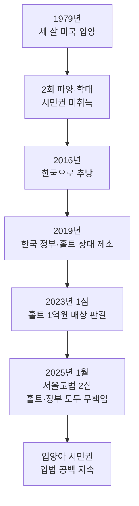

# 입양 한인 애덤 크랩서 패소 — 1만 9천 한인 입양아 무국적 문제

세 살에 미국으로 입양된 뒤 40년 만에 한국으로 추방된 애덤 크랩서(한국명 신성혁) 씨가 한국 정부와 홀트아동복지회를 상대로 제기한 손해배상 소송에서 결국 패소했습니다. 서울고등법원은 1심에서 일부 인정됐던 홀트의 배상 책임마저 뒤집으며 양측 모두의 책임을 인정하지 않았습니다. 이 판결의 의미와 함께, 여전히 미국에서 시민권 없이 살아가는 약 1만 9천 명의 한인 입양아 문제를 정리합니다.

## 1. 애덤 크랩서는 누구인가

애덤 크랩서 씨는 1979년 세 살의 나이에 한국에서 미국 가정으로 입양되었습니다. 첫 번째 양부모로부터 학대와 파양을 겪고 또 다른 가정에 재입양되었지만, 두 번째 가정 역시 아동학대로 기소되었습니다. 양부모 중 누구도 그의 시민권 취득 절차를 마무리해주지 않았고, 결국 그는 미국 시민권 없이 성장했습니다.

성인이 된 후 양부모 집에 보관돼 있던 한국에서 가져온 성경책을 되찾으려 무단 침입했다가 형사처벌을 받았고, 이 전과를 빌미로 미국 이민당국은 2016년 그를 한국으로 추방했습니다. 그는 한국말도 모르고 가족도 없는 나라로 추방돼 큰 사회적 충격을 일으켰습니다.

## 2. 1심과 2심의 엇갈린 판단

크랩서 씨는 2019년 한국 정부와 홀트아동복지회(Holt Children's Services)를 상대로 손해배상 소송을 제기했습니다.

2023년 5월 서울중앙지방법원은 홀트의 책임을 일부 인정해 1억 원(약 6만 8천 600달러)의 배상을 명령했습니다. 1심 재판부는 "홀트가 입양 부모에게 시민권 취득을 위한 추가 절차가 필요하다는 점을 알려야 할 의무가 있었다"고 판단했습니다.

그러나 2025년 1월 8일 서울고등법원은 이 판결을 뒤집고 한국 정부와 홀트아동복지회 모두의 책임을 인정하지 않았습니다. 2026년 현재까지 이 판결이 유지되며, 크랩서 씨와 비슷한 처지의 입양아들에게 큰 실망을 안겼습니다.

## 3. 1983년 이전 입양아의 사각지대

이 문제의 핵심은 2000년 제정된 미국의 **아동시민권법(Child Citizenship Act of 2000)** 에 있습니다. 이 법은 외국에서 입양된 아동에게 자동으로 미국 시민권을 부여하지만, 법 시행 당시 만 18세 이상이었던 입양아 — 즉 1983년 2월 27일 이전에 출생한 입양아 — 에게는 소급 적용되지 않습니다.

한국 보건복지부 통계에 따르면 미국으로 입양된 한인은 약 18,603명이며, 그 중 상당수가 시민권을 받지 못한 채 성인이 되었습니다. 미국 입양인 권익단체들은 한인 성인 입양아의 약 20%가 시민권 미보유 또는 추방 위험에 놓여 있다고 추산합니다.

이들은 사실상 **무국적자(stateless person)** 입니다. 미국 시민권도 없고, 한국 국적도 자동 회복되지 않은 채 추방 위험 속에 살아가고 있습니다.

## 4. 입양아시민권법(Adoptee Citizenship Act) — 미국 의회의 숙제

미국에서는 2009년부터 **입양아시민권법(Adoptee Citizenship Act)** 이 여러 차례 발의됐습니다. 이 법안은 미국 시민에 의해 입양된 모든 외국 출생 입양아에게 입양일·비자 종류에 상관없이 자동으로 시민권을 부여하자는 내용입니다.

그러나 이 법안은 매 회기마다 발의됐다 폐기되기를 반복하며 통과되지 못하고 있습니다. 2025~2026년에도 일부 한국계 의원과 입양인 단체들이 재발의를 추진 중이지만, 트럼프 행정부의 이민 정책 강화 기조 속에서 통과 전망은 여전히 불투명합니다.

## 자주 묻는 질문 (FAQ)

**Q1. 입양된 한인 중 시민권이 없는 사람이 정말 그렇게 많나요?**
A. 한국 정부 통계상 미국 입양 한인은 약 1만 8천~1만 9천 명이며, 권익단체들은 이 중 약 20%가 시민권 미보유 또는 불완전 상태로 추산합니다. 정확한 수치는 미국 정부도 파악하지 못하고 있습니다.

**Q2. 자신의 시민권 상태를 어떻게 확인할 수 있나요?**
A. 미국 시민권 증서(Certificate of Citizenship) 또는 미국 여권 보유 여부로 확인할 수 있습니다. 불확실한 경우 USCIS Form N-600을 통해 시민권 증서를 신청해 확인하시기 바랍니다. 한인 입양인 단체(예: Adoptees for Justice)도 무료 상담을 제공합니다.

**Q3. 추방 위험이 있는 입양아는 어떻게 도움을 받을 수 있나요?**
A. 즉시 이민 전문 변호사 자문을 받으셔야 합니다. 또한 Adoptees for Justice, AAJC(Asian Americans Advancing Justice) 등 권익단체에서 무료 또는 저비용 법률 지원 연결을 받을 수 있습니다.

## 마무리

애덤 크랩서 씨의 패소는 한 개인의 패배가 아니라, 입양 시스템의 책임 공백이 법적으로 묻히는 과정을 보여줍니다. 1만 9천 명의 한인 입양아 중 상당수가 여전히 무국적 상태로 살아가고 있다는 사실은, 한국 정부와 미국 의회 모두에게 풀어야 할 숙제입니다. 입양은 한 아이의 인생 전체를 책임지는 일이라는 점을, 이 판결이 다시 한번 일깨워주고 있습니다.

---

**출처(Sources):**
- [South Korean government and adoption agency exonerated in Adam Crapser adoptee deportation case - NBC News](https://www.nbcnews.com/news/asian-america/adam-crapser-korea-adoptee-deportation-rcna186803)
- [Court orders Holt to pay W100m to deported US adoptee - The Korea Herald](https://www.koreaherald.com/article/3127299)
- [Deportation of Korean adoptees from the United States - Wikipedia](https://en.wikipedia.org/wiki/Deportation_of_Korean_adoptees_from_the_United_States)
- [The Child Citizenship Act of 2000 and Its Effect on Foreign-Born Adoptions - American Bar Association](https://www.americanbar.org/groups/gpsolo/resources/magazine/2024-july-august/child-citizenship-act-2000-effect-foreign-born-adoptions/)
- [Lacking proof of citizenship, an adoptee fears deportation - NPR](https://www.npr.org/2025/04/19/g-s1-60166/trump-immigration-citizenship-deportation-adoptee-south-korea)
