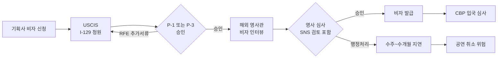

# K-pop 비자 거절 시대 — NCT WISH 공연 취소의 진짜 이유

K-pop 그룹이 미국 비자를 받지 못해 공연을 취소하는 사례가 잇따르고 있습니다. **NCT WISH는 2025년 5월 11일 SMTOWN LIVE LA 공연을 단 이틀 앞두고 출연을 취소**했습니다. SM엔터테인먼트는 "필요한 모든 절차를 완료했으나 예상치 못한 지연으로 비자를 받지 못했다"고 발표했습니다. 한 그룹의 단순한 사고가 아니라, 미국의 강화된 비자 심사가 K-pop 산업 전반에 미치는 영향을 보여주는 신호로 읽힙니다.

## 1. NCT WISH 케이스 정리

코리아헤럴드와 SM엔터테인먼트 공식 발표에 따르면 사건 경과는 다음과 같습니다.

- **2025.05.09(현지)**: SM엔터테인먼트, NCT WISH의 LA 공연 불참 공지
- **사유**: 미국 비자 발급 지연. 서류 제출과 인터뷰는 완료
- **2025.05.11**: SMTOWN LIVE 2025 in LA 진행 (NCT WISH 제외)
- **그룹 구성**: 한국 멤버 시온·재희, 일본 멤버 리쿠·유시·료·사쿠야

SM엔터테인먼트는 "지연의 정확한 사유는 알 수 없다"고 밝혔지만, 업계에서는 K-pop 그룹이 주로 사용하는 P-1(운동선수·연예 그룹) 또는 P-3(문화적으로 독특한 공연자) 비자의 심사 강화가 원인으로 지목되고 있습니다.

## 2. K-pop 비자 종류와 처리 단계

- **P-1B**: 국제적으로 인정받는 엔터테인먼트 그룹. K-pop 그룹 대부분이 사용
- **P-3**: 문화적으로 독특한 공연·교습. K-pop 정의가 모호해 활용 가능
- **O-1B**: 예술·엔터테인먼트 분야 특기자. 솔로 아티스트에 적합

각 단계마다 행정처리(administrative processing)가 걸리면 수주에서 수개월까지 지연될 수 있고, 공연 일정에 맞춰 발급되지 못하면 무대 취소가 불가피합니다.

## 3. 왜 갑자기 거절·지연이 늘었나

2025년 6월 이후 미국 국무부는 **F·J·M 비자 신청자의 온라인 활동(소셜미디어 포함)에 대한 전면 심사를 강화**했고, 같은 기조가 P·O 비자 심사에도 확산되고 있다는 분석이 나옵니다. Fragomen 등 이민법 펌의 2026년 분석에 따르면 모든 외국인의 미국 입국 심사가 광범위하게 강화되는 추세입니다.

K-pop 업계에 특히 영향을 미치는 요인은 다음과 같습니다.

- **소셜미디어 검토 강화**: 멤버들의 SNS 활동, 과거 발언, 팬덤과의 소통이 심사 대상에 포함
- **공연 일정 빠듯**: 컴백·월드투어 일정이 촘촘해 단 며칠 지연도 무대 취소로 이어짐
- **그룹 단위 심사**: 한 명이라도 행정처리에 걸리면 그룹 전체가 영향
- **영사 인터뷰 대기 증가**: 한국 내 미 대사관 인터뷰 슬롯이 빠듯해 재신청도 시간 소요

## 4. 팬덤과 기획사에 주는 시사점

이번 NCT WISH 사례에서 팬들은 의외로 SM엔터테인먼트를 적극 옹호하는 반응을 보였습니다. 코리아부(Koreaboo) 보도에 따르면 팬들은 "회사 잘못이 아니라 비자 시스템 문제"라며 환불·재공연 요구보다는 멤버들의 무사 입국을 응원하는 분위기였습니다.

기획사 입장에서 K-pop 공연 일정 관리는 더욱 신중해질 수밖에 없습니다. 비자 신청부터 발급까지 **최소 4~6개월의 여유**를 두는 것이 새로운 표준이 되고 있으며, 일부 기획사는 비상시 대체 공연자나 부분 공연 시나리오까지 사전 준비하고 있는 것으로 알려져 있습니다.

> **전문가 상담 권장**: 공연·이벤트 비자(P, O 계열) 신청은 이민 전문 변호사와 엔터테인먼트 전문 에이전트의 협업이 필수입니다. RFE(추가서류 요청)나 행정처리 발생 시 대응에 따라 결과가 크게 달라집니다.

## 자주 묻는 질문 (FAQ)

**Q1. NCT WISH는 그 이후 미국 공연을 한 적이 있나요?**
A. NCT WISH는 이후 SMTOWN LIVE 방콕 일정 등 아시아 투어를 진행했습니다. 미국 무대 복귀 일정은 공식 위버스 공지를 통해 확인 가능합니다.

**Q2. 다른 K-pop 그룹도 비슷한 일을 겪고 있나요?**
A. 공식 발표가 있었던 NCT WISH 외에도 업계에서는 비자 지연으로 인한 일정 조정 사례가 있는 것으로 알려져 있습니다. 다만 모든 사례가 공개되지는 않습니다.

**Q3. 팬으로서 공연 취소 시 환불은 어떻게 받나요?**
A. 주최 측 또는 티켓 판매 플랫폼(Ticketmaster, AXS 등)의 환불 정책에 따라 처리됩니다. 일반적으로 공연 자체가 취소되면 전액 환불됩니다.

**Q4. P-1 비자 발급에 보통 얼마나 걸리나요?**
A. USCIS 일반 처리는 약 2~4개월, Premium Processing(추가 비용)을 이용하면 15일 내 결정이 가능합니다. 다만 영사 인터뷰와 행정처리 기간은 별도입니다.

**Q5. SNS 활동이 비자 심사에 정말 영향을 주나요?**
A. 국무부는 2025년 6월부터 F·J·M 비자 신청자에게 소셜미디어 계정을 공개로 전환할 것을 요구하고 있으며, 다른 비자 카테고리로도 심사 범위가 확대되는 추세입니다.

## 마무리

K-pop의 글로벌 위상은 변함없이 높지만, 미국 무대에 오르기까지의 행정 장벽은 어느 때보다 높아졌습니다. 팬덤·기획사·아티스트 모두가 비자 시스템의 현실을 알고 일정에 여유를 두는 것이 중요한 시기입니다. 본인이 좋아하는 아티스트의 비자 이슈를 경험하셨다면 댓글로 공유해 주세요.

---

**출처(Sources):**
- [NCT Wish misses SM Town LA concert due to US visa delay — Korea Herald](https://www.koreaherald.com/article/10484651)
- [NCT WISH Unable to Participate in SMTOWN LA — Weverse 공식 공지](https://weverse.io/nctwish/notice/27103)
- [NCT WISH to Miss SMTOWN LA Concert Due to U.S. Visa Delays — DIPE](https://www.dipe.co.kr/2323421)
- [Fans Defend SM Entertainment After Last-Minute SMTOWN LA Cancellation — Koreaboo](https://www.koreaboo.com/news/fans-surprisingly-defend-sm-entertainment-after-last-minute-smtown-la-performance-cancellation/)
- [How Asian Pop Stars Can Get a U.S. Visa: P3 and O-1B Explained — McEntee Law](https://mcenteelaw.com/how-asian-pop-stars-can-get-a-us-visa-p3-and-o-1b-explained/)
- [United States: 2026 International Travel Planning for F-1 Students — Fragomen](https://www.fragomen.com/insights/united-states-2026-international-travel-planning-for-f-1-students.html)
