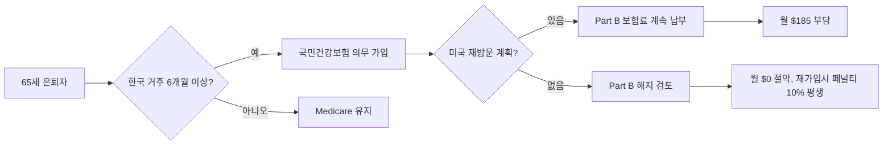

# 65세 한국 회귀 — F-5-13 비자와 Medicare 포기 실제 계산 2026

은퇴 후 한국으로 돌아가는 것을 진지하게 고민하는 1세대가 늘고 있습니다. 환율, 자녀 거주지, 의료비, 그리고 "마지막은 고향에서"라는 정서가 맞물린 결과입니다. 본 글에서는 한국 영주권 중 은퇴자에게 적합한 F-5-13 비자의 실제 요건과, Medicare를 포기·유지할 때의 비용 차이를 2026년 기준으로 따져봅니다.

## 1. F-5-13 비자란 무엇인가

F-5-13은 60세 이상 외국인(또는 외국 국적 동포)이 해외 연금을 일정 금액 이상 수령하는 경우 한국 영주권을 신청할 수 있는 트랙입니다. 핵심 요건은 다음 두 가지입니다.

- **신청자 연령**: 60세 이상
- **연금 소득**: 신청 직전 1년간 실제 수령한 해외 연금이 한국 1인당 GNI의 **2배 이상**

한국은행 발표에 따르면 2024년 한국 1인당 GNI는 **49,955,000원**입니다. 따라서 2025~2026년 신청자는 직전 1년간 약 **9,991만 원(약 7만 1천 달러, 환율 1,400원 기준)** 이상의 해외 연금을 받았음을 입증해야 합니다.

추가로 F-5-13 신청자는 소득 심사 면제, KIIP(사회통합프로그램) 면제, 무범죄증명서 면제 혜택이 있어 일반 영주권보다 절차가 간소합니다.

## 2. Medicare는 한국에서 사용할 수 없습니다

가장 중요한 사실: **Medicare는 미국 영토 밖에서는 적용되지 않습니다.** Medicare Part A(병원), Part B(외래), Part D(약제)는 한국 병원에서 사용할 수 없습니다. 응급 상황도 마찬가지입니다.

대신 한국에 6개월 이상 체류하면 **국민건강보험(NHIS) 의무 가입** 대상이 됩니다. F-5 영주권자는 지역가입자로 등록되며, 보험료는 소득·재산에 따라 산정됩니다.

## 3. 실제 비용 시뮬레이션

**케이스 A: 미국 거주 유지(65세, 메디케어 가입)**
- Medicare Part B 월 보험료: **$185.00** (2025년 표준 보험료 기준, 2026년은 연말 발표)
- Medicare Part D 평균 보험료: 월 약 $40
- 메디갭(Medigap Plan G) 평균: 월 약 $150
- 합계 월 **$375 / 연 $4,500** + 본인부담금

**케이스 B: 한국 영주(F-5-13, NHIS 가입)**
- 국민건강보험 지역가입자 보험료: 소득·재산 따라 월 약 ₩20만~50만 원
- 본인부담률: 외래 30~60%, 입원 20%
- 합계 연 약 ₩300~600만 원(약 $2,100~4,300)

단, Medicare Part B를 해지하면 향후 재가입 시 **지연 가입한 12개월마다 보험료가 10%씩 평생 가산**됩니다. 미국에 자녀가 있어 응급 시 돌아올 가능성이 있다면 Part B를 유지하는 것이 안전합니다. 본 계산은 일반 추정이며, 본인의 실제 보험료는 소득·재산·주(State)에 따라 다릅니다. **세무·이민 전문가 상담 권장.**

## 4. 결정 전 반드시 점검할 5가지

1. **사회보장 연금(SSA)**: 한국 은행 계좌로 수령 가능합니다. 단, 미국 시민권자가 아니라면 6개월 이상 해외 거주 시 일부 제한이 있을 수 있습니다.
2. **세금**: F-5 영주권자는 한국 세법상 거주자로 분류되어 전 세계 소득 신고 의무가 생깁니다. 한미 조세조약으로 이중과세는 조정됩니다.
3. **부동산**: 한국 의료보험료는 보유 부동산까지 합산해 산정됩니다. 강남 아파트 보유자는 보험료가 월 100만 원을 넘기도 합니다.
4. **자녀 방문 비자**: F-5 영주권자의 자녀는 별도 비자가 필요합니다(F-1 방문동거 등).
5. **귀국 시 영주권 유지**: 한국 영주권은 일반적으로 2년 이상 한국을 떠나면 취소될 수 있습니다.

## 자주 묻는 질문 (FAQ)

**Q1. 401(k) 인출도 연금 소득으로 인정되나요?**
A. 일반적으로 정기적·종신 수령 형태의 연금만 인정되며, 일시금 인출은 제외됩니다. 출입국·이민 전문 변호사 상담 권장.

**Q2. 미국 시민권자도 F-5-13을 받을 수 있나요?**
A. 네. 외국 국적 동포와 일반 외국인 모두 신청 가능합니다.

**Q3. NHIS는 가입 즉시 적용되나요?**
A. F-5 영주권자는 입국·등록 직후부터 가입됩니다. 단기 체류자(D-2 등)는 6개월 체류 후 의무 가입입니다.

**Q4. 한국에서 진료받고 Medicare에 청구할 수 있나요?**
A. 원칙적으로 불가능합니다. 응급 상황 중 미국-멕시코·캐나다 국경 근처 예외가 있지만, 한국은 해당되지 않습니다.

**Q5. 미국으로 돌아왔을 때 NHIS는 어떻게 되나요?**
A. 한국 출국 후 NHIS는 자동 정지되며, 재입국 시 다시 활성화됩니다.

## 마무리

F-5-13 비자는 연금이 충분한 은퇴자에게 매력적인 선택지지만, Medicare 포기는 되돌리기 어려운 결정입니다. 연금 수령액, 자녀 거주지, 향후 5~10년의 의료 수요를 종합적으로 따져본 뒤, 반드시 이민 변호사와 세무사 양쪽의 자문을 받으시기 바랍니다.

---

**출처(Sources):**
- [F-5-13 Permanent Resident Visa — IMMIKOREA](https://immikorea.com/en/f-5-13-visa-overseas-pension-beneficiaries/)
- [2025 Korea GNI Visa Requirement — Pureum Law](https://pureumlawoffice.com/2025-korea-gni/)
- [Medicare coverage for those who live permanently outside the United States](https://www.medicareinteractive.org/understanding-medicare/health-coverage-options/medicare-and-living-abroad/medicare-coverage-for-those-who-live-permanently-outside-the-united-states)
- [What Medicare Does Not Cover When You're Overseas](https://www.elderlawanswers.com/getting-medicare-while-traveling-or-living-overseas-8229)
- [Pensions at a Glance 2025: Korea (OECD)](https://www.oecd.org/en/publications/pensions-at-a-glance-2025-country-notes_8a53ef12-en/korea-republic-of_5cd52913-en.html)
