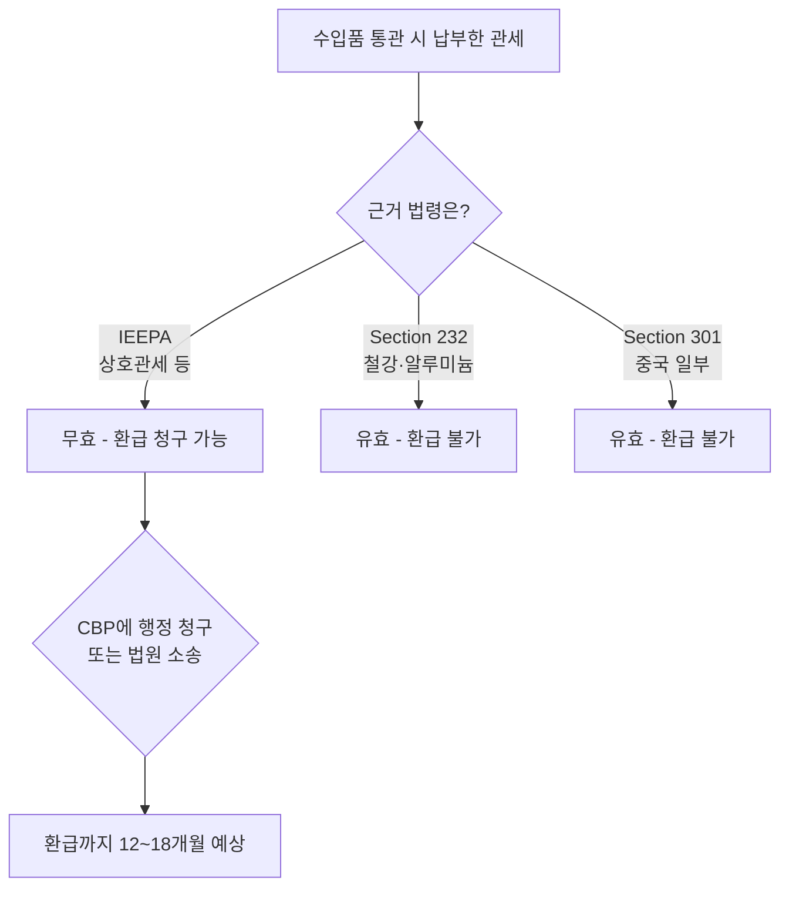

# 트럼프 관세 위법 판결 — 한인 가게 환급 가능한가 2026

지난 2026년 2월 20일, 미국 대법원은 트럼프 행정부가 IEEPA(국제비상경제권한법)에 근거해 부과한 관세가 대통령 권한을 벗어났다고 6-3으로 판결했습니다(Learning Resources, Inc. v. Trump). 한국에서 식료품·생활용품·화장품을 수입해 판매하는 한인 자영업자들에게는 환급 가능성이 열린 셈입니다. 본 글에서는 어떤 관세가 무효가 되었고, 누가 환급받을 수 있는지 정리합니다.

## 1. 무엇이 무효가 되었나

대법원은 IEEPA가 대통령에게 "관세를 부과할 권한"을 부여하지 않는다고 판단했습니다. 이에 따라 다음 관세들이 무효 처분되었습니다.

- **2025년 4월 부과 상호관세(reciprocal tariffs)**: 대부분 국가 수입품에 부과된 10% 이상의 관세 (한국 수입품 포함)
- **펜타닐 관련 관세**: 중국 10%, 캐나다 일부 35%, 멕시코 25%
- 기타 IEEPA 근거 추가 관세

행정부는 2026년 2월 7일자로 해당 관세를 이미 폐지했고, 대법원 판결은 "처음부터 위법이었다"는 점을 확인한 것입니다. Penn Wharton Budget Model 추산에 따르면 환급 대상 총액은 최대 **약 1,750억 달러**에 이를 수 있습니다.

## 2. 무엇이 그대로인가 — 중요한 구분

모든 관세가 사라진 것은 아닙니다. **다른 법적 근거(Section 232, Section 301, Section 201 등)로 부과된 관세는 그대로 유효**합니다.

- Section 232(국가안보): 철강·알루미늄 관세
- Section 301(불공정 무역): 중국 일부 품목 관세
- Section 201(세이프가드): 세탁기·태양광 등

따라서 한국산 김치, 라면, 화장품에 부과되었던 "상호관세 10%"는 무효이지만, 한국산 철강이나 자동차 부품에 적용되던 Section 232 관세는 영향을 받지 않습니다.

## 3. 한인 사업자 환급 절차 — 누가 어떻게

**대상자**: 2025년 4월 이후 한국·중국·캐나다·멕시코 등에서 물품을 수입하면서 IEEPA 근거 관세를 납부한 모든 수입자(Importer of Record). H Mart, Zion Market 같은 대형 수입자뿐 아니라 본인 명의로 통관한 소규모 한인 업체도 포함됩니다.

**준비 서류**:
- CBP Form 7501(Entry Summary) 사본
- 통관 인보이스, B/L
- 관세 납부 증빙(ACH 또는 수표)
- HTSUS 코드별 납부 금액 내역

**청구 경로**:
1. **행정 환급 청구(Protest)**: 통관일로부터 180일 이내라면 CBP에 직접 Protest 제출
2. **법원 소송**: 180일 경과분은 국제무역법원(CIT)에 소송 필요
3. **자동 환급?**: 대법원 판결이 자동 환급을 명령하지는 않았습니다. 본인이 청구해야 합니다.

TD Securities 등 업계 추정에 따르면 실제 환급까지 **12~18개월**이 소요될 전망이며, 행정부가 환급 절차를 지연시키거나 제한하려 할 가능성도 거론됩니다.

## 4. 한인 자영업자가 지금 해야 할 5가지

1. **수입 기록 보존**: 2025년 4월 이후 모든 통관 서류를 즉시 백업하시기 바랍니다.
2. **수입대행 업체 확인**: 본인이 직접 수입한 것이 아니라면, 환급 청구권은 통관 명의자(수입대행사)에게 있습니다. 계약서 검토 필수.
3. **관세사·통관 변호사 상담**: 환급 가능 금액이 수천 달러 이상이면 전문가 비용을 상회하는 회수 가능성이 큽니다.
4. **납품 단가 재협상**: 일부 한국 공급사는 관세 인상 시 가격을 올렸으나, 무효 후에도 단가를 내리지 않고 있는 경우가 있습니다.
5. **회계 처리**: 환급 예상액을 미수금으로 인식할지, 실제 수령 시 수익 인식할지는 CPA와 협의하시기 바랍니다.

> 본 글은 일반 정보 제공이며, 대법원 판결 이후 행정부 대응에 따라 환급 절차는 변동될 수 있습니다. 실제 환급 청구는 **관세 전문 변호사 또는 면허 관세사(Licensed Customs Broker) 상담 권장.**

## 자주 묻는 질문 (FAQ)

**Q1. 도매상에서 사 온 한국 식품도 환급 대상인가요?**
A. 환급권은 통관 시 관세를 납부한 "수입자"에게만 있습니다. 도매상에서 구매했다면 환급권자는 도매상입니다.

**Q2. 환급금에 세금이 붙나요?**
A. 일반적으로 사업 비용으로 처리했던 관세를 돌려받는 것이므로 사업 소득으로 인식됩니다. CPA 상담 필수.

**Q3. 행정부가 다시 다른 법령으로 같은 관세를 부과할 수 있나요?**
A. 가능합니다. Section 122(국제수지) 또는 Section 338(차별적 무역) 등 다른 권한을 활용하려는 움직임이 보도되고 있습니다.

**Q4. 한국 화장품 수입 관세는 환급 가능한가요?**
A. 2025년 4월 부과된 IEEPA 기반 10% 상호관세 부분은 환급 가능성이 있습니다. 기존 MFN 관세는 별도이며 영향 없습니다.

**Q5. 청구하지 않으면 자동으로 못 받게 되나요?**
A. 네. Protest 180일 기한 또는 CIT 소송 시효 내에 청구하지 않으면 권리가 소멸할 수 있습니다.

## 마무리

대법원 판결로 한인 자영업자의 환급 길은 열렸지만, "가만히 있으면 들어오는 돈"은 아닙니다. 통관 서류를 정리하고, 환급 가능 금액을 추정한 뒤, 관세 전문가의 도움으로 적시에 청구하시기 바랍니다. 시간은 통관일 기준 180일부터 흐르고 있습니다.

---

**출처(Sources):**
- [SCOTUSblog: Supreme Court strikes down tariffs](https://www.scotusblog.com/2026/02/supreme-court-strikes-down-tariffs/)
- [Norton Rose Fulbright: Potential refunds — US Supreme Court overturns IEEPA tariffs](https://www.nortonrosefulbright.com/en/knowledge/publications/20f2de87/potential-refunds-us-supreme-court-overturns-ieepa-tariffs)
- [Penn Wharton Budget Model: Supreme Court Tariff Ruling — IEEPA Revenue and Potential Refunds](https://budgetmodel.wharton.upenn.edu/issues/2026/2/20/supreme-court-tariff-ruling-ieepa-revenue-and-potential-refunds)
- [CNBC: Supreme Court Trump tariff decision impact — fight for billions in refunds begins](https://www.cnbc.com/2026/02/20/supreme-court-trump-tariff-decision-illegal-refunds.html)
- [NPR: After the Supreme Court's ruling on tariffs, companies line up for refunds](https://www.npr.org/2026/02/21/g-s1-110987/supreme-court-tariffs-refunds)
- [PwC: US Supreme Court invalidates IEEPA tariffs](https://www.pwc.com/us/en/services/tax/library/pwc-us-supreme-court-invalidates-ieepa-tariffs.html)
