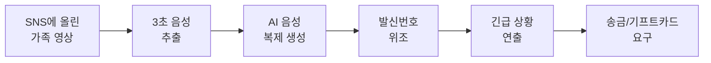

뉴저지 팰리세이즈팍에 사시는 김 할머니(72세)는 어제 오후 3시, 익숙한 번호로 한 통의 전화를 받으셨습니다. 수화기 너머에서 들려온 목소리는 분명 LA에 사는 둘째 딸 "수진"이었습니다.

"엄마… 나야. 사고 났어. 지금 경찰서야. 보석금 보내줘. 빨리…"

울먹이는 목소리, 숨소리, 말투까지 똑같았습니다. 김 할머니는 떨리는 손으로 은행에 달려가 $9,000을 송금하셨습니다. 30분 뒤, 진짜 딸이 전화를 걸어왔을 때 김 할머니는 그 자리에 주저앉으셨습니다. **딸은 사고를 당한 적이 없었습니다.** 김 할머니가 들었던 그 목소리는 AI가 SNS에 올라간 3초짜리 음성으로 만들어낸 가짜였습니다.

이런 일이 더 이상 영화 속 이야기가 아닙니다. 미국 연방거래위원회(FTC)에 따르면 2026년 1분기(Q1)에만 AI 음성 사기 신고가 **25만 건**을 넘었고, 피해자 1인당 평균 손실액은 **$12,500**에 달합니다. 특히 한인 시니어 가정이 표적이 되고 있어 각별한 주의가 필요합니다.

---

## 1. AI 보이스 클론이 어떻게 가능한가

예전에는 목소리를 복제하려면 몇 시간 분량의 녹음이 필요했습니다. 그러나 2026년 현재, AI 음성복제 기술은 단 **3초**의 음성 샘플만 있으면 누구의 목소리든 거의 완벽하게 흉내낼 수 있습니다.

문제는 그 3초짜리 샘플을 너무 쉽게 구할 수 있다는 점입니다. 손주가 올린 인스타그램 동영상, 자녀의 유튜브 영상, 카카오톡 음성메시지, 심지어 부재중 전화 음성사서함까지 — 모두 재료가 됩니다.

사기범들은 AI로 만든 목소리에 **발신번호 위조(spoofing)**까지 더해, 실제 가족의 번호가 화면에 뜨도록 만듭니다. 게다가 숨소리, 울음, 말 끊김까지 자연스럽게 연출하기 때문에 전화를 받은 부모님이 의심하기란 거의 불가능합니다.

## 2. 한인 가정이 특히 표적이 되는 이유

미국 FBI 통계에 따르면 60세 이상 시니어는 AI 사기 전체 피해액의 **43%**를 차지합니다. 그중에서도 한인 가정은 다음 다섯 가지 이유로 더욱 취약합니다.

1. **장거리 가족 구조** — 부모님은 뉴저지·LA·애틀랜타에, 자녀는 한국 또는 타주에 떨어져 사는 경우가 많아 즉시 확인이 어렵습니다.
2. **카카오톡 음성메시지 의존** — 가족 단톡방에 올라간 음성·영상이 그대로 AI 학습 자료가 됩니다.
3. **언어 장벽** — 영어가 불편한 부모님은 "FBI"나 "경찰" 같은 단어에 더 쉽게 위축됩니다.
4. **가족을 위한 헌신 문화** — "자식 일이라면" 일단 돈부터 보내는 한국적 정서를 노립니다.
5. **공공기관 신뢰** — 총영사관·대사관·검찰청 사칭이 잘 통합니다.

실제로 2025년 뉴저지의 한 한인 어르신은 "주뉴욕 총영사관"을 사칭한 전화를 받고 **약 $70,000(약 7만 불)**을 송금해 평생 모은 노후 자금을 잃으셨습니다. 주뉴욕·샌프란시스코·애틀랜타 총영사관은 잇따라 공식 사칭 주의 공지를 발표했습니다.

> **알아두세요:** 영사관, 대사관, 검찰청, 경찰청은 **절대로** 전화로 돈을 요구하지 않습니다. 송금이나 기프트카드를 요구하면 100% 사기입니다.

## 3. 가족 암호(Safety Word) 만들기 — 가장 강력한 방어

전문가들이 입을 모아 추천하는 **가장 효과적이고 가장 저렴한** 방어책은 바로 **가족 암호(Family Safe Word)**입니다. AI는 어떤 목소리도 흉내낼 수 있지만, 가족만 아는 비밀 단어는 절대 알 수 없습니다.

**좋은 가족 암호를 만드는 법:**

- 가족 외에는 절대 모르는 **고유한 단어**를 정합니다 (예: "할머니 손주 시절 별명", "고향 마을 이름 + 강아지 이름")
- **SNS·카카오톡·블로그**에 절대 올리지 않습니다
- 부모님, 자녀, 손주까지 **온 가족이 외웁니다**
- "사고", "체포", "병원" 같은 긴급 상황 전화에서 반드시 **먼저 물어봅니다**
- 6개월~1년마다 **새 단어**로 바꿉니다

예시 질문: *"우리 집 첫 강아지 이름이 뭐였지?"* / *"엄마가 좋아하는 김치찌개 비밀 재료가 뭐야?"*

가족 암호를 모르면 — 그게 누구든 — **무조건 사기입니다.**

## 4. 의심스러운 전화를 받았을 때 5단계 대응

만약 지금 당장 "엄마, 나 사고 났어"라는 전화를 받으신다면, 아래 5단계를 그대로 따라하시기 바랍니다.

1. **숨을 깊게 쉬고 침착함을 유지하세요.** 사기범의 가장 큰 무기는 "공황 상태"입니다. 1분만 늦춰도 사기는 실패합니다.
2. **일단 전화를 끊으세요.** "잠깐만 다시 걸게"라고 말한 뒤 끊어도 무례하지 않습니다. 진짜 가족이라면 이해합니다.
3. **알고 있는 번호로 직접 다시 거세요.** 화면에 뜬 번호가 아니라, 평소 저장된 번호로 전화하거나 카카오톡으로 직접 연락하세요.
4. **가족 암호를 물어보세요.** 답하지 못하면 사기범입니다. 절대 송금하지 마세요.
5. **즉시 FTC와 경찰에 신고하세요.** [reportfraud.ftc.gov](https://reportfraud.ftc.gov) 또는 한국어 신고전화 **1-877-382-4357 (옵션 6)**.

**절대 하지 말아야 할 것:** 기프트카드(애플·아마존·구글플레이) 구입, 비트코인 송금, Zelle/Venmo로 모르는 계좌 송금, 텔레그램·시그널 앱 설치.

## 5. 자녀가 부모님께 지금 해야 할 5가지

해외 또는 타주에 사는 자녀라면, 부모님이 사기 피해를 입기 **전에** 다음 다섯 가지를 꼭 실천해주시기 바랍니다.

1. **이 글을 카카오톡으로 부모님께 보내세요.** "엄마, 이거 꼭 읽어봐. 중요해" 한 줄이면 충분합니다.
2. **오늘 저녁 가족 단톡방에서 '가족 암호'를 정하세요.** 어색해도 무조건 정하세요. 한 번 정해두면 평생의 방패가 됩니다.
3. **부모님 SNS·블로그에 올라간 음성·영상을 함께 정리하세요.** 특히 손주 영상은 비공개 또는 친구공개로 바꿔주세요.
4. **부모님 스마트폰에 발신자 차단 앱을 설치해드리세요.** Hiya, Truecaller 같은 무료 앱이 자동으로 스팸 전화를 차단합니다.
5. **비상 연락처 카드를 만들어 냉장고에 붙여드리세요.** 자녀 직장 번호, 은행 사기방지팀 번호, FTC 한국어 신고전화를 큰 글씨로 적어주세요.

## 자주 묻는 질문 (FAQ)

**Q1. AI가 한국어 목소리도 복제할 수 있나요?**
A. 네, 완벽히 가능합니다. 현재 AI 음성복제 기술은 한국어, 영어, 중국어 등 거의 모든 언어에 작동합니다. 한국어 억양과 사투리까지 흉내냅니다.

**Q2. 발신자 번호에 가족 이름이 떠도 가짜일 수 있나요?**
A. 네. 발신번호 위조(spoofing) 기술로 어떤 번호든 가짜로 띄울 수 있습니다. 화면에 뜬 번호를 절대 믿지 마시고, 평소 알던 번호로 직접 다시 거세요.

**Q3. 이미 송금했는데 어떻게 해야 하나요?**
A. **즉시** 은행에 전화해 송금 취소를 요청하세요(골든타임은 30분~1시간). 동시에 경찰(911)과 FTC(reportfraud.ftc.gov)에 신고하세요. Zelle·Venmo는 회수가 어렵지만, 빠를수록 가능성이 있습니다.

**Q4. 영사관에서 "당신 명의로 사건이 접수됐다"고 전화가 왔어요. 진짜일까요?**
A. 100% 사기입니다. 주미국 한국 총영사관·대사관은 **절대로** 개인에게 전화로 송금이나 개인정보를 요구하지 않습니다. 즉시 끊으세요.

**Q5. 부모님이 영어를 못 하시는데 신고는 어떻게 하나요?**
A. FTC 한국어 신고전화 **1-877-382-4357 (옵션 6 한국어)**로 전화하면 한국어 상담원과 통화할 수 있습니다.

## 마무리

AI 음성복제 사기는 더 이상 "남의 일"이 아닙니다. 2026년 한 해, 미국에서 시니어 한 분당 평균 **$12,500**을 잃고 있고, 한인 가정의 피해 사례는 매주 늘고 있습니다.

하지만 **단 한 가지만 기억하시면 됩니다**: 가족 암호를 정하세요. AI가 아무리 정교해져도 가족만 아는 비밀 단어는 절대 복제할 수 없습니다. 오늘 저녁, 부모님께 전화 한 통, 가족 단톡방에 메시지 한 줄로 시작하세요.

의심스러운 전화를 받으셨다면 즉시 가족·은행·경찰에 알리시고, FTC에 신고해 주세요: **[reportfraud.ftc.gov](https://reportfraud.ftc.gov)** / 한국어 신고전화 **1-877-382-4357 (옵션 6)**.

---

**출처(Sources):**
- [CNBC — AI-powered scam calls are getting more convincing (May 2026)](https://www.cnbc.com/2026/05/09/ai-powered-scam-calls-getting-more-convincing.html)
- [BBB Warning — Scammers Using AI Voice Cloning to Impersonate Family (April 2026)](https://www.wmbfnews.com/2026/04/03/bbb-warns-scammers-using-ai-voice-cloning-impersonate-family-members/)
- [주뉴욕 대한민국 총영사관 — 보이스피싱 유의 안내](https://www.mofa.go.kr/us-newyork-ko/brd/m_27184/view.do?seq=1344003)
- [주샌프란시스코 총영사관 — 총영사관 사칭 보이스피싱 공지](https://www.mofa.go.kr/us-sanfrancisco-ko/brd/m_4677/view.do?seq=1347457)
- [FTC Consumer Advice — Fighting back against harmful voice cloning](https://consumer.ftc.gov/consumer-alerts/2024/04/fighting-back-against-harmful-voice-cloning)
- [Trend Micro News — AI Voice Cloning: The Scam That Sounds Exactly Like Someone You Love](https://news.trendmicro.com/2026/04/16/ai-voice-cloning/)
