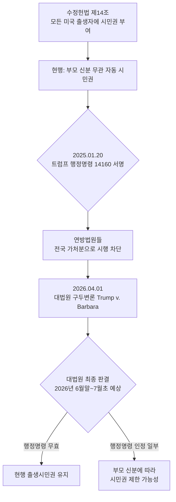

미국에서 아이를 가진 한국인 부모님들 사이에서 가장 뜨거운 이슈가 바로 **출생시민권(Birthright Citizenship)** 문제입니다. 트럼프 대통령이 2025년 1월 20일에 서명한 행정명령이 현재 대법원 심리 단계에 있고, 2026년 4월 1일 구두변론이 끝난 뒤 늦어도 7월 초 전에는 최종 판결이 나올 것으로 전망되고 있습니다. 임신 중이거나 결혼 직후 미국 출산을 계획 중인 한국 분들께 어떤 의미인지, 사실 위주로 정리해 보았습니다.

## 1. 트럼프 행정명령(EO 14160)이란 무엇인가

문제의 행정명령은 **Executive Order 14160(2025년 1월 20일 서명)** 입니다. 이 명령은 부모 중 어느 한쪽도 미국 시민권자나 영주권자가 아닐 경우, 미국 영토에서 태어난 아기에게 시민권 서류를 발급하지 않겠다는 내용을 담고 있습니다. 적용 대상에는 불법 체류자뿐 아니라 **학생비자(F비자), 관광비자, 비자면제프로그램(ESTA), 취업비자(H-1B 등 일부 비이민비자) 소지자의 자녀도 포함**된다는 점이 한국인 임산부에게 특히 민감한 부분입니다. 행정명령은 서명 후 30일이 지난 2025년 2월 19일부터 시행될 예정이었지만, 곧바로 여러 연방법원에서 가로막혔습니다.

## 2. 현재 법적 상태 — 행정명령은 아직 한 번도 시행된 적 없음

중요한 사실 한 가지는, **이 행정명령은 지금까지 단 한 번도 효력을 가진 적이 없다**는 점입니다. 이 명령에 대한 모든 연방법원이 위헌 가능성을 인정해 시행을 정지시켰고, 2025년 7월 10일에는 뉴햄프셔 연방지법의 조셉 라플란테 판사가 ACLU 측 요청을 받아들여 영향을 받을 모든 신생아·태아를 대상으로 한 집단 가처분(class-wide preliminary injunction)을 내렸습니다. 2026년 4월 1일에는 **Trump v. Barbara(Barbara v. Trump)** 사건의 구두변론이 대법원에서 진행되었고, SCOTUSblog와 NPR 보도에 따르면 다수의 대법관이 행정명령에 비판적인 태도를 보였다고 합니다. 다만 최종 판결은 6월 말~7월 초로 예상되므로, 결과가 확정되기 전까지는 **현재 미국에서 태어나는 모든 아기는 종전대로 자동으로 미국 시민권을 받습니다.**

## 3. 한국인 부모 중 누가 영향을 받을 수 있나

만약 대법원이 행정명령을 일부라도 인정한다면, 한국 국적자 중 **다음 분들이 직접적인 영향권**에 들어갑니다. 첫째, 단기 방문(B1/B2) 또는 ESTA로 입국해 출산을 계획 중인 분, 둘째, F-1 학생비자 소지자로 배우자가 영주권자나 시민권자가 아닌 경우, 셋째, H-1B·E-2·L-1 등 비이민 취업비자 소지자 부부, 넷째, 영주권 신청 중이지만 아직 그린카드를 받지 못한 단계의 부부입니다. 반대로 **부모 중 한 명이라도 미국 시민권자이거나 영주권자**라면, 행정명령이 시행되더라도 자녀는 시민권을 받는 구조입니다. NPR 보도에 따르면 행정명령이 시행될 경우 매년 약 25만 5천 명의 신생아가 영향을 받을 것으로 추산되고 있습니다.

## 4. 한국 임산부·신혼부부가 지금 해야 할 일

가장 먼저 강조드리고 싶은 점은, **현재 시점(2026년 5월)에서 출생하는 아기는 부모 신분과 무관하게 미국 시민권을 자동 취득**한다는 사실입니다. 그러므로 출산을 앞두신 분은 평소처럼 산전 진료를 받으시고, 병원 출산 후 **출생증명서(Birth Certificate)와 사회보장번호(SSN), 미국 여권 신청**까지 가능한 한 빠르게 마무리해 두시는 것이 안전 장치가 될 수 있습니다. 출생 직후 받은 시민권은 이미 확정된 권리이기 때문에 이후 판결이 어떻게 나오든 소급 적용될 가능성은 낮다는 것이 다수 법률 전문가들의 견해이지만, 서류상 증빙을 빨리 확보해 두는 편이 분쟁 위험을 줄입니다. 또한 신혼부부로 향후 출산을 계획 중이라면 **본인과 배우자의 비자 상태, 영주권 진행 단계를 이민변호사와 한 번 점검**하시기를 권합니다. 행정명령의 향후 적용 범위는 판결문 문구에 따라 달라질 수 있으므로, 6~7월 판결 전후로 ACLU, 미국시민자유연맹, 또는 한인 이민변호사 협회의 공식 안내를 꼭 확인해 보시기 바랍니다.

## 자주 묻는 질문 (FAQ)

**Q1. 제가 H-1B 비자로 일하고 있고, 올해 미국에서 출산 예정인데 아기가 시민권을 못 받나요?**
A. 현재 행정명령은 효력이 정지된 상태이기 때문에, 지금 출산하시면 종전대로 자녀는 자동으로 미국 시민권을 취득합니다. 대법원 판결 결과에 따라 향후 정책이 달라질 수 있으므로, 출생증명서와 여권 발급을 빠르게 진행해 두시는 것을 권합니다.

**Q2. 행정명령이 시행되면 이미 태어난 우리 아이의 시민권도 취소되나요?**
A. 트럼프 행정명령 14160은 시행일 이후 출생자에 한해 적용되도록 작성되었고, 소급 적용 조항은 포함되어 있지 않습니다. 다만 최종 판결문에서 어떻게 해석되는지가 관건이므로 6~7월 발표될 판결 원문 확인이 필요합니다.

**Q3. ESTA로 미국에 들어와 출산하는 이른바 '원정출산'은 어떻게 되나요?**
A. 행정명령은 단기 방문자(관광·비자면제 포함)의 자녀를 명시적으로 시민권 제외 대상에 포함했습니다. 현재는 법원이 막고 있지만, 대법원이 행정명령을 인정할 경우 이 그룹이 가장 먼저 영향을 받을 가능성이 높습니다.

**Q4. 대법원 판결은 정확히 언제 나오나요?**
A. SCOTUSblog와 미국 헌법센터(Constitution Center) 보도에 따르면 2026년 6월 말~7월 초 사이 발표될 가능성이 높습니다. 정확한 일자는 대법원이 별도로 고지합니다.

**Q5. 영주권 진행 중인데 그린카드 받기 전에 아이가 태어나면요?**
A. 행정명령 문구상 출생 시점에 부모 중 적어도 한 명이 시민권자 또는 영주권자여야 한다고 되어 있으므로, 그린카드 승인 전 출생은 영향권에 들어갈 수 있습니다. 다만 현재는 시행 정지 상태이므로 즉각적인 권리 변동은 없습니다.

## 마무리

판결이 나오기까지 한 달여 남은 지금이 가장 불안한 시기일 수 있습니다. 다만 **현 시점 출생아의 시민권은 안전하다**는 사실, 그리고 출생 직후 서류 정리가 가장 강력한 보호 장치라는 점은 분명합니다. 비슷한 상황에 계신 분이 있다면 댓글로 경험을 나눠 주시면 다른 한인 부모님들께도 큰 도움이 될 것 같습니다.

---
**출처(Sources):**
- [Supreme Court appears likely to side against Trump on birthright citizenship — SCOTUSblog](https://www.scotusblog.com/2026/04/supreme-court-appears-likely-to-side-against-trump-on-birthright-citizenship/)
- [Supreme Court considers Trump's fight to end birthright citizenship — NPR](https://www.npr.org/2026/04/01/nx-s1-5732437/supreme-court-birthright-citizenship-trump)
- [Executive Order 14160 — Wikipedia](https://en.wikipedia.org/wiki/Executive_Order_14160)
- [Know Your Rights: FAQ on Trump's Birthright Citizenship Executive Order — NAACP LDF](https://www.naacpldf.org/case-issue/know-your-rights-birthright-citizenship/)
- [Trump's Birthright Citizenship Executive Order: What Happens Next — ACLU](https://www.aclu.org/news/immigrants-rights/trumps-birthright-citizenship-executive-order-what-happens-next)
- [If the Supreme Court ends birthright citizenship, what will it mean for newborns? — NPR](https://www.npr.org/2026/03/31/nx-s1-5761354/birthright-citizenship-child-health-medicaid-social-security)
- [Birthright Citizenship Reaches Supreme Court: What Parents Need to Know — TIME](https://time.com/article/2026/04/01/what-parents-need-to-know-as-birthright-citizenship-reaches-the-supreme-court/)
- [Birthright Citizenship: Litigation Status Update — Congress.gov (CRS)](https://www.congress.gov/crs-product/LSB11414)
