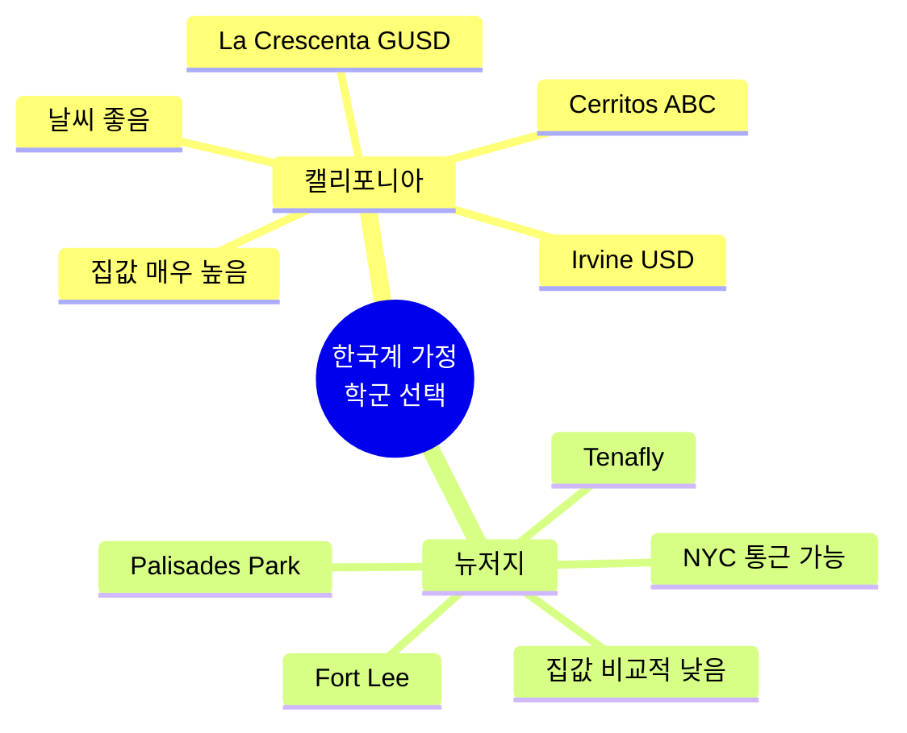

미국에서 자녀를 키우는 한국계 가정이라면 한 번쯤은 이 질문을 마주하게 됩니다. "캘리포니아로 갈까, 뉴저지로 갈까?" 두 지역은 미국 내에서 가장 강력한 한인 커뮤니티와 함께, 한국계 학부모들이 선호하는 명문 학군을 두루 갖춘 곳입니다. 본 글에서는 2026년 기준으로 두 지역의 대표적인 한인 학군, 부동산 가격, 한인 커뮤니티 자원을 비교해 보고, 어떤 가정에 어떤 지역이 더 잘 맞는지 함께 살펴보겠습니다.

## 1. 캘리포니아 한인 학군 (남부 중심)

캘리포니아 남부에는 한국계 가정이 밀집한 도시가 여러 곳 있습니다. 가장 대표적인 곳은 오렌지카운티의 **어바인(Irvine)**으로, 어바인 통합 교육구(Irvine USD)는 2026년 Niche 기준 캘리포니아 학군 순위 약 20위권에 자리하고 있습니다. 학구열이 높은 한인·중국계 가정이 유입되면서 University High, Northwood High 등은 매년 명문대 진학률이 꾸준히 높은 편입니다.

LA카운티 남부의 **세리토스(Cerritos)**도 빼놓을 수 없습니다. ABC 통합 교육구(ABC USD)는 2026년 캘리포니아 학군 순위 약 40위권을 유지하고 있으며, Whitney High School은 캘리포니아 공립 매그넷 스쿨 중 최상위권에 자주 이름을 올립니다. 그 외에 **라크레센타(La Crescenta·Glendale USD)**, **팔로스 버디스(Palos Verdes)** 또한 한국계 가정의 선호도가 높은 학군으로 알려져 있습니다.

## 2. 뉴저지 한인 학군 (북부 중심)

뉴저지는 맨해튼과 인접한 버겐 카운티(Bergen County) 북부에 한인 커뮤니티가 집중되어 있습니다. **팰리세이드 파크(Palisades Park)**는 주민의 약 65%가 한국계로, 서반구에서 한인 밀도가 가장 높은 자치구로 알려져 있습니다. 한국어 간판이 즐비하고, 한국 식료품·미용실·학원 접근성이 미국 어디와 비교해도 압도적입니다.

학군 자체로 보면 **테너플라이(Tenafly)**와 **릿지우드(Ridgewood)**가 강력합니다. 두 학군 모두 뉴저지 상위권에 꾸준히 자리하며, Tenafly High School은 SAT 평균과 AP 응시율 모두 주 내 최상위권입니다. **포트리(Fort Lee)** 역시 아시아계 비율이 42% 이상으로 한인 인프라가 풍부하면서도, 맨해튼 통근이 차로 10~15분 거리라는 점에서 학부모들에게 인기가 높습니다. 인근의 **크레스킬(Cresskill)**, **릿지필드(Ridgefield)**도 한국계 가정이 꾸준히 유입되는 지역입니다.

## 3. 부동산 가격 + 생활비 비교

2026년 기준 캘리포니아의 주택 중간값은 약 70만~90만 달러 수준으로, 캘리포니아 부동산협회(C.A.R.)는 2026년 연간 중간값을 약 90만 5천 달러로 전망하고 있습니다. 어바인이나 팔로스 버디스의 단독주택은 150만 달러를 넘는 경우가 흔합니다.

반면 뉴저지의 주택 중간값은 Redfin 기준 약 54만 5천 달러(2026년 3월)로, 캘리포니아 대비 상당히 낮은 편입니다. 다만 테너플라이, 크레스킬 같은 상위 학군의 단독주택은 100만~150만 달러 이상으로 형성되어 있어 학군 프리미엄이 명확합니다.

세금 측면에서 캘리포니아는 소득세 최고세율이 13.3%로 전국 최고 수준이지만 재산세율은 비교적 낮습니다. 뉴저지는 반대로 재산세가 미국에서 가장 높은 주(평균 약 2.2%)로, 학군 좋은 동네에서는 연간 재산세가 1만 5천~2만 달러를 넘는 경우도 흔합니다.

## 4. 한인 커뮤니티 밀도와 자원

한인 커뮤니티 밀도 측면에서는 두 지역 모두 강력하지만 색깔이 다릅니다. **캘리포니아**는 LA 한인타운(Koreatown), 부에나파크, 가든그로브, 어바인을 잇는 광역 인프라가 발달해 있어 한국 마트(H마트, 시온마켓), 한인 교회, 학원, 병원이 폭넓게 분포합니다. 한국어 진료가 가능한 의료기관과 한국계 변호사·회계사 네트워크도 매우 두텁습니다.

**뉴저지**는 팰리세이드 파크와 포트리를 중심으로 한인 인프라가 매우 촘촘하게 모여 있습니다. H마트 본사도 뉴저지에 있고, 한인 학원, 한국 음식점, 한국 미용실, 한국어 의료서비스가 도보권 안에 모두 있다는 점이 큰 장점입니다. 특히 토요한국학교(KCS NJ 등)와 한인 교회 네트워크가 견고합니다.

## 5. 어떤 가정이 어디에 맞을까

* **온화한 날씨와 넓은 단독주택 라이프스타일을 원하는 가정** → 캘리포니아(어바인, 세리토스)
* **자녀가 IT·바이오·UC 계열 대학 진학을 목표로 하는 가정** → 캘리포니아
* **맞벌이로 맨해튼 출퇴근이 필요한 가정** → 뉴저지(포트리, 팰리세이드 파크)
* **자녀의 한국어·한국 문화 노출을 최대한 유지하고 싶은 가정** → 뉴저지(팰리세이드 파크)
* **재산세 부담을 줄이고 싶은 가정** → 캘리포니아(상대적으로 유리)
* **초기 주택 구입 예산이 100만 달러 이하인 가정** → 뉴저지가 선택지 폭이 더 넓음

## 자주 묻는 질문 (FAQ)

**Q1. 어바인과 테너플라이 중 어디 학군이 더 좋습니까?**
A. 두 학군 모두 각 주의 최상위권이라 단순 비교는 어렵습니다. 어바인은 STEM과 UC 진학 트랙이 강하고, 테너플라이는 아이비리그 등 동부 명문대 진학 비율이 더 높은 편입니다.

**Q2. 한국어를 자녀에게 꾸준히 가르치기에는 어디가 더 유리합니까?**
A. 일상 노출 측면에서는 팰리세이드 파크가 미국 내 최고 수준입니다. 캘리포니아는 한국학교와 한국어 정규 과목(공립 고교 한국어 AP·Seal of Biliteracy) 측면에서 제도적 지원이 폭넓습니다.

**Q3. 재산세가 정말 그렇게 차이가 큽니까?**
A. 네. 동일 가격대 주택 기준으로 뉴저지 재산세가 캘리포니아의 2~3배에 달하는 경우가 흔합니다. 다만 캘리포니아는 주택 가격 자체가 높아 총 부담은 따로 계산해 봐야 합니다.

**Q4. 한인 교회·학원 인프라는 어디가 더 좋습니까?**
A. 절대 수와 다양성은 캘리포니아(LA·OC)가 앞서지만, 도보·차량 5분 거리 안 밀집도는 팰리세이드 파크·포트리가 우세합니다.

**Q5. 자녀가 어릴수록 어느 지역이 적응이 쉬울까요?**
A. 영유아~초등 저학년이면 한국어 환경이 풍부한 뉴저지가 적응이 수월하다는 의견이 많고, 중·고등학생이라면 학업 트랙이 명확한 어바인·세리토스가 안정적이라는 평이 많습니다.

## 마무리

캘리포니아와 뉴저지는 한국계 가정에 있어 각각 다른 강점을 지닌 지역입니다. 어느 한쪽이 절대적으로 우월하다고 단정짓기는 어렵고, 가정의 직장 위치, 예산, 자녀 연령, 라이프스타일에 따라 답이 달라집니다. 가능하다면 이주를 결정하기 전에 실제 거주 중인 한국계 학부모들과 직접 대화를 나눠보시고, 짧게라도 두 지역을 방문해 현지 분위기를 체감해 보시기를 권해 드립니다. 자녀의 10년, 20년이 달린 결정이기에 신중한 비교가 무엇보다 중요합니다.

---
**출처(Sources):**
- [2026 Best School Districts in California - Niche](https://www.niche.com/k12/search/best-school-districts/s/california/)
- [2026 Best School Districts in Irvine - Niche](https://www.niche.com/k12/search/best-school-districts/t/irvine-orange-ca/)
- [2026 Best School Districts in Cerritos - Niche](https://www.niche.com/k12/search/best-school-districts/t/cerritos-los-angeles-ca/)
- [Best Palisades Park Schools - GreatSchools](https://www.greatschools.org/new-jersey/palisades-park/)
- [Palisades Park, New Jersey - Wikipedia](https://en.wikipedia.org/wiki/Palisades_Park,_New_Jersey)
- [New Jersey Housing Market - Redfin](https://www.redfin.com/state/New-Jersey/housing-market)
- [California Housing Market 2026 - ManageCasa](https://managecasa.com/articles/california-housing-market-2026)
- [What NJ Cities Have the Largest Asian Population](https://iwillbuyyourhouseforcash.com/blog/what-nj-cities-have-the-largest-asian-population/)
