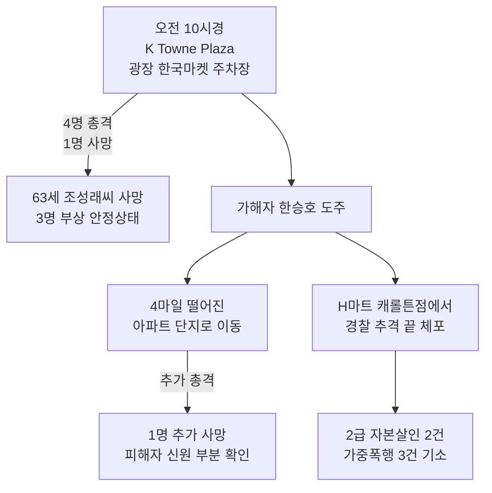

2026년 5월 5일 화요일 오전, 텍사스 댈러스 북부의 한인타운 캐롤튼에서 충격적인 총격 사건이 발생했습니다. **69세 한인 한승호(Seung Ho Han)씨가 한인 사업가 5명을 쏴 2명이 사망**했습니다. 가해자도, 피해자도 모두 한인이라는 사실에 미국 전역의 한인 커뮤니티가 깊은 충격에 빠졌습니다. 이 글에서는 사건의 전말, 배경이 된 사업 분쟁, 그리고 한인 사회가 던지고 있는 질문들을 정리합니다. 🕯️

## 1. 사건 개요 — 두 곳에서 연쇄적으로 벌어진 비극

총격은 두 곳에서 약 4마일 떨어진 곳에서 연속적으로 일어났습니다.

캐롤튼 경찰은 한씨를 **자본살인 2건과 흉기를 사용한 가중폭행 3건**으로 기소했습니다. 부상자 3명은 안정 상태로 인근 병원에서 치료받고 있습니다.

## 2. 배경 — $75,000짜리 사업 분쟁

경찰 조사 결과 이번 사건은 **무작위 범죄가 아닌 사업 분쟁이 원인**으로 밝혀졌습니다. 한씨가 형사들과의 인터뷰에서 직접 밝힌 동기는 다음과 같습니다.

- 한씨는 작년 K-Town Plaza 안에 **사시미 식당을 매입**
- 그 과정에서 유씨, 조용학씨로부터 **조지아주 부동산 투자 기회를 소개받음**
- 조씨에게 약 **$70,000**, 유씨에게 **$5,000** 등 총 약 $75,000을 투자
- 한씨 주장: "그들이 내 돈을 가져가고 있다"는 분노가 점점 커짐
- 분쟁 해결을 위해 마련된 **사전 약속된 만남에서** 총격을 가함

당국은 이번 사건을 **"특정 직업적 분쟁을 표적으로 한 사건이지만 증오 범죄는 아니다"**라고 분류했습니다.

## 3. 한인 사회의 충격과 반응

수요일 오전 열린 기자회견에서 댈러스 한인회 지도자들은 깊은 슬픔을 표현했습니다.

> "우리 모두 충격에 빠졌습니다. 이런 일은 한인 사회에서 이 정도 규모로 일어난 적이 없습니다. 우리 모두가 겪고 있는 슬픔, 충격, 트라우마를 표현하기 어렵습니다." — 영성(Young Sung) 전 캐롤튼 시의원

캐롤튼은 댈러스-포트워스 광역권에서 빠르게 성장한 한인 거주 지역으로, 안전하고 가족 친화적인 동네로 알려져 있었습니다. 그래서 한인 사업가가 한인 사업가를 향해 총을 쏘는 사건은 **단순한 범죄를 넘어 한인 사회의 자기성찰을 요구**하는 사건이 되고 있습니다.

## 4. 우리가 던져야 할 질문들

이번 사건은 몇 가지 어려운 질문들을 한인 사회에 던집니다.

**질문 1. 한인 사업 분쟁이 왜 극단으로 가는가?**
한인끼리의 사업 분쟁은 미국 법정보다 비공식 합의나 한인 변호사를 통한 해결로 가는 경우가 많습니다. 그러나 이번처럼 합의가 실패하면 폭력으로 번질 위험이 있습니다.

**질문 2. 60-70대 한인 남성의 사회적 고립 문제**
한씨는 69세입니다. 미국에서 30년 이상 거주한 1세대 한인 남성들 중 상당수가 영어 장벽, 사회적 고립, 가족 의존 등 정신건강 문제를 겪고 있다는 연구가 있습니다([USC 연구](https://dworakpeck.usc.edu/news/usc-launches-new-study-of-dementia-support-program-for-korean-american-caregivers)). 한인 노인 30.3%가 우울증을 겪지만 치료받는 비율은 17%에 불과합니다.

**질문 3. 한인 커뮤니티의 안전 인프라**
캐롤튼처럼 빠르게 성장한 한인 타운에는 상가 보안 카메라, 한인 변호사 네트워크, 위기 상담 핫라인 등의 인프라가 충분한가? 사건 발생 후 댈러스 한인회는 회원들에게 도움을 요청하라고 호소했습니다.

## 5. 사업 분쟁을 안전하게 해결하는 방법

이런 비극을 막기 위해 한인 사업가들이 알아두어야 할 실용적 조언:

- **모든 투자는 서면 계약으로**: 구두 합의나 한인 신뢰 관계에만 의존하지 말 것
- **분쟁 발생 시 즉시 변호사 상담**: 한인 변호사 네트워크 또는 한인회를 통해 추천 받기
- **금액이 큰 분쟁은 중재(Arbitration) 활용**: 법정 소송보다 빠르고 비용이 적음
- **사전 약속된 단독 만남 피하기**: 분쟁 중인 상대와 만날 때는 제3자 동행
- **정신건강 도움이 필요할 때**: 한인 가족 상담소(LA: 213-235-4865, NYC: 718-460-3800) 또는 KCS Korean Community Services

## 자주 묻는 질문 (FAQ)

**Q1. 이 사건이 증오 범죄인가요?**
A. 아닙니다. 경찰은 "특정 직업적 분쟁이 원인이지 증오 범죄가 아니다"라고 공식 확인했습니다. 가해자와 피해자 모두 한인입니다.

**Q2. 캐롤튼 한인타운은 여전히 안전한가요?**
A. 경찰은 이번 사건이 사전 계획된 표적 범죄이지 무작위 폭력이 아니라고 밝혔습니다. 일반 방문자에게 즉각적 위험은 없습니다.

**Q3. 한인 노인 정신건강 도움은 어디서 받나요?**
A. 한국어 상담이 가능한 기관: KCS (Korean Community Services), KAFSC (Korean American Family Service Center), 한인가정상담소(KFAM). 911 위기 상황 시 988 한국어 정신건강 핫라인 이용 가능.

**Q4. 한인 사업 분쟁을 도와줄 한인 변호사를 찾으려면?**
A. 각 지역 한인회 웹사이트, 한인 상공회의소, 또는 한인 변호사 협회(KABA - Korean American Bar Association)에서 추천받을 수 있습니다.

**Q5. 한씨에게 어떤 형량이 예상되나요?**
A. 텍사스 자본살인은 최대 사형 또는 가석방 없는 종신형이 가능합니다. 재판은 수개월에서 수년이 걸릴 수 있습니다.

## 마무리

이번 캐롤튼 사건은 단순한 범죄 보도를 넘어 우리 한인 사회 전체가 마주해야 할 거울입니다. 한인 노인의 정신건강, 한인 사업 분쟁 해결 방식, 그리고 빠르게 성장한 한인 타운의 안전 인프라 — 모두 우리가 함께 답을 찾아야 할 문제입니다.

희생자 조성래씨와 미확인 피해자께 깊은 애도를 표하며, 부상자들의 빠른 회복을 기원합니다.

여러분 지역의 한인 사업 분쟁 해결 방법은 어떠한가요? 비슷한 경험이 있으시면 댓글로 공유해주세요.

---

**출처(Sources):**
- [Texas Tribune — Two killed in shooting at Carrollton shopping mall](https://www.texastribune.org/2026/05/05/texas-carrollton-fatal-shooting-shopping-center/)
- [ABC News — 2 dead, 3 injured in shootings at Texas shopping center](https://abcnews.com/US/texas-carrollton-koreatown-shopping-center-shooting/story?id=132682907)
- [CBS Texas — Suspect arrested after Carrollton shootings tied to business dispute](https://www.cbsnews.com/texas/news/large-police-presence-in-carrollton-after-reports-of-shooting/)
- [FOX 4 — Suspect was tired of business associates 'taking his money'](https://www.fox4news.com/news/carrollton-shooter-was-tired-business-associates-taking-his-money-report-says)
- [WFAA — 'We're shocked': Deadly shooting sends shockwaves through Carrollton](https://www.wfaa.com/article/news/crime/deadly-shopping-plaza-shooting-sends-shockwaves-through-carrollton-community/287-179d702d-b886-4848-88de-f095dee21eae)
- [NBC DFW — Community speaks following deadly shooting](https://www.nbcdfw.com/news/local/carrollton-investigation-korean-market/4020555/)
- [Korea Daily English — Carrollton Korean Town Shooting Linked to Business Dispute](https://en.koreadaily.com/carrollton-korean-town-shooting/)
