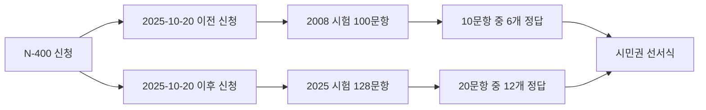

미국 영주권을 가지고 계신 한인 분들께 2025년 10월부터 큰 변화가 찾아왔습니다. USCIS(미국 시민권·이민국)가 자연화(귀화) 시민권 시험을 약 17년 만에 전면 개편했기 때문입니다. 새로운 시험은 문항 수가 100개에서 128개로 늘어났고, 합격 기준도 더 까다로워졌습니다. 2026년에 N-400(시민권 신청서)을 준비하시는 한국인 영주권자라면, 예전 방식으로 공부해서는 부족할 수 있습니다. 본 글에서는 새 시험의 핵심 변화부터 한국인이 자주 막히는 부분, 60대 이상 면제 조건, 그리고 실전 합격 전략 5가지를 정리해 드리겠습니다.

## 1. 2025년 10월 이후 무엇이 바뀌었나

가장 중요한 사실은 **N-400 접수일 기준**으로 어떤 시험을 보게 되는지가 결정된다는 점입니다. 인터뷰 날짜가 아니라 신청서를 접수한 날짜가 기준입니다.

| 구분 | 2008년 시험 (구) | 2025년 시험 (신) |
|---|---|---|
| 적용 대상 | 2025-10-20 이전 N-400 접수자 | 2025-10-20 이후 N-400 접수자 |
| 전체 문항 풀 | 100문항 | 128문항 |
| 인터뷰 시 출제 | 최대 10문항 | 최대 20문항 |
| 합격 기준 | 10개 중 6개 정답 | 20개 중 12개 정답 |
| 시험 방식 | 구술시험 (영어) | 구술시험 (영어) |

USCIS는 새 시험에서 12개를 맞히는 즉시 통과로 종료하고, 9개를 틀리면 그 시점에 불합격으로 처리합니다. 즉, 만점을 위해 20문항을 다 풀 필요는 없지만, 출제 가능 범위가 넓어진 만큼 학습 부담이 늘어난 것은 분명합니다.

## 2. 한국인이 가장 어려워하는 부분

한국에서 자라신 분들께서 시민권 시험에서 흔히 힘들어하시는 영역은 크게 세 가지입니다.

첫째, **미국 헌법과 권리장전 관련 용어**입니다. "Bill of Rights", "amendment", "rule of law", "checks and balances" 같은 추상적 정치 용어는 한국식 한자어 번역만으로는 의미 파악이 어렵습니다.

둘째, **연방·주·지방 정부 구조의 구분**입니다. 한국은 단일 정부 체계이기 때문에 federal과 state의 권한 분담 개념이 직관적이지 않습니다. 특히 본인이 거주하는 주의 주지사, 연방 상·하원의원 이름을 정확히 답해야 하는 문제는 따로 외워야 합니다.

셋째, **영어 구술 답변**입니다. 시민권 인터뷰는 객관식이 아니라 USCIS 심사관의 질문을 듣고 영어로 직접 답해야 합니다. 발음이 완벽할 필요는 없지만, 심사관이 알아들을 수 있는 정도의 명확한 발화가 필요합니다.

## 3. 60대 이상 면제 조건

USCIS는 고령 영주권자의 부담을 덜기 위해 세 가지 특별 규정을 운영하고 있습니다. 다만 면제되는 것은 **영어 시험**이며, 시민학(civics) 시험 자체는 모국어로 치를 수 있습니다.

- **50/20 규정**: 50세 이상이면서 영주권 보유 20년 이상 — 영어 인터뷰·읽기·쓰기 면제, 시민학은 한국어로 응시 가능.
- **55/15 규정**: 55세 이상이면서 영주권 보유 15년 이상 — 영어 면제, 시민학은 한국어로 응시 가능.
- **65/20 규정**: 65세 이상이면서 영주권 보유 20년 이상 — 영어 면제 + 시민학도 특별 단축본(20문항 중 10문항 출제, 6개 정답 시 합격)으로 응시.

65/20 대상자는 USCIS가 제공하는 별도의 단축 문제집(현재 2025년판 기준 20문항)으로만 공부하시면 됩니다. 한국어 통역사 동반이 허용되므로, 부모님이나 조부모님 세대께서는 반드시 이 규정 해당 여부를 먼저 확인해 보시기 바랍니다.

## 4. 한국인 합격 5가지 전략

**전략 1. 신청 시점 먼저 확인하기.** 본인이 어떤 시험에 해당하는지부터 명확히 하셔야 합니다. 이미 2025년 10월 20일 이전에 N-400을 접수하셨다면 100문항만 공부하시면 됩니다. 그 이후 접수하셨다면 128문항 전체가 학습 범위입니다.

**전략 2. 하루 30분, 6주 플랜.** 미국 이민 전문가들이 가장 추천하는 학습 패턴은 "벼락치기"가 아니라 **매일 20~30분씩 4~6주**입니다. 인터뷰 통보를 받은 시점부터 최소 90일 전에는 학습을 시작하시는 것이 안정적입니다.

**전략 3. 출제 빈도가 높은 항목 우선 학습.** 128문항 중에서도 헌법, 대통령·부통령·대법원장 이름, 본인 거주 주의 의원·주지사 이름, 독립기념일·헌법기념일 같은 날짜 문제는 거의 매 인터뷰에 등장합니다. 이런 "단골 문제"부터 확실히 외우시는 것이 효율적입니다.

**전략 4. 소리 내어 답변 연습하기.** 시민권 시험은 구술이기 때문에 눈으로만 외운 답은 인터뷰장에서 잘 나오지 않습니다. 휴대전화 녹음 기능이나 가족과의 모의 인터뷰를 통해 **실제로 말해 보는 연습**을 반드시 병행하셔야 합니다.

**전략 5. 한인 커뮤니티 스터디 활용.** LA, 뉴욕, 시카고, 애틀랜타 등 주요 한인 밀집 지역의 한인회·교회·도서관에서는 무료 또는 저비용으로 시민권 시험 준비반을 운영합니다. 혼자 외우기 힘드신 분들은 이런 그룹의 도움을 받으시면 합격률이 크게 올라갑니다.

## 5. 추천 학습 자료

- **USCIS 공식 2025년 시험 페이지**: 128문항 영어 원문, 음원, PDF를 무료로 제공합니다. 가장 정확한 자료입니다.
- **USCIS 65/20 면제 단축본 PDF**: 고령 영주권자 전용 20문항 자료입니다.
- **USCIS Study Materials**: 플래시카드, 오디오, 비디오 학습 자료 일체를 무료 제공합니다.
- **한인 도서관 한·영 대조본**: 시카고, 뉴욕, LA 한인 도서관에서 한국어-영어 대조 시민권 교재를 대출하실 수 있습니다.
- **NPO 무료 강좌**: ProLiteracy, CLINIC, New Americans Campaign 등 비영리 단체가 무료 학습 가이드와 강좌를 운영합니다.

## 자주 묻는 질문 (FAQ)

**Q1. 저는 2025년 10월 15일에 N-400을 접수했는데, 인터뷰는 2026년 3월입니다. 어떤 시험을 보나요?**
A. 접수일 기준이므로 **2008년 100문항 시험**을 보시게 됩니다. 인터뷰 날짜와는 무관합니다.

**Q2. 영어가 자신이 없는데 인터뷰를 미루는 게 나을까요?**
A. 무작정 미루기보다는 본인 연령·영주권 기간으로 면제 규정에 해당하는지부터 확인하시는 것이 우선입니다. 50/20, 55/15에 해당하시면 시민학을 한국어로 응시할 수 있어 부담이 크게 줄어듭니다.

**Q3. 한 번 떨어지면 시민권 신청 자체가 무효가 되나요?**
A. 아닙니다. USCIS는 시민학 또는 영어 시험에서 떨어진 경우 보통 60~90일 이내에 **재시험 기회 1회**를 제공합니다. 떨어진 부분만 다시 보시면 됩니다.

**Q4. 거주하는 주의 상원의원 이름이 바뀌면 어떻게 하나요?**
A. USCIS는 선거나 임명으로 답이 바뀌는 문제에 대해 최신 정보를 반영합니다. 인터뷰 직전에 USCIS 공식 페이지의 "Check for Test Updates" 항목을 꼭 확인하시기 바랍니다.

**Q5. 시험 중 영어 단어를 못 알아들으면 다시 물어볼 수 있나요?**
A. 네, 심사관에게 "Could you repeat the question, please?"라고 정중히 요청하실 수 있습니다. 다시 묻는 것 자체는 감점 사유가 아닙니다.

## 마무리

미국 시민권 시험 개편은 분명 부담스러운 변화이지만, 핵심은 변하지 않았습니다. **꾸준한 학습과 정확한 정보**입니다. 본인이 어떤 시험에 해당하는지, 면제 규정에 해당되는지부터 확실히 정리하시고, 매일 30분씩 6주만 투자하시면 충분히 합격하실 수 있습니다. 이 글이 도움이 되셨다면 댓글로 본인의 준비 경험이나 궁금하신 점을 남겨 주세요. 같은 길을 걷는 한인 영주권자분들께 큰 힘이 됩니다.
