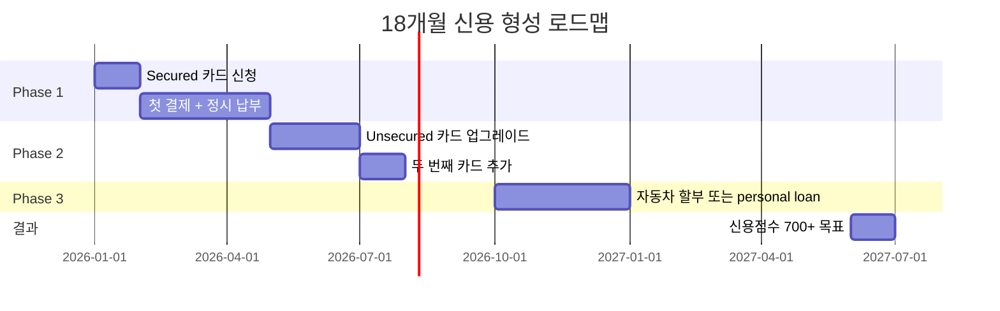

미국에 처음 도착하시면 가장 먼저 부딪히는 벽이 바로 "신용점수(Credit Score)"입니다. 한국에서 아무리 오래 직장 생활을 하고 신용 관리를 잘 해오셨더라도, 미국 시스템에서는 그 기록이 그대로 인정되지 않습니다. 아파트 임대(렌트), 휴대폰 개통, 자동차 할부, 심지어 일부 직장의 백그라운드 체크까지 — 신용점수 없이는 거의 모든 정착 과정이 어려워집니다. 신용점수 0에서 시작해 18개월 안에 700점 이상을 만드는 현실적인 로드맵을 정리해 드리겠습니다.

## 1. 한국 신용 가져오기 — Nova Credit

가장 먼저 알아두셔야 할 도구가 **Nova Credit**입니다. 이 회사는 한국 신용평가원(KCB 등)의 신용 기록을 미국 대출 기관이 이해할 수 있는 형식으로 번역해 주는 "Credit Passport" 서비스를 제공합니다.

2026년 현재 한국은 Nova Credit이 정식 지원하는 약 20개국 중 하나입니다. 특히 **American Express**가 한국 신용 기록을 직접 받아 카드 심사에 활용하고 있어, 미국 도착 직후 SSN만 발급받으셨다면 Amex 개인 카드를 시도해 보실 수 있습니다.

다만 한 가지 중요한 한계가 있습니다. Nova Credit은 한국 기록을 "참고 자료"로 보여줄 뿐, 미국 신용국(Experian, Equifax, TransUnion)에 영구적으로 이전해 주지는 않습니다. 즉, 미국 신용 이력은 결국 미국 안에서 직접 쌓으셔야 합니다. 한국 조회는 soft pull이라 한국 신용점수에는 영향이 없으니 부담 없이 시도해 보십시오.

## 2. 첫 6개월 — Secured 카드로 시작

SSN 또는 ITIN을 받으신 직후, 가장 확실한 출발점은 **Secured Credit Card(보증금 담보 카드)** 입니다.

추천 카드 두 가지를 정리해 드립니다.

- **Capital One Platinum Secured**: 보증금 $49, $99, 또는 $200으로 시작 가능. ITIN 신청도 받아 줍니다. 한국분들께 가장 진입 장벽이 낮은 카드입니다.
- **Capital One Quicksilver Secured**: 보증금 $200, 1.5% 캐시백 제공. 단 ITIN 신청 시 조건이 더 까다롭습니다.
- **Discover it Secured**: 보증금 $200부터. 단 Discover는 **SSN을 반드시 요구**하므로 ITIN만 있으신 분께는 적합하지 않습니다.

처음 카드를 받으시면 무리하게 사용하지 마시고, 한 달에 한두 번 작은 금액(예: 넷플릭스, 휴대폰 요금)만 자동 결제로 걸어 두십시오. 그리고 매달 **명세서가 나오기 전에 잔액을 전액 상환**하시는 것이 가장 안전합니다.

## 3. 7-12개월 — Unsecured 카드와 second card

6개월 정도 성실히 납부하시면 신용점수가 보통 **620~680점** 사이로 올라옵니다. 이때부터 다음 단계로 넘어가시면 됩니다.

첫째, Capital One Platinum Secured는 **자동 검토(Auto Graduation)** 를 통해 보증금을 돌려받고 Unsecured 카드로 전환됩니다. 직접 요청하지 않으셔도 보통 6~11개월 사이에 진행됩니다.

둘째, **두 번째 카드**를 추가하십시오. 이 시점에는 Chase Freedom Unlimited, Discover it Cash Back(SSN 보유 시), 또는 Capital One Savor One 같은 카드가 가능해집니다. 카드가 두 장이 되면 **신용 활용률(utilization)** 을 분산할 수 있어 점수가 더 빨리 올라갑니다.

핵심 원칙은 단순합니다. **총 한도의 10% 이내**만 사용하시고, **매달 100% 정시 납부**하십시오. 이 두 가지만 지키셔도 1년 안에 700점은 충분히 가능합니다.

## 4. 13-18개월 — Installment loan 추가

700점 근처에 도달하시면 마지막 퍼즐이 남습니다. 바로 **신용 믹스(Credit Mix)** 입니다. 미국 신용 점수의 약 10%는 "다양한 종류의 대출을 잘 관리하고 있는가"를 봅니다. 즉, 카드(revolving) 외에 **할부(installment)** 도 하나 있으면 좋습니다.

선택지는 세 가지입니다.

1. **Auto Loan(자동차 할부)**: 차를 사실 계획이 있으시면 가장 자연스러운 방법입니다. 신용점수 650 이상이면 합리적 금리가 나옵니다.
2. **Credit-Builder Loan**: Self, Kikoff 같은 핀테크가 제공합니다. 일정 금액을 매달 납부하고 만기에 돌려받는 구조입니다. 차가 필요 없으신 분께 적합합니다.
3. **Personal Loan**: 추천하지 않습니다. 금리가 높고, 신용 형성용으로는 비효율적입니다.

## 5. 절대 하지 말아야 할 5가지 실수

1. **Cash Advance(현금 서비스) 사용** — 수수료 5%, 즉시 이자 발생. 절대 금물입니다.
2. **단 하루라도 연체** — 30일 이상 연체는 신용점수를 100점 이상 깎습니다.
3. **신용 한도 90% 이상 사용** — utilization은 30% 이하, 이상적으로는 10% 이하로 유지하십시오.
4. **짧은 기간에 여러 카드 신청** — 6개월 안에 hard inquiry 3건 이상은 위험 신호로 잡힙니다.
5. **가장 오래된 카드 해지** — 신용 이력 평균 나이가 짧아져 점수가 떨어집니다. 안 쓰셔도 보관하십시오.

## 자주 묻는 질문 (FAQ)

**Q1. SSN 없이 카드 신청 가능한가요?**
A. 가능합니다. ITIN으로 신청 가능한 대표 카드는 Capital One Platinum Secured, Petal, Zolve, Firstcard 등입니다. 단 Discover, Chase의 일부 카드는 SSN을 반드시 요구합니다.

**Q2. 한국 신용카드를 미국에서 계속 써도 신용 형성에 도움이 되나요?**
A. 도움 되지 않습니다. 한국 카드는 한국 신용국에만 보고되므로, 미국 점수와 무관합니다.

**Q3. 배우자가 미국 시민/영주권자인데, Authorized User로 등록하면 도움이 되나요?**
A. 네, 매우 효과적입니다. 배우자의 오래된 카드에 본인을 추가 사용자로 등록하시면, 그 카드의 이력이 본인 신용 보고서에도 일부 반영됩니다. 단 배우자의 신용 관리가 좋아야 합니다.

**Q4. 렌트비 납부도 신용점수에 반영되나요?**
A. 자동으로는 반영되지 않습니다. Esusu, BoomReport, RentTrack 같은 서비스를 통해 별도로 신청하셔야 Experian, TransUnion에 보고됩니다.

**Q5. 18개월 안에 700점이 정말 가능한가요?**
A. 가능합니다만, 조건이 있습니다. ① 단 한 번의 연체도 없어야 하고, ② utilization을 항상 10% 이하로 유지해야 하며, ③ 6개월 차에 두 번째 카드를 추가하는 등 단계를 정확히 밟으셔야 합니다.

## 마무리

미국 신용 형성은 결국 **시간과 일관성**의 게임입니다. 단기간에 점수를 끌어올리는 마법은 없습니다. 매달 정시 납부, 낮은 사용률, 카드 해지하지 않기 — 이 세 가지를 18개월간 꾸준히 지키시면 700점은 자연스럽게 따라옵니다. 처음 몇 달은 답답하실 수 있지만, 이 기간이 미국 정착의 가장 중요한 재정 기반이 됩니다. 천천히, 그러나 꾸준히 가시기 바랍니다.
