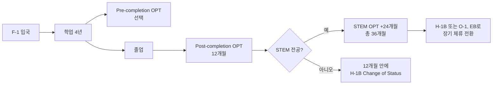

미국 대학을 졸업하는 한국 유학생에게 가장 절박한 질문은 "졸업 후 어떻게 합법적으로 미국에 더 머무르며 일할 수 있을까"입니다. 정답은 OPT(Optional Practical Training)와 STEM OPT 24개월 연장을 전략적으로 활용해 미국 체류 시간을 최대 36개월까지 확보하고, 그 사이 H-1B 추첨에 여러 번 도전하는 것입니다. 본 글은 2026년 5월 기준 USCIS 규정을 토대로 한국 유학생이 반드시 알아야 할 시간표, 자격, 함정을 정리해 드립니다.

## 1. 전체 시간표 한눈에 보기

핵심은 "12개월 + 24개월 = 36개월" 공식을 머릿속에 새기는 것입니다. STEM 전공자라면 36개월 동안 H-1B 추첨에 최대 3번 도전할 수 있고, 비STEM 전공자는 단 1번의 기회만 주어집니다.

## 2. OPT 신청 — 졸업 90일 전부터

Post-completion OPT는 졸업 전 90일부터 졸업 후 60일까지 USCIS에 Form I-765를 제출할 수 있습니다. 다만 DSO(Designated School Official)가 SEVIS에 OPT 추천을 입력한 날로부터 30일 안에 USCIS 접수가 완료되어야 한다는 점을 반드시 기억하셔야 합니다.

신청 절차는 다음과 같습니다.

1. 졸업 90일 전 학교 국제학생 사무실(ISSS)에 OPT 신청 요청
2. DSO가 SEVIS에 OPT 추천 입력 후 새 I-20 발급
3. Form I-765 + I-20 사본 + 여권 사진 2장 + 수수료 $520(2026년 기준) USCIS 온라인 또는 우편 접수
4. EAD 카드(Employment Authorization Document) 수령까지 평균 90일 소요

USCIS 평균 처리 기간이 3~5개월에 달하므로, 졸업 직후 일을 시작하시려면 가능한 한 90일 전에 신청을 마치시기를 권장 드립니다.

## 3. STEM OPT 24개월 연장 — 자격 요건

STEM OPT 연장은 다음 네 가지 조건을 모두 충족해야 신청 가능합니다.

- **STEM 학위 보유**: 미국 교육부 인증 학교에서 받은 학사·석사·박사 학위가 DHS STEM Designated Degree Program List(CIP 코드 기준)에 포함되어야 합니다. 핵심 분야는 공학(14), 생물/생의학(26), 수학/통계(27), 자연과학(40)이며, 컴퓨터/정보과학(11), 공학기술(15) 등 18개 관련 분야도 포함됩니다.
- **E-Verify 등록 고용주**: 일하시려는 회사가 USCIS의 E-Verify 시스템에 등록되어 있어야 합니다. 한국 유학생이 자주 놓치는 부분으로, 작은 스타트업이나 컨설팅 회사는 미등록인 경우가 많습니다.
- **Form I-983 Training Plan**: 고용주와 학생이 공동으로 작성하는 공식 교육 계획서로, STEM 학위와 업무의 직접적 연관성, 학습 목표, 평가 방법을 명시해야 합니다.
- **주 20시간 이상 유급 근무**: 무급 인턴이나 자원봉사는 불가하며, 동종 미국인 근로자와 동등한 보수가 보장되어야 합니다.

신청은 현재 OPT가 만료되기 90일 전부터 가능합니다. 만료일 이전에 USCIS가 접수만 해도 자동으로 180일간 근로가 연장됩니다.

## 4. 한국 유학생이 자주 놓치는 함정

**무직 일수 누적 한도**: Post-completion OPT 12개월 중 무직 일수는 90일을 넘을 수 없습니다. STEM OPT까지 연장하시면 36개월 전체 기간에 걸쳐 누적 150일이 한도입니다. 주말과 공휴일도 무직 일수에 포함되며, 한도 초과 시 SEVIS 자동 종료와 향후 비자 거절 사유가 됩니다.

**여행 위험**: OPT 신청 후 EAD 카드 수령 전 출국하시면 재입국이 거부될 수 있습니다. EAD 카드, 유효 F-1 비자, 고용주 레터, I-20 OPT 추천 페이지를 모두 지참하셔야 안전합니다.

**Cap-Gap 사각지대**: H-1B 추첨에 당첨되어 10월 1일 시작 신분으로 변경되더라도, OPT가 그 전에 끝나면 Cap-Gap 자동 연장 적용 여부를 DSO와 확인하셔야 합니다.

**STEM 학위 10년 룰**: STEM OPT 신청 시점 기준 과거 10년 이내에 받은 STEM 학위만 자격 인정됩니다.

## 5. STEM OPT 종료 후 — H-1B 또는 다른 비자

36개월이 종료되기 전 반드시 다음 비자로의 전환 계획을 세우셔야 합니다.

- **H-1B**: 매년 4월 추첨, 당첨률 약 20~30%. STEM OPT 기간 중 최대 3회 도전 가능
- **O-1**: 특기자 비자, 연구·예술·기술 분야에서 탁월한 업적이 있는 분에게 유리
- **EB-2 NIW(National Interest Waiver)**: 고용주 스폰서 없이 영주권 직행, 박사·연구자에게 권장
- **L-1**: 한국 본사 1년 이상 근무 후 미국 지사 전근 시 활용

H-1B 미당첨이 반복되더라도 좌절하지 마시고, 박사 진학을 통한 F-1 신분 갱신, 캐나다 워크퍼밋, O-1 등 우회 경로를 미리 검토하시기를 권합니다.

## 자주 묻는 질문 (FAQ)

**Q1. 학사와 석사를 모두 STEM으로 받으면 STEM OPT를 두 번 받을 수 있나요?**
A. 평생 STEM OPT 연장은 최대 2회까지 가능합니다. 단, 두 번째는 더 높은 학위 취득 후에만 인정됩니다. 예를 들어 STEM 학사로 24개월 연장 후, STEM 석사를 새로 취득하면 다시 12개월 OPT + 24개월 STEM OPT를 받을 수 있습니다.

**Q2. 비STEM 전공인데 과거 학사가 STEM이면 연장이 가능한가요?**
A. 가능합니다. 현재 OPT의 근거가 된 학위가 비STEM이라도, 10년 이내에 받은 STEM 학위가 미국 인증 학교에서 발급되었고 현재 직무와 직접 관련된다면 그 학위를 근거로 STEM OPT 24개월을 신청할 수 있습니다.

**Q3. 자영업이나 프리랜서도 STEM OPT 대상인가요?**
A. 일반 OPT는 자영업이 허용되지만, STEM OPT는 불가합니다. E-Verify 등록 고용주와 정식 고용 관계(employer-employee relationship)가 필수입니다.

**Q4. I-983은 누가 작성하나요?**
A. 학생과 고용주가 공동으로 작성합니다. 학습 목표, 감독자 정보, 평가 일정 등을 포함하며, 12개월마다 자기 평가 보고서를 DSO에 제출해야 합니다.

**Q5. OPT 기간 중 이직하면 어떻게 되나요?**
A. 일반 OPT는 10일 안에 DSO에 새 고용주 정보를 보고하면 됩니다. STEM OPT 중 이직 시에는 새 고용주의 E-Verify 등록을 사전 확인하고, 새 I-983을 작성해 DSO에 제출해야 합니다.

## 마무리

OPT와 STEM OPT는 단순한 행정 절차가 아니라 한국 유학생의 미국 커리어 운명을 결정하는 핵심 도구입니다. 시간표를 놓치거나 무직 일수를 초과하면 수년간 쌓아 온 미국 경력이 한순간에 무너질 수 있습니다.

본 글은 일반 정보 제공 목적이며 법률 자문이 아닙니다. 개별 상황은 반드시 학교 **DSO(Designated School Official)**와 **공인 이민 변호사(Immigration Attorney)**에게 상담을 받으시기를 강력히 권장 드립니다. 특히 H-1B 전환, 신분 공백, 여행 계획 등 복잡한 사안은 전문가의 검토 없이 진행하지 마시기 바랍니다.

---

**출처(Sources):**
- [USCIS — Optional Practical Training (OPT) for F-1 Students](https://www.uscis.gov/working-in-the-united-states/students-and-exchange-visitors/optional-practical-training-opt-for-f-1-students)
- [USCIS — Optional Practical Training Extension for STEM Students (STEM OPT)](https://www.uscis.gov/working-in-the-united-states/students-and-exchange-visitors/optional-practical-training-extension-for-stem-students-stem-opt)
- [DHS Study in the States — STEM OPT Hub](https://studyinthestates.dhs.gov/stem-opt-hub)
- [ICE — DHS STEM Designated Degree Program List (PDF)](https://www.ice.gov/sites/default/files/documents/stem-list.pdf)
- [DHS Study in the States — Eligible CIP Codes for the STEM OPT Extension](https://studyinthestates.dhs.gov/stem-opt-hub/additional-resources/eligible-cip-codes-for-the-stem-opt-extension)
- [DHS Study in the States — Form I-983 Overview](https://studyinthestates.dhs.gov/stem-opt-hub/additional-resources/form-i-983-overview)
- [E-Verify — I-983 Training Plan FAQ](https://www.e-verify.gov/faq/as-an-employer-am-i-required-to-complete-form-i-983-training-plan-for-stem-opt-students-for)
- [DHS Study in the States — Unemployment Counter](https://studyinthestates.dhs.gov/sevis-help-hub/student-records/fm-student-employment/unemployment-counter)
