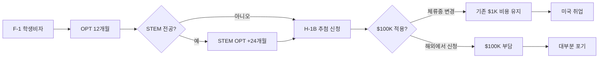
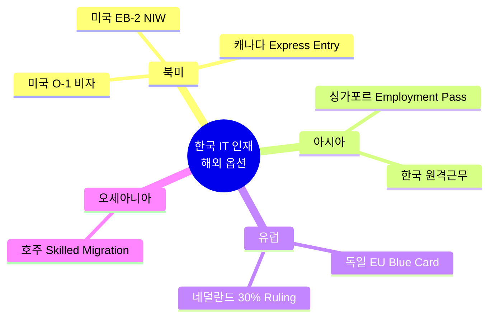

미국 트럼프 행정부가 H-1B 취업 비자 신청료를 기존 $1,000에서 **$100,000로 100배 인상**했습니다. 미국에서 공부 중이거나 취업을 준비하는 한국인 유학생 약 6만 명에게 직접 영향을 미치는 변화입니다. 이 글에서는 누가 영향을 받는지, 어떤 예외가 있는지, 그리고 한국 유학생이 지금 당장 해야 할 일을 정리해드립니다. 🎓

## 1. 변경 사항 핵심 요약

- **기존 신청료**: $1,000
- **새로운 신청료**: $100,000 (100배 인상)
- **시행 시점**: 2026 회계연도부터 단계적 적용
- **선정 방식**: 기존 추첨제 → **연봉 기반 우선 선정**으로 전환 검토 중

100배 인상의 명분은 "비자 남용 방지"입니다. 인도계 IT 아웃소싱 기업들이 저임금 외국인 노동자로 미국 일자리를 채우는 관행을 막겠다는 의도입니다. 하지만 결과적으로 모든 H-1B 신청자에게 직격탄이 됩니다.

## 2. 한국 유학생에게 미치는 영향

미국 대학을 졸업한 한국 유학생의 일반적 경로는 다음과 같습니다:

이 경로에서 H-1B 단계가 무너지면 **귀국 외에 대안이 거의 없습니다**. 2026 회계연도 추첨 선정률은 약 **35%**였는데, $100K 신청료가 본격 시행되면 많은 기업이 외국인 채용 자체를 포기할 것으로 전망됩니다.

특히 영향을 크게 받는 그룹:
- 미국 대학 학부/대학원 졸업 후 취업 준비 중인 한국 유학생
- 중소 IT 기업, 스타트업 취업 희망자 (대기업만 $100K 부담 가능)
- 비STEM 전공자 (OPT 1년만 받기 때문에 시간 압박)

## 3. 예외 조항 — 다행히 빠져나갈 길이 있다

**좋은 소식**: 새로운 $100K 신청료는 **이미 미국에 체류 중인 사람의 신분 변경에는 적용되지 않습니다**. 즉:

✅ 적용 안 됨 (Change of Status):
- F-1 비자로 미국 체류 중 → OPT → H-1B 신분 변경 신청
- 현재 미국 내에 있는 모든 비자 신분 변경 신청자

❌ 적용됨 (New H-1B):
- 해외에서 신규 H-1B 신청 (영사 인터뷰 통한 입국)
- 새로 미국에 들어오는 외국인 노동자

**결론**: 미국에서 학교를 다니고 있다면, OPT 종료 전에 H-1B 신분 변경을 신청하는 게 핵심입니다.

## 4. 한국 유학생이 지금 당장 해야 할 5가지

1. **OPT 신청을 서둘러라** — 졸업 90일 전부터 신청 가능. 빠를수록 좋음
2. **STEM 졸업자라면 STEM OPT 연장 신청** — 추가 24개월 확보
3. **체류 중 H-1B 신분 변경(Change of Status)을 노려라** — 신규 신청 ($100K)이 아닌 변경 신청은 $1,000대 비용 유지
4. **H-1B 외 비자 옵션도 검토하라** — O-1 (특기자), L-1 (기업 내 전근), EB 시리즈 (영주권 직접)
5. **대기업/H-1B 적극 후원 기업 위주로 지원하라** — $100K를 감당할 수 있는 회사만 외국인 채용 유지

## 5. 한국 IT 인재의 새로운 옵션

미국 H-1B 길이 좁아지면서, 한국 IT 인재들의 대안도 다양해지고 있습니다:

- **캐나다 Express Entry** — 영주권 직행, 연봉 무관
- **호주 Skilled Migration** — IT 직군 점수 가산
- **유럽 EU Blue Card** — 독일/네덜란드 IT 수요 많음
- **싱가포르 Employment Pass** — 한국과 가깝고 영어 사용
- **한국 귀국 후 글로벌 원격 근무** — Toptal, Turing 등 플랫폼

## 자주 묻는 질문 (FAQ)

**Q1. 이미 H-1B 받은 사람도 $100K 내야 하나요?**
A. 아니요. 기존 H-1B 보유자의 갱신(extension)에는 적용되지 않습니다. 신규 신청에만 적용됩니다.

**Q2. STEM 전공이 아니면 어떻게 하나요?**
A. OPT 1년 안에 H-1B 신분 변경(Change of Status)을 노리거나, O-1, EB-2 NIW 같은 다른 비자를 검토해야 합니다. 시간이 매우 촉박합니다.

**Q3. $100K은 누가 내나요? 본인? 회사?**
A. 법적으로는 고용주 부담입니다. 즉 회사가 $100K을 낼 의사가 있어야 외국인 채용이 가능합니다.

**Q4. 언제부터 시행되나요?**
A. 2026 회계연도(2025년 10월~2026년 9월) 일부 적용, 전면 시행은 2027 회계연도로 예상됩니다.

**Q5. 한국으로 돌아가서 다시 미국 취업하려면?**
A. 해외에서 신청 시 $100K 적용이 유력합니다. 가능하면 미국 체류 중에 신분 변경하는 것이 압도적으로 유리합니다.

## 마무리

H-1B $100K 신청료 인상은 한국 유학생에게 매우 불리한 변화입니다. 하지만 **체류 중 신분 변경(Change of Status) 예외**가 살아있는 한, 미국에서 공부하고 OPT 받은 후 H-1B 변경 신청하는 경로는 여전히 유효합니다.

핵심은 **시간 압박**입니다. 졸업 → OPT → STEM OPT → H-1B 변경까지 일정을 미리 계획하고, OPT 종료 전 H-1B 변경 신청을 반드시 완료해야 합니다.

여러분은 어떤 비자 단계에 계신가요? 댓글로 상황 공유해주시면 함께 정보 나눠보겠습니다.

---

**출처(Sources):**
- [Korea Times — H-1B visa fee surge](https://www.koreatimes.co.kr/southkorea/society/20250924/h-1b-visa-fee-surge-shuts-door-on-korean-students-us-job-hopes)
- [American Visa Law Group — H-1B 2026 updates](https://www.usavisalaw.com/immigration-blog/h1b-visa-news-2026)
- [U.S. Embassy Korea — Visa Information](https://kr.usembassy.gov/visas/)
