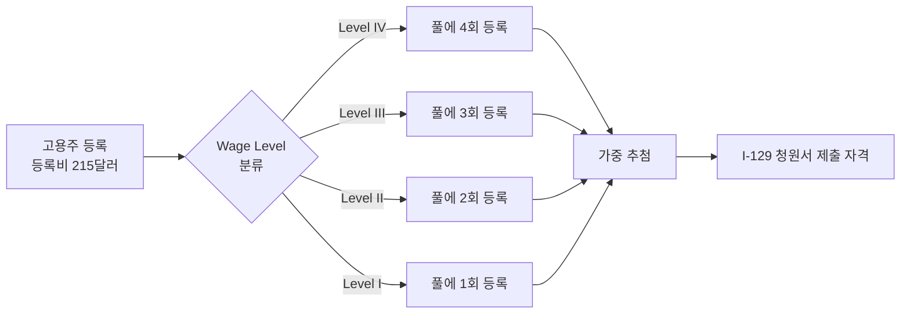

# H-1B 추첨제 폐지, 연봉순 선발 시대 — 유학생 영향 정리

지난 33년간 유지돼 온 H-1B 무작위 추첨제가 막을 내렸습니다. 미국 국토안보부(DHS)는 2025년 12월 29일 최종 규정을 관보에 게재했고, 새 규정은 **2026년 2월 27일부터 발효**됐습니다. FY 2027 H-1B 캡 시즌부터 곧바로 적용됐기 때문에 올봄 OPT 종료를 앞둔 한국 유학생들이 직격탄을 맞고 있습니다.

## 1. 무엇이 바뀌었나 — 4배 가중 시스템

핵심은 단순합니다. 연봉이 높을수록 추첨 풀에 더 많이 들어갑니다. 미국 노동부(DOL)가 직종·지역별로 산정하는 **prevailing wage** 4단계 기준에 따라 등록 횟수가 달라집니다.

- **Wage Level IV** (상위 67%): 풀에 4회 등록
- **Wage Level III** (45–66%): 3회
- **Wage Level II** (17–34%): 2회
- **Wage Level I** (하위 17%): 1회

같은 직무라도 Level IV로 분류된 지원자는 Level I 지원자보다 **선발 확률이 최대 4배 높습니다**. USCIS는 이번 개편을 두고 "더 높은 숙련도와 임금을 가진 외국인에게 비자를 우선 배정해 미국 근로자의 임금·근로조건·일자리를 보호한다"고 설명했습니다.

## 2. 선발 방식 흐름도

이 구조에서 갓 졸업한 OPT 학생이 받는 초임 연봉은 대체로 Level I 또는 낮은 Level II에 속합니다. 한국 유학생들이 많이 진출하는 마케팅·디자인·일반 회계 직군은 특히 Level I 비중이 높아 사실상 후순위로 밀린다는 분석이 나옵니다.

## 3. 한국 유학생에게 미치는 실질 영향

**STEM 분야 졸업생은 상대적으로 유리합니다.** AI, 사이버보안, 데이터 사이언스, 고급 소프트웨어 엔지니어링 직군은 초임이 Level II 이상으로 책정되는 경우가 많기 때문입니다. 반면 **인문·사회계열, 디자인, 일반 마케팅 분야** 졸업생은 Level I 단일 등록으로 사실상 추첨 가능성이 크게 낮아졌다는 평가입니다.

대응 방안으로는 ▲연봉이 Level II 이상으로 책정되는 직무·지역 선택 ▲석사 이상 학위로 'master's cap' 별도 풀 활용 ▲캡 면제 고용주(대학·비영리 연구기관) 검토 등이 거론됩니다. 다만 캡 면제 고용주는 자리 자체가 제한적이라는 한계가 있습니다.

USCIS는 등록 부정행위 방지를 위해 **연봉을 임의로 부풀리거나, 동일 인물을 여러 고용주가 중복 등록한 정황이 보이면 청원을 거부·취소할 수 있는 권한**을 명시했습니다.

## 4. 자영업자·소상공인 영향

LA·뉴저지·뉴욕 한인 자영업자들이 직원 채용 목적으로 H-1B를 활용해 온 관행에도 변화가 불가피합니다. 소규모 회계법인, 한식 레스토랑 매니저, 한인 미디어 종사자 등은 직무 특성상 Level I·II에 머무르는 경우가 많아 채용 자체가 어려워질 가능성이 큽니다.

> **전문가 상담 권장**: 직무별 wage level 산정, master's cap 활용 전략, 캡 면제 고용주 매칭 등은 케이스마다 결과가 크게 달라집니다. 반드시 이민 전문 변호사와 개별 상담을 받으시기 바랍니다.

## 자주 묻는 질문 (FAQ)

**Q1. FY 2027 등록 기간은 언제였나요?**
A. 2026년 3월 4일 정오(미 동부시간)부터 3월 19일 오후 5시까지 진행됐습니다. 등록비는 1인당 215달러입니다.

**Q2. 석사 이상 학위가 있으면 여전히 유리한가요?**
A. 네. 일반 캡 65,000명과 별도로 미국 내 석사 이상 학위 소지자를 위한 20,000명 별도 풀이 유지됩니다. 단, 두 풀 모두 wage level 가중이 적용됩니다.

**Q3. 연봉을 일부러 올려 받으면 되는 것 아닌가요?**
A. USCIS가 등록 부정행위에 대한 명시적 단속 권한을 새로 부여받았습니다. DOL prevailing wage 데이터와 비교해 비정상적으로 높게 책정된 경우 청원 거부 또는 취소 사유가 될 수 있습니다.

**Q4. Level I이면 아예 가능성이 없나요?**
A. 0%는 아닙니다. Level IV의 4분의 1 확률로 등록은 되지만, 신청자 수와 캡(85,000명)을 고려하면 실질 당첨률은 한 자릿수 초반으로 추정됩니다.

**Q5. O-1, EB-2 NIW 같은 대안은 어떤가요?**
A. 박사급 연구자나 특기·예술 분야 종사자는 O-1, EB-2 National Interest Waiver 같은 비자 대안을 적극 검토하는 것이 좋습니다. 자격 요건이 까다로우므로 변호사 상담이 필수입니다.

## 마무리

H-1B는 더 이상 '운'이 아니라 '연봉'으로 결정되는 비자가 됐습니다. 졸업을 앞둔 유학생이라면 채용 단계에서부터 직무·지역의 prevailing wage level을 확인하고, 자영업자라면 채용 전략 자체를 재검토할 필요가 있습니다. 댓글로 본인 산업·지역의 wage level 경험을 공유해 주시면 다른 분들에게 큰 도움이 됩니다.

---

**출처(Sources):**
- [DHS Changes Process for Awarding H-1B Work Visas — USCIS](https://www.uscis.gov/newsroom/news-releases/dhs-changes-process-for-awarding-h-1b-work-visas-to-better-protect-american-workers)
- [USCIS Finalizes Wage Weighted H-1B Cap Selection Rule, Effective Feb. 27, 2026 — Greenberg Traurig](https://www.gtlaw.com/en/insights/2026/2/uscis-finalizes-wage-weighted-h-1b-cap-selection-rule-effective-feb-27-2026)
- [Weighted Selection Process for Cap-Subject H-1B Petitions — Federal Register](https://www.federalregister.gov/documents/2025/12/29/2025-23853/weighted-selection-process-for-registrants-and-petitioners-seeking-to-file-cap-subject-h-1b)
- [H-1B Electronic Registration Process — USCIS](https://www.uscis.gov/working-in-the-united-states/temporary-workers/h-1b-specialty-occupations/h-1b-electronic-registration-process)
- [DOL Prevailing Wages — flag.dol.gov](https://flag.dol.gov/programs/prevailingwages)
