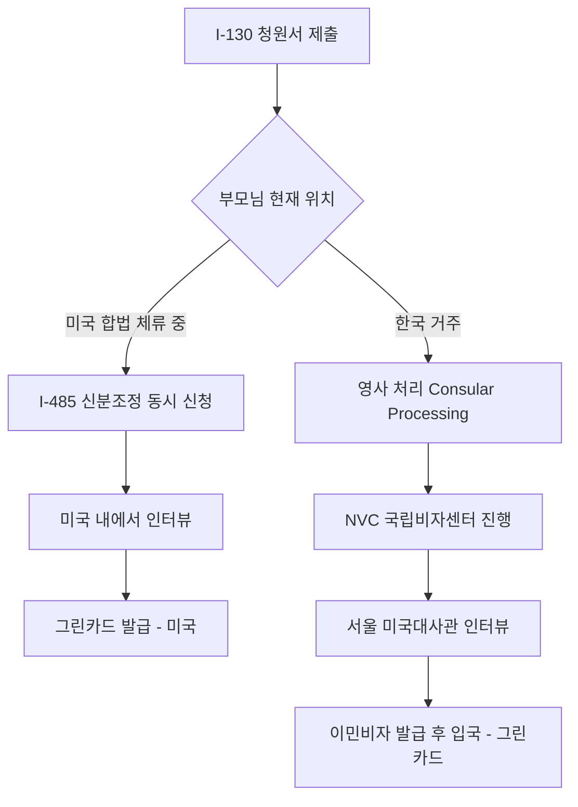

미국 시민권을 취득하신 한국계 미국인 분들이 가장 먼저 알아보시는 이민 절차 중 하나가 바로 부모님 초청입니다. 미국 이민법상 시민권자의 **부모는 "직계가족(Immediate Relative, IR-5)"** 으로 분류되어, 형제·자매나 결혼한 자녀와 달리 **연간 비자 쿼터 제한이 없는** 가장 빠른 가족 초청 카테고리입니다. 본 글에서는 2026년 5월 기준 최신 USCIS 자료를 바탕으로 I-130 신청부터 그린카드 수령까지의 전 과정을 정리해 드리겠습니다.

## 1. 자격 요건 — 누가 신청할 수 있나

부모님을 초청하시려면 청원인(신청자)이 다음 조건을 모두 충족해야 합니다.

- **미국 시민권자**여야 합니다. 영주권자(LPR)는 부모님 초청이 **불가능**합니다.
- **만 21세 이상**이어야 합니다.
- 부모님과의 관계를 서류로 입증할 수 있어야 합니다.

부모님의 범위는 다음과 같이 인정됩니다.
1. **친생 부모(생물학적 부모)** — 가장 기본적이며 출생증명서로 증명합니다.
2. **계부모(Step-parent)** — 청원인이 만 18세가 되기 **전에** 친부모와 재혼한 경우에만 인정됩니다.
3. **양부모(Adoptive parent)** — 청원인이 만 16세가 되기 전에 입양되었고, 입양 후 2년 이상 법적·물리적 양육 관계가 있어야 합니다.

아버지가 청원인의 출생 당시 친모와 혼인 관계가 아니었던 경우(혼외 출생), 부자(부녀) 관계 입증을 위한 추가 서류가 요구될 수 있으므로 주의하셔야 합니다.

## 2. 두 가지 경로 — 어떤 길을 택할까

부모님의 **현재 체류 국가**에 따라 절차가 갈립니다.

**(가) 신분조정(Adjustment of Status, I-485)** — 부모님이 합법적 비자(예: B-2 방문)로 미국에 체류 중이시라면 I-130과 I-485를 동시(Concurrent)로 제출할 수 있습니다. 단, 입국 직후 90일 이내 신청은 "비자 사기" 의심을 받을 수 있으니 신중하셔야 합니다.

**(나) 영사 처리(Consular Processing)** — 부모님이 한국에 거주 중이시라면 I-130 승인 후 NVC를 거쳐 **서울 미국대사관**에서 이민비자 인터뷰를 보고, 비자를 받아 미국 입국 시점에 그린카드 신분이 됩니다.

## 3. 필수 서류 체크리스트

청원인(시민권자 자녀)이 준비할 서류입니다.

- Form **I-130** 작성본 및 수수료
- 시민권 증명서(여권 사본, 출생증명서, 또는 귀화증명서 N-550)
- 부모님과의 관계 증명: **본인의 출생증명서**(부모 성함 기재) — 한국 가족관계증명서·기본증명서는 반드시 공인 영문 번역본과 함께 제출
- 청원인 여권용 사진 2매
- (계부모 초청 시) 친부모의 혼인증명서 및 이전 혼인 종료(이혼·사망) 증명서

부모님(수익자) 측 서류는 다음과 같습니다.

- 한국 여권 사본
- 출생증명서 및 혼인관계증명서(영문 번역 공증)
- 경찰 신원증명서(범죄 경력 회보서)
- 신체검사서(대사관 지정 병원)
- **Form I-864 재정보증서** + 청원인 최근 연방 세금보고서(IRS Tax Return), W-2, 급여명세서

## 4. 처리 기간과 비용 (2026년 기준)

**처리 기간**

USCIS 공식 통계에 따르면 2026년 5월 현재 시민권자가 직계가족(부모 포함)을 위해 제출하는 I-130의 처리 기간은 평균 약 **14~17개월**입니다. 단, 사례에 따라 일부 서비스 센터에서는 더 길어질 수 있으니 [USCIS Processing Times](https://egov.uscis.gov/processing-times)에서 본인 케이스를 직접 확인하시기 바랍니다.

**수수료 (2026년 기준)**

| 항목 | 비용 |
|---|---|
| I-130 청원서 (온라인) | **$625** |
| I-130 청원서 (종이) | **$675** |
| I-485 신분조정 (미국 내 경로) | **$1,440** (생체정보 포함) |
| DS-260 이민비자 수수료 (영사 경로) | $325 |
| I-864 재정보증서 처리비 (NVC) | $120 |
| 신체검사·번역·공증 | 별도 약 $500~$1,000 |

**재정보증 소득 기준 (I-864, 2026년 3월 1일 발효 HHS 빈곤선 125% 기준, 본토 48개 주)**

- 2인 가구: $27,050
- 3인 가구: $34,150
- 4인 가구: $41,250

청원인 본인의 소득이 부족하시면 **공동 보증인(Joint Sponsor)**을 세우거나 자산을 활용할 수 있습니다.

## 5. 흔한 실수와 피하는 법

1. **번역 누락** — 한국 가족관계증명서를 그대로 제출하시면 RFE(추가서류요청)가 나옵니다. 반드시 공인 번역사의 영문 번역본과 번역 정확성 진술서(Translator's Certification)를 첨부하세요.
2. **B-2 입국 직후 I-485 신청** — 90일 이내 신분조정을 신청하시면 "사기적 의도(Fraudulent Intent)"가 추정될 수 있습니다.
3. **소득 기준 미달** — 청원인 본인 세금보고가 부족한 경우, 미리 조인트 스폰서를 확보해 두시는 것이 안전합니다.
4. **부모님 의료보험 미준비** — 그린카드 취득 후 메디케어 가입까지 5년 거주 요건이 있으므로, 초기 의료비 부담 대비가 필요합니다.
5. **이름·생년월일 오기** — 한국식 표기와 여권 표기가 다를 경우 전부 일치시키고, 다르면 별도 진술서를 첨부하셔야 합니다.

## 자주 묻는 질문 (FAQ)

**Q1. 영주권자도 부모님을 초청할 수 있나요?**
A. **불가능합니다.** 부모님 초청은 오직 만 21세 이상 미국 시민권자에게만 허용됩니다. 영주권자이시라면 먼저 시민권 취득을 진행하셔야 합니다.

**Q2. 부모님이 B-2 비자로 입국하신 직후 바로 I-485를 신청해도 되나요?**
A. 법적으로는 가능하지만, 입국 후 **90일 이내** 신청은 "사전 이민 의도"로 의심받아 거절 위험이 있습니다. 가능하면 90일 경과 후 신청하시거나, 미리 영사 처리를 검토하시길 권장드립니다.

**Q3. 부모님이 한국에서 인터뷰를 보시는 데 시간이 얼마나 걸리나요?**
A. I-130 승인(약 14~17개월) 이후 NVC 단계 약 3~6개월, 서울 미국대사관 인터뷰 대기 약 2~4개월로, **전체 약 20~27개월**을 예상하시면 됩니다.

**Q4. 부모님 두 분을 함께 초청하려면 어떻게 하나요?**
A. **각자 별도의 I-130을 제출**해야 하며, 수수료도 각각 부과됩니다. 동시에 제출하시면 처리 진행도 비슷한 속도로 이루어집니다.

**Q5. 그린카드 발급 후 부모님이 한국에 다시 오래 머무르셔도 되나요?**
A. 영주권 유지를 위해서는 **1년 이상 미국 외 체류는 피해야** 하며, 부득이한 경우 재입국허가(Re-entry Permit, I-131)를 미리 신청하셔야 합니다.

## 마무리

부모님 초청은 미국 가족 이민 카테고리 중 가장 빠르고 확실한 길이지만, 서류 한 장의 실수로도 1년 이상의 지연이 발생할 수 있는 절차입니다. 특히 **계부모 초청, B-2 신분 전환, 소득 미달 케이스** 등 복잡한 사안은 반드시 경험 있는 이민 변호사와 상담하신 후 진행하시기를 권해 드립니다. 본 글은 일반 정보 제공 목적이며 법률 자문이 아니므로, 실제 신청 전에는 USCIS 공식 자료와 전문가의 검토를 함께 받으시기 바랍니다.

---

**출처(Sources):**
- [USCIS - I-130, Petition for Alien Relative](https://www.uscis.gov/i-130)
- [USCIS - Case Processing Times](https://egov.uscis.gov/processing-times)
- [USCIS - I-864P, HHS Poverty Guidelines for Affidavit of Support](https://www.uscis.gov/i-864p)
- [USCIS - Form G-1055 Fee Schedule](https://www.uscis.gov/g-1055)
- [U.S. Embassy & Consulate in the Republic of Korea - Visa Information](https://kr.usembassy.gov/visas/important-visa-information/)
- [Travel.State.Gov - Affidavit of Support](https://travel.state.gov/content/travel/en/us-visas/immigrate/the-immigrant-visa-process/step-1-submit-a-petition/affidavit-of-support.html)
