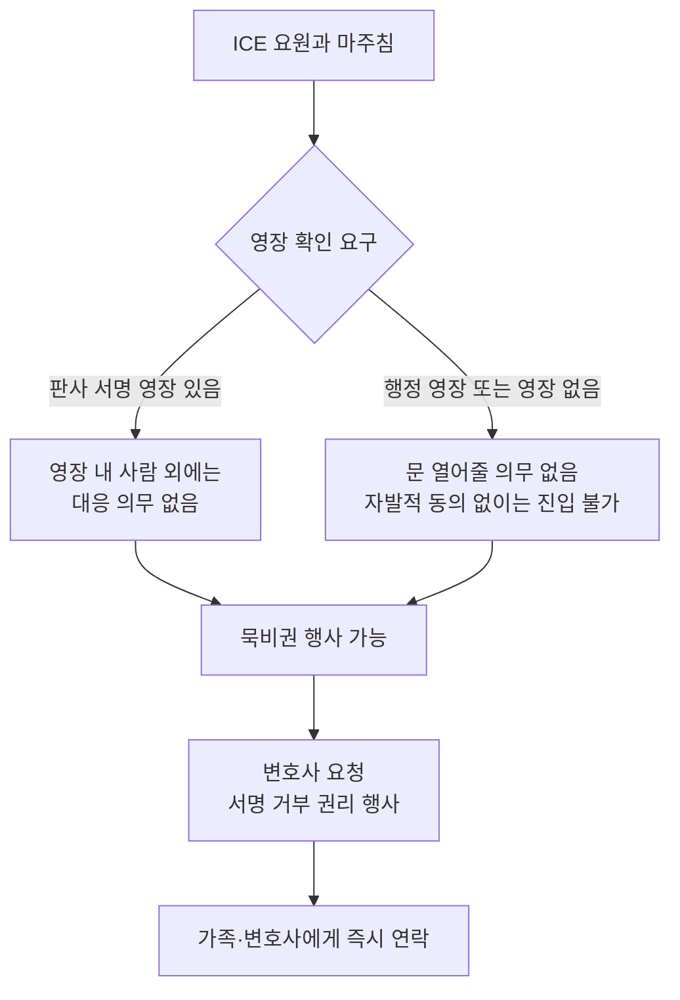

# ICE 단속 시민권자도 표적 — 한인사회 공포 확산

이민단속국(ICE)의 광역 단속이 시카고·미네소타·LA 등 한인 밀집 지역으로 확산되면서, 시민권자조차 안심할 수 없는 상황이 벌어지고 있습니다. **Stop AAPI Hate**가 2026년 3월 발표한 보고서에 따르면 아시아·태평양계 성인의 절반 가까이가 지난 1년간 본인 또는 지인이 반(反)이민 정책의 영향을 받았다고 답했습니다. 한인 자영업자와 비시민권자 부모를 둔 가정은 사실상 일상이 멈춰선 상태입니다.

## 1. 무슨 일이 벌어지고 있나

ICE는 2025년 1월 행정부 출범 이후 광역 단속(at-large arrests)을 시카고, 포틀랜드, 뉴올리언스, 샬럿, 미니애폴리스 등으로 확대했습니다. American Immigration Council 분석에 따르면 ICE의 아시아계 이민자 체포는 **2024년 약 2,000건에서 2025년 7,000건 이상으로 약 4배 증가**했습니다.

2025년 1월부터 10월 중순까지의 아시아·태평양계 ICE 통계는 다음과 같습니다.

- 체포: 7,752건
- 구금: 7,243건
- 추방: 2,776건
- 한국 국적자 비중: 약 5% (388명)

체포 국적별 순위는 중국(26%), 인도(25%), 베트남(12%), **한국(5%, 388명)**, 라오스(4%) 순입니다.

## 2. 시민권자 오인 체포 사례

가장 충격적인 변화는 시민권자조차 잘못 체포되는 사례가 늘고 있다는 점입니다. American Immigration Council은 트럼프 2기 행정부 출범 후 9개월간 **최대 170명의 미국 시민이 ICE에 의해 구금된 것으로 보고**됐다고 밝혔습니다.

PBS NewsHour가 보도한 사례에서 미네소타의 한 시민권자는 ICE 요원들이 영장 없이 자택 문을 부수고 들어와 속옷 차림으로 끌려나갔습니다. 미네소타에서 다수의 흐몽(Hmong)계 사전 심사를 마친 난민들도 잘못 구금됐다는 보고가 이어졌습니다. 한인 사회에서는 자진출국(self-deport)을 준비하던 중 ICE에 체포된 한국 이민자 저스틴 정(Justin Chung) 씨의 사례가 큰 충격을 줬습니다.

## 3. 한인사회 영향 — 비즈니스도 멈춰선다

AsAmNews와 American Community Media 보도에 따르면 LA 코리아타운에서 ICE 요원이 목격된 이후 한인 사회 SNS에는 패닉 상태의 게시물이 쏟아졌습니다. 한인 자영업자 단체들은 ▲손님 발길이 끊기는 매출 타격 ▲합법 신분임에도 시민권 신청을 미루는 사례 증가 ▲자녀 등하교조차 두려워하는 가족의 호소 등을 보고하고 있습니다.

Stop AAPI Hate 조사에서는 아시아·태평양계 성인 가운데 **30%가 체포·구금·추방을 두려워하거나 직접 경험**했고, **28%는 미국을 떠나는 것을 고려하거나 준비 중**이라고 응답했습니다.

> **전문가 상담 권장**: 본인 또는 가족이 ICE 단속 대상이 될 가능성이 있다면, 반드시 이민 전문 변호사와 사전 상담해 비상 연락망과 위임장(Power of Attorney) 등을 준비해 두시기 바랍니다.

## 4. 시민권자·영주권자가 반드시 알아야 할 권리

미국에서는 신분과 무관하게 모든 사람이 **수정헌법상 권리**를 가집니다.

- **묵비권**: 본인 신분, 출생지, 입국 경로 등에 대해 답변할 의무가 없습니다.
- **영장 확인 권리**: ICE는 행정 영장만으로 자택에 강제 진입할 수 없습니다. 판사가 서명한 사법 영장이 있을 때만 강제 진입이 가능합니다.
- **변호사 선임권**: 어떤 서류에도 변호사 없이 서명하지 마세요. 특히 자진출국 동의서(Form I-407 등)는 권리 포기로 이어집니다.
- **녹화·녹음 권리**: 공공장소에서는 단속 장면을 녹화·녹음할 수 있습니다.

집에 항상 두어야 할 비상 키트: ▲시민권 또는 영주권 사본 ▲여권 사본 ▲비상 연락처(친지·변호사·영사관) ▲자녀가 있는 경우 임시 보호자 위임장 ▲한국어/영어 권리 카드(Know Your Rights Card).

## 자주 묻는 질문 (FAQ)

**Q1. 시민권자인데 신분증을 항상 들고 다녀야 하나요?**
A. 법적으로 시민권자에게 신분증 휴대 의무는 없습니다. 다만 잘못된 체포 시 신원 확인에 도움이 되므로 여권 사본 또는 운전면허증을 휴대하는 것이 권장됩니다.

**Q2. ICE 요원이 집 문을 두드리면 어떻게 해야 하나요?**
A. 문을 열지 말고 창문 너머로 영장 확인을 요구하세요. 판사가 서명한 사법 영장(judicial warrant)이 아닌 행정 영장(administrative warrant, Form I-200/I-205)만으로는 강제 진입할 수 없습니다.

**Q3. 자녀가 학교에 있는 동안 부모가 체포되면 어떻게 되나요?**
A. 사전에 신뢰할 수 있는 친지에게 자녀의 임시 보호자 위임장(Caregiver Authorization)을 작성해 두는 것이 좋습니다. 한인 가정폭력·법률 지원 단체에서 한국어 양식을 제공합니다.

**Q4. 영주권자도 추방될 수 있나요?**
A. 영주권자도 특정 범죄 기록이 있으면 추방 대상이 될 수 있습니다. 음주운전이나 경범죄라도 시기와 횟수에 따라 영향이 있을 수 있으므로 변호사 상담이 필수입니다.

**Q5. 한국 영사관에 도움을 요청할 수 있나요?**
A. 네. LA, 뉴욕, 시카고, 시애틀, 애틀랜타, 휴스턴, 보스턴, 호놀룰루, 샌프란시스코, 워싱턴 DC, 댈러스, 앵커리지 등 12개 한국 영사관이 영사 조력을 제공합니다. 구금된 경우 영사 면담 요청이 가능합니다.

## 마무리

ICE 단속은 더 이상 '나와 무관한 일'이 아닙니다. 시민권자조차 잘못 체포되는 시대에 권리를 알고 준비하는 것이 가장 확실한 보호입니다. 본인 지역의 단속 상황이나 도움이 된 변호사·단체 정보를 댓글로 공유해 주시면 한인 커뮤니티 전체에 큰 힘이 됩니다.

---

**출처(Sources):**
- [Keeping Count: A/PI adults feel the impact of ICE as arrests quadruple — Stop AAPI Hate](https://stopaapihate.org/2026/03/05/keeping-count-a-pi-adults-feel-the-impact-of-ice-as-arrests-quadruple-under-trump/)
- [Reports of ICE send shockwaves through Korean American networks — AsAmNews](https://asamnews.com/2026/02/03/ice-sightings-spark-panic-in-korean-communities/)
- [Korean American Organizations Cite Rising Business, Community Fears Over ICE Raids — American Community Media](https://americancommunitymedia.org/immigration/korean-american-organizations-cite-rising-business-community-fears-over-ice-raids/)
- [A U.S. citizen says ICE forced open the door to his Minnesota home — PBS NewsHour](https://www.pbs.org/newshour/nation/a-u-s-citizen-says-ice-forced-open-the-door-to-his-minnesota-home-and-removed-him-in-his-underwear-after-a-warrantless-search)
- [New ICE Arrest Statistics — American Immigration Council](https://www.americanimmigrationcouncil.org/blog/ice-arrest-statistics-americans-noncriminals/)
- [Goldman, Warren, Padilla Demand Investigations into ICE's Detention of U.S. Citizens](https://goldman.house.gov/media/press-releases/goldman-warren-padilla-kelly-and-correa-demand-investigations-ices-detention)
