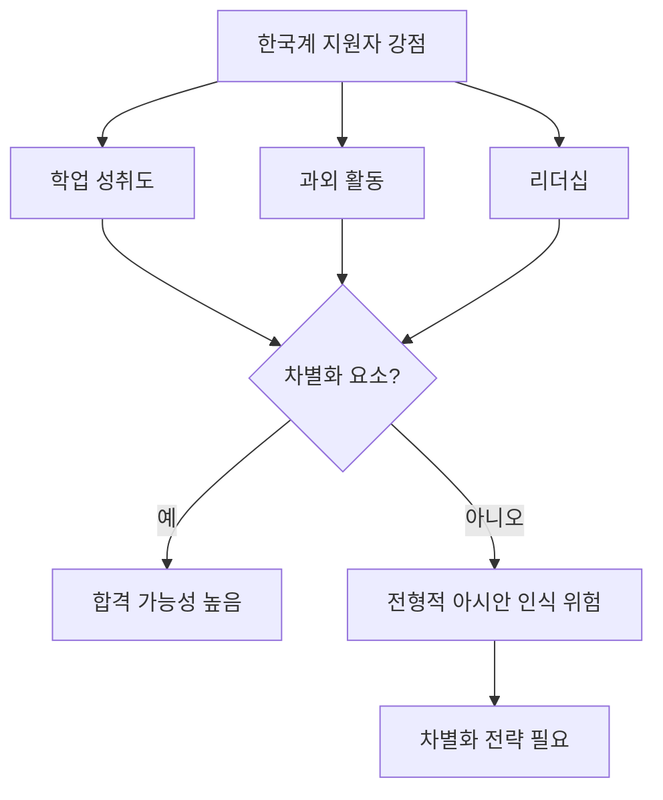

2023년 6월, 미국 연방대법원은 SFFA v. Harvard 판결을 통해 대학 입학에서의 인종 기반 어퍼머티브 액션(Affirmative Action)을 위헌으로 결정하였습니다. 한국계를 비롯한 아시안 아메리칸 학부모들에게는 오랫동안 기다려 온 변화였습니다. 그러나 두 번의 입학 사이클이 지난 지금, 결과는 예상과 다르게 흘러가고 있습니다. 일부 학교에서는 아시안 비율이 오히려 줄었고, 합격의 문은 여전히 좁습니다. 이 글에서는 2026년 입학 시즌을 준비하시는 한국계 학부모님들께 변화된 환경과 실질적인 대응 전략을 정리해 드리고자 합니다.

## 1. SFFA v. Harvard 판결 (2023) — 무엇이 바뀌었나

연방대법원은 6대 2(또는 UNC 사건은 6대 3)로, 하버드와 노스캐롤라이나 대학(UNC)이 입학 사정에서 인종을 고려하는 방식이 수정헌법 제14조 평등보호 조항과 1964년 시민권법 제6편을 위반한다고 판결하였습니다. 즉, 인종 자체를 "플러스 요소(plus factor)"로 사용하는 행위가 금지된 것입니다.

다만 판결문은 중요한 단서를 남겼습니다. 첫째, 지원자가 에세이를 통해 자신의 인종이 인격 형성에 어떤 영향을 주었는지 서술하는 것은 여전히 허용됩니다. 둘째, 학교는 종합적 평가(holistic review)를 계속할 수 있으며, 가족 배경·역경 극복·1세대 대학생 여부 등은 평가 요소로 남습니다. 결과적으로 "인종 박스"는 사라졌지만, "인종 서사(narrative)"는 오히려 더 중요해졌다는 평가가 나오고 있습니다.

## 2. 한국계 지원자가 직면한 새로운 현실

판결 후 첫 입학 사이클(Class of 2028)에서 결과는 매우 엇갈렸습니다. 하버드의 아시안 아메리칸 비율은 37%로 거의 변동이 없었고, 컬럼비아는 9%p 상승, 브라운은 4%p 상승하였습니다. 반면 예일은 30%에서 24%로 6%p 하락, 프린스턴은 2.2%p 하락, 다트머스는 1.5%p 하락하였습니다. "어퍼머티브 액션이 폐지되면 아시안 합격률이 크게 오를 것"이라는 기대와 달리, 학교마다 결과가 다르게 나타난 것입니다.

이는 명문대들이 인종 데이터를 직접 사용하지 못하는 대신, 지역·고등학교·가족 배경·에세이 내용을 통해 다양성을 간접적으로 유지하는 방식으로 평가 체계를 재설계하였기 때문으로 분석됩니다. 한국계 지원자들이 가장 경계해야 할 것은 여전히 "전형적인 아시안(stereotypical Asian)" 인식의 함정입니다.

## 3. 차별화 전략 — "전형적 아시안 신화"에서 벗어나기

높은 SAT 점수, 바이올린·피아노, 수학·과학 올림피아드, 의사·변호사 지망. 이러한 조합은 더 이상 강점이 아니라 "구분되지 않는 지원서"가 됩니다. 명문대 입학 사정관들은 매년 수천 명의 비슷한 프로필을 봅니다.

차별화의 핵심은 다음과 같습니다. 첫째, 자녀가 진정으로 몰입할 수 있는 한두 가지 분야를 깊이 파고들도록 도와주십시오("spike" 전략). 둘째, 동네·이민자 커뮤니티·교회·한인 사회의 구체적 문제에 기여하는 프로젝트를 만들도록 격려해 주십시오. 셋째, 한국계 정체성을 약점이 아닌 고유한 자산으로 풀어내야 합니다. 예를 들어 1.5세대로서 부모님의 비즈니스를 도운 경험, 한국어와 영어를 잇는 통역 봉사, K-콘텐츠와 미국 청소년 문화를 연결하는 창작 활동 등은 진정성 있는 서사가 됩니다.

## 4. 에세이가 더 중요해졌다

SFFA 판결 이후 가장 큰 변화는 에세이의 무게가 커졌다는 점입니다. 인종 박스가 사라지면서, 개인 에세이(Common App Personal Statement)와 학교별 보충 에세이(Supplemental Essays)가 지원자의 정체성·관점·성장 경로를 보여주는 거의 유일한 통로가 되었습니다.

대법원장 로버츠도 다수의견에서 "학생이 인종이 자신의 삶에 미친 영향을 에세이를 통해 논하는 것은 금지되지 않는다"고 명시하였습니다. 이는 한국계 지원자가 이민자 가정의 경험, 언어와 문화 사이의 정체성 협상, 모델 마이너리티 고정관념에 대한 자신의 시각 등을 진솔하게 풀어낼 수 있는 공간이 열렸음을 뜻합니다. 다만 "고생한 이야기"의 진부한 반복이 아니라, 그 경험이 어떤 사고방식과 행동으로 이어졌는지를 보여주는 것이 핵심입니다.

## 5. 추천 행동 — 9-12학년 단계별

**9학년**: GPA의 기초를 다지고, 다양한 활동을 시도하며 자녀의 진정한 관심 분야를 탐색하는 시기입니다. 부모의 욕심을 내려놓고 자녀의 목소리에 귀 기울여 주십시오.

**10학년**: 한두 가지 핵심 활동을 정해 깊이 들어가야 합니다. PSAT 준비를 시작하고, 학교 밖 봉사·연구·창업 등 외부 활동 1~2개를 확보하면 좋습니다.

**11학년**: 가장 중요한 학년입니다. AP·IB 수강, SAT/ACT 시험, 여름 리서치 또는 인턴십, 추천서를 부탁드릴 선생님과의 관계 형성에 집중하셔야 합니다. 학년 말부터 에세이 주제를 고민해 보십시오.

**12학년 가을**: Early Decision/Early Action 전략을 신중히 결정하고, 에세이를 10번 이상 수정하며 다듬는 것이 필수입니다. 지원할 학교를 Reach·Target·Safety로 균형 있게 12~15개 선정해 주십시오.

## 자주 묻는 질문 (FAQ)

**Q1. 인종 박스가 사라졌으니 'White' 또는 'Decline to State'로 표기하는 것이 유리한가요?**
A. 권하지 않습니다. 한국계라는 정체성을 숨기는 것은 에세이·추천서·활동 내역과 충돌할 수 있으며, 진정성 부족으로 이어집니다. 차라리 한국계 경험을 강점으로 풀어내는 편이 효과적입니다.

**Q2. 명문대 합격을 위해 외부 컨설팅이 꼭 필요한가요?**
A. 자녀의 강점과 학교 카운슬러의 역량에 따라 다릅니다. 컨설팅이 도움이 되는 경우도 있지만, 자녀의 진정한 목소리를 가리는 컨설팅은 오히려 역효과를 냅니다.

**Q3. 한국 국적 또는 영주권자 자녀는 인터내셔널 지원자로 분류되나요?**
A. 시민권자·영주권자는 국내 지원자(domestic)로 분류되며 SFFA 판결의 영향을 동일하게 받습니다. 학생 비자 소지자는 인터내셔널 풀에서 별도 평가됩니다.

**Q4. SAT 점수가 1500 미만이면 아이비리그는 포기해야 하나요?**
A. 그렇지 않습니다. 시험 점수는 한 요소일 뿐이며, 학교마다 정책이 다릅니다. 다만 한국계 지원자 풀에서는 평균이 매우 높기 때문에, 다른 요소에서 더욱 두드러져야 합니다.

**Q5. 명문대가 아니면 인생이 끝나나요?**
A. 절대 그렇지 않습니다. 미국에는 학생을 잘 키우는 우수한 주립대학·리버럴 아츠 칼리지가 많습니다. 자녀의 적성과 행복이 학교 이름보다 훨씬 중요합니다.

## 마무리

SFFA 판결은 게임의 규칙을 바꾸었지만, 한국계 자녀에게 자동적인 합격을 보장해 주지는 않았습니다. 오히려 진정성 있는 서사, 깊이 있는 몰입, 자신만의 정체성을 풀어내는 능력이 그 어느 때보다 중요해졌습니다.

부모로서 마지막으로 한 가지를 꼭 기억해 주시기 바랍니다. 아이비리그 합격이 자녀의 행복을 보장하지 않습니다. 명문대 입학은 인생의 출발점 중 하나일 뿐, 결승선이 아닙니다. 자녀가 자신만의 색깔을 잃지 않고, 부모의 기대보다 자신의 길을 찾을 수 있도록 격려해 주시는 것이 가장 큰 사랑입니다.

---

**출처(Sources):**
- [Students for Fair Admissions v. Harvard — Wikipedia](https://en.wikipedia.org/wiki/Students_for_Fair_Admissions_v._Harvard)
- [SCOTUS Opinion 20-1199 (PDF)](https://www.supremecourt.gov/opinions/22pdf/20-1199_hgdj.pdf)
- [Stanford Law School: SFFA FAQ](https://law.stanford.edu/2023/12/12/students-for-fair-admissions-v-harvard-faq-navigating-the-evolving-implications-of-the-courts-ruling/)
- [Harvard Crimson: Class of 2029 Admissions Data](https://www.thecrimson.com/article/2025/10/23/admissions-data-class-2029/)
- [Harvard Magazine: Admissions after Affirmative Action](https://www.harvardmagazine.com/2024/09/admissions-after-affirmative-action)
- [NBC News: Asian American Enrollment After Affirmative Action](https://www.nbcnews.com/news/asian-america/affirmative-action-enrollment-asian-americans-rcna170716)
- [Goldsea: How SFFA Changed Asian American Enrollment (Feb 2026)](https://goldsea.com/article_details/how-the-sffa-decision-changed-asian-american-enrollment-in-leading-universities)
