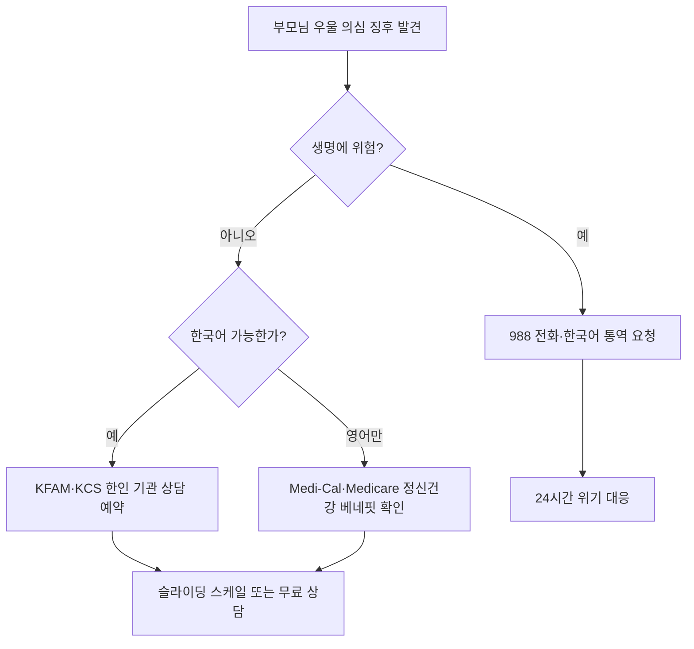

# 한인 노인 30% 우울증 — 한국말 정신건강 자원 가이드 2026

부모님이 갑자기 말수가 줄고 식사를 거르신다면, 단순한 노화가 아닐 수 있습니다. 미국 내 한인 노인의 우울증 유병률은 31~53%로 미국 전체 노인 평균(약 13.5%)의 두 배가 넘는다는 연구 결과가 있습니다. 그러나 정작 정신건강 서비스를 이용하는 비율은 5.7%에 불과합니다. 본 글에서는 한국어로 진료받을 수 있는 자원과 위기 상황 대응법을 정리합니다.

## 1. 왜 한인 노인은 더 우울할까

이민 1세대 노인의 우울증 위험은 언어 장벽, 사회적 고립, 자녀 세대와의 단절, 그리고 "남들 보기 부끄럽다"는 체면 문화가 복합적으로 작용한 결과입니다. NIH(미국 국립보건원) 산하 PMC에 게재된 'Memory and Aging Study of Koreans(MASK)' 연구에 따르면, 한인 노인의 약 3분의 1이 임상적으로 유의미한 우울 증상을 보였으며, 이 중 상당수가 한 번도 전문가 진료를 받지 않았다고 합니다.

특히 한인 사회에서 "정신과를 다닌다"는 것에 대한 낙인(stigma)이 강해, 자녀가 먼저 알아채고 권유하지 않으면 본인이 도움을 청하기 어려운 구조입니다.

## 2. 위기 신호 — 이런 증상이 보이면 즉시 연락

다음 중 하나라도 해당되면 전문가 상담을 권장합니다.

- 2주 이상 지속되는 의욕 저하, 불면, 식욕 변화
- "사는 게 의미가 없다", "짐이 되고 싶지 않다" 같은 표현
- 평소 즐기던 활동(교회, 모임, 손주 만남)을 갑자기 거부
- 약 복용을 잊거나 일부러 거르는 행동

## 3. 한국어 진료 가능한 주요 기관

**988 자살·위기 상담 라인(연방·24시간)**
SAMHSA가 운영하는 988은 영어·스페인어 외에 240여 개 언어에 대해 통역사 연결 서비스를 제공합니다. 전화 연결 후 "Korean, please"라고 말하면 한국어 통역사가 합류합니다. 무료, 익명, 보험 불필요.

**KFAM(한인가정상담소) — LA**
3727 W. 6th St., Ste. 320, Los Angeles, CA 90020 / (213) 389-6755. 이중언어·이중문화 한인 면허 치료사, 정신과 의사, 인턴이 상담을 제공합니다. 소득 기반 슬라이딩 스케일이며 자격 요건을 충족하면 무료(pro bono) 상담도 가능합니다.

**KCS(Korean Community Services) — 뉴욕·LA·뉴저지**
뉴욕의 KCS Mental Health Clinic은 한국어 정신과 진료, 약물 관리, 개인·집단 상담을 운영합니다. 메디케이드(Medicaid) 및 메디케어(Medicare) 수용.

**Inclusive Therapists 디렉토리**
한국어 가능한 면허 치료사를 주(State)별로 검색할 수 있습니다.

## 4. 보험으로 정신건강 상담 받는 법

Medicare Part B는 외래 정신건강 상담의 80%를 보장하며, 2024년부터는 마저(MFT)·정신건강 카운슬러(MHC)까지 직접 청구가 가능해졌습니다. Medicaid(주별로 Medi-Cal, NY State Medicaid 등)는 한인 기관 상담을 거의 전액 보장합니다. 보험 종류와 적용 범위는 매년 바뀔 수 있으므로 가입 보험사와 해당 기관에 직접 확인하시기 바랍니다.

> 본 글은 일반 정보 제공 목적이며, 의학적 진단을 대체하지 않습니다. 우울증 진단·약물 처방은 반드시 면허 정신과 전문의의 진료를 받으시기 바랍니다. **전문가 상담 권장.**

## 자주 묻는 질문 (FAQ)

**Q1. 988에 한국어로 전화하면 바로 한국어 상담사가 받나요?**
A. 한국어 전담 상담사는 없지만, 전화 연결 후 "Korean"이라고 말씀하시면 통역사가 3자 통화로 합류합니다. 대기 시간이 다소 있을 수 있습니다.

**Q2. 보험이 없는 부모님도 한인 기관 상담을 받을 수 있나요?**
A. 네. KFAM, KCS 모두 소득 기반 슬라이딩 스케일을 운영하며 무료 상담 대상자도 있습니다. 기관에 직접 문의하시면 자격 심사를 안내해 드립니다.

**Q3. 한국에서 처방받던 우울증 약을 미국에서도 계속 받을 수 있나요?**
A. 동일 성분이라도 미국 FDA 승인 제품과 용량이 다를 수 있습니다. 한국어 가능한 정신과 의사에게 한국 처방전을 보여드리고 재처방받으시는 것이 안전합니다.

**Q4. 자녀가 부모님 동의 없이 상담을 예약할 수 있나요?**
A. 본인 동의가 원칙이지만, 첫 상담은 자녀가 동행해 가족 상담 형태로 진행하는 경우가 많습니다. 기관에 상황을 미리 설명하시면 도움을 받을 수 있습니다.

**Q5. 메디케어로 한인 정신과 의사를 찾으려면?**
A. Medicare.gov의 'Care Compare' 도구에서 zip code와 'Psychiatry'를 입력하면 메디케어 수용 의사 목록을 볼 수 있습니다. 별도로 한인 의사회 디렉토리(KAMA 등)도 참고하세요.

## 마무리

한인 노인의 우울증은 "참고 견디면 나아진다"고 방치할 수 있는 문제가 아닙니다. 다행히 미국 곳곳에 한국어로 진료받을 수 있는 기관이 있고, 988을 통해 24시간 통역 서비스도 받을 수 있습니다. 부모님께 "정신과"라는 말 대신 "마음 건강 상담"이라는 표현으로 부드럽게 권해보시기 바랍니다.

---

**출처(Sources):**
- [SAMHSA 988 Suicide & Crisis Lifeline FAQs](https://www.samhsa.gov/mental-health/988/faqs)
- [Prevalence and Predictors of Depression in Korean American Elderly (MASK study, PMC)](https://pmc.ncbi.nlm.nih.gov/articles/PMC4442756/)
- [What Does Depression Mean for Korean American Elderly (PMC)](https://pmc.ncbi.nlm.nih.gov/articles/PMC5067351/)
- [KFAM Mental Health Program](https://www.kfamla.org/programs/mental-health)
- [KCS NY Mental Health Clinic](https://www.kcsny.org/mental-health)
- [Inclusive Therapists — Korean directory](https://www.inclusivetherapists.com/korean)
