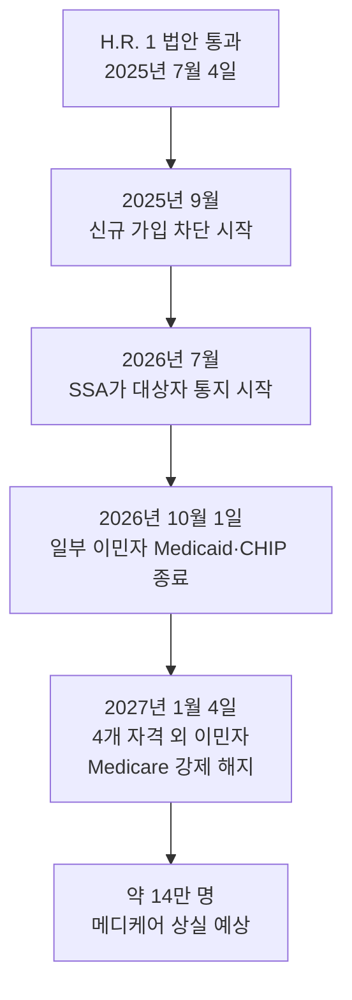

뉴저지에 사는 70세 김 모 어르신. 1995년 가족 초청으로 미국에 오신 후 30년 동안 세탁소를 운영하시며 매달 빠짐없이 FICA(연방보험기여세)를 납부하셨습니다. 메디케어 세금만 따져도 수만 달러. 작년에 65세를 넘기시며 드디어 "내가 낸 돈으로 받는 의료보험"을 누리기 시작하셨습니다.

그런데 지난 주, SSA(사회보장국)로부터 한 통의 통지서가 도착했습니다. **"귀하의 메디케어 자격이 2027년 1월 4일자로 종료됩니다."**

미국 의회 역사상 **처음으로** 특정 집단의 메디케어 자격을 박탈하는 법이 시행되고 있습니다. 그 대상에 우리 한국 부모님 세대가 일부 포함될 수 있다는 사실, 알고 계셨습니까?

## 1. 무엇이 바뀌었나 — H.R. 1 핵심

2025년 7월 4일, 트럼프 대통령은 **"One Big Beautiful Bill Act (H.R. 1)"** 에 서명했습니다. 이 법은 합법 체류 이민자 중 일부의 메디케어·메디케이드·ACA 마켓플레이스 보조금 자격을 제한합니다. KFF 분석에 따르면 약 **140만 명**의 합법 체류 이민자가 의료보험을 잃을 것으로 추정됩니다.

## 2. 누가 영향을 받나

**메디케어 자격이 유지되는 분 (영향 없음):**
- 미국 시민권자
- **영주권자(LPR / 그린카드 소지자)**
- 쿠바·아이티 이민자(Cuban-Haitian entrants)
- COFA(자유연합협정) 거주자 — 마셜제도·미크로네시아·팔라우 국민

**메디케어 자격을 잃는 분 (2027년 1월 4일 종료):**
- 난민(Refugee) — 그린카드 미취득자
- 망명자(Asylee) — 그린카드 미취득자
- TPS(임시보호지위) 소지자
- 취업비자(H-1B 등) 소지자
- 그 외 합법 체류 신분 중 위 4개 범주에 들지 않는 분

핵심은 **"30년간 메디케어 세금을 냈더라도 신분 범주가 맞지 않으면 자격이 박탈된다"** 는 점입니다. KFF 이민자 보건정책 책임자 Drishti Pillai 박사는 "의회가 특정 집단으로부터 메디케어를 박탈한 것은 미국 역사상 처음"이라고 지적했습니다.

## 3. 우리 한국 부모님이 영향을 받는지 확인하는 방법

대부분의 한인 부모님은 **가족 초청 영주권자(LPR)** 이시므로 메디케어 자격이 유지됩니다. 하지만 다음 경우는 확인이 필요합니다:

1. **그린카드 소지 여부** — 시민권자·영주권자라면 안전합니다.
2. **취업비자(H-1B 등) 상태로 65세 도달한 분** — 영향 받을 가능성 큽니다.
3. **난민·망명 신분으로 입국 후 그린카드 미취득** — 영향 받습니다.
4. **40 크레딧(10년 근로 이력) 부족한 영주권자** — 자격 자체는 유지되나, Part A 보험료를 본인이 납부해야 합니다.

가장 확실한 방법은 **SSA 1-800-772-1213** 또는 가까운 사회보장국 사무소에 직접 확인하시는 것입니다. 2026년 7월부터 SSA가 자격 박탈 대상자에게 우편 통지를 시작합니다.

## 4. 지금 할 수 있는 일 5가지

1. **신분 서류 확인** — 그린카드, 시민권 증서, 영주권 카테고리 코드(IR1, F2A 등)를 점검합니다.
2. **근로 이력(40 크레딧) 정리** — `my Social Security` 계정에서 평생 소득 기록을 확인하고, 누락된 분기가 있으면 W-2·1099 등으로 보정 신청합니다.
3. **시민권 신청 자격 점검** — 영주권 5년(시민권자 배우자는 3년) 이상이라면 N-400 신청을 즉시 검토합니다.
4. **대체 보험 사전 조사** — Marketplace 보조금, 메디케이드(주별 상이), 단체 보험 등을 비교해 두십시오.
5. **한인 단체 상담 활용** — 대한노인회 미주연합회, 민권센터(KACE), 한미연합회(KAC) 등에서 한국어 상담을 받으실 수 있습니다.

## 5. 영주권자 → 시민권 신청을 서둘러야 하는 이유

H.R. 1 법안은 영주권자의 메디케어 자격을 직접 박탈하지 않지만, 향후 행정부의 추가 규제·재해석 위험은 항상 존재합니다. **시민권을 취득하면 메디케어를 포함한 거의 모든 연방 혜택이 법적으로 완전히 보호됩니다.**

또한 시민권자는 부모·자녀 초청 시 대기 기간이 단축되고, 투표권을 통해 이런 입법에 직접 의사 표시를 할 수 있습니다. 65세 이상이시면 영어 시험 면제 조항(50/20, 55/15 규정)도 활용 가능합니다.

## 자주 묻는 질문 (FAQ)

**Q1. 시민권자도 영향을 받나요?**
A. 아니요. 미국 시민권자는 메디케어 자격에 변동이 전혀 없습니다.

**Q2. 영주권자(그린카드 소지자)인데 메디케어가 끊기나요?**
A. 끊기지 않습니다. 영주권자는 자격 유지 4개 범주에 명시되어 있습니다. 단, 40 크레딧이 부족하면 Part A 보험료를 본인이 납부해야 합니다.

**Q3. 30년간 메디케어 세금을 냈는데 자격이 박탈되면 환불받을 수 있나요?**
A. 현행법상 환불 조항은 없습니다. 이것이 가장 부당하다고 지적되는 부분이며, 다수의 시민단체가 소송 및 입법 폐지 운동을 진행 중입니다.

**Q4. 메디케이드도 같은 날짜에 끊기나요?**
A. 메디케이드·CHIP는 **2026년 10월 1일** 부터 신규 자격 제한이 적용되며, 기존 수혜자는 2027년 1월 4일까지 단계적으로 종료됩니다.

**Q5. SSA에서 통지서를 받지 못하면 안전한가요?**
A. 통지는 2026년 7월부터 시작됩니다. 받지 못하셨다고 안심하지 마시고, 본인의 신분 범주를 직접 확인하시는 것이 가장 안전합니다.

## 마무리

메디케어는 "복지"가 아니라 **본인이 평생 납부한 세금으로 받는 보험**입니다. 30년간 성실히 세금을 내신 분의 보장을 신분 범주 하나로 끊어버리는 것은 정의의 문제입니다. 다행히 대부분의 한인 영주권자·시민권자는 영향권 밖이지만, 가족 중 한 명이라도 해당될 수 있으니 반드시 확인이 필요합니다.

이 글은 일반 정보 제공 목적이며, 개별 사례는 반드시 **이민변호사 또는 의료보험 전문가(SHIP, 메디케어 카운슬러) 상담**을 권장합니다.

---

**출처(Sources):**
- [KFF — 1.4M Lawfully Present Immigrants Expected to Lose Health Coverage](https://www.kff.org/immigrant-health/1-4-million-lawfully-present-immigrants-are-expected-to-lose-health-coverage-due-to-the-2025-tax-and-budget-law/)
- [KFF Health News — Immigrant Seniors Lose Medicare Coverage Despite Paying for It](https://kffhealthnews.org/news/article/immigrant-seniors-medicare-california-big-beautiful-bill-eligibility-taxes/)
- [NPR — Immigrant seniors lose Medicare coverage despite paying into it](https://www.npr.org/transcripts/nx-s1-5770484)
- [KFF FAQ — Can immigrants enroll in Medicare? New law changes](https://www.kff.org/faqs/medicare-open-enrollment-faqs/enrollment-information-for-people-new-to-medicare/can-immigrants-enroll-in-medicare/)
- [Georgetown CCF — New Immigrant Eligibility Restrictions](https://ccf.georgetown.edu/2025/10/01/new-immigrant-eligibility-restrictions-coming-to-federally-funded-health-coverage/)
- [Families USA — Timeline of Trump's New Health Care Law](https://familiesusa.org/resources/timeline-of-trumps-new-health-care-law-what-you-need-to-know/)
