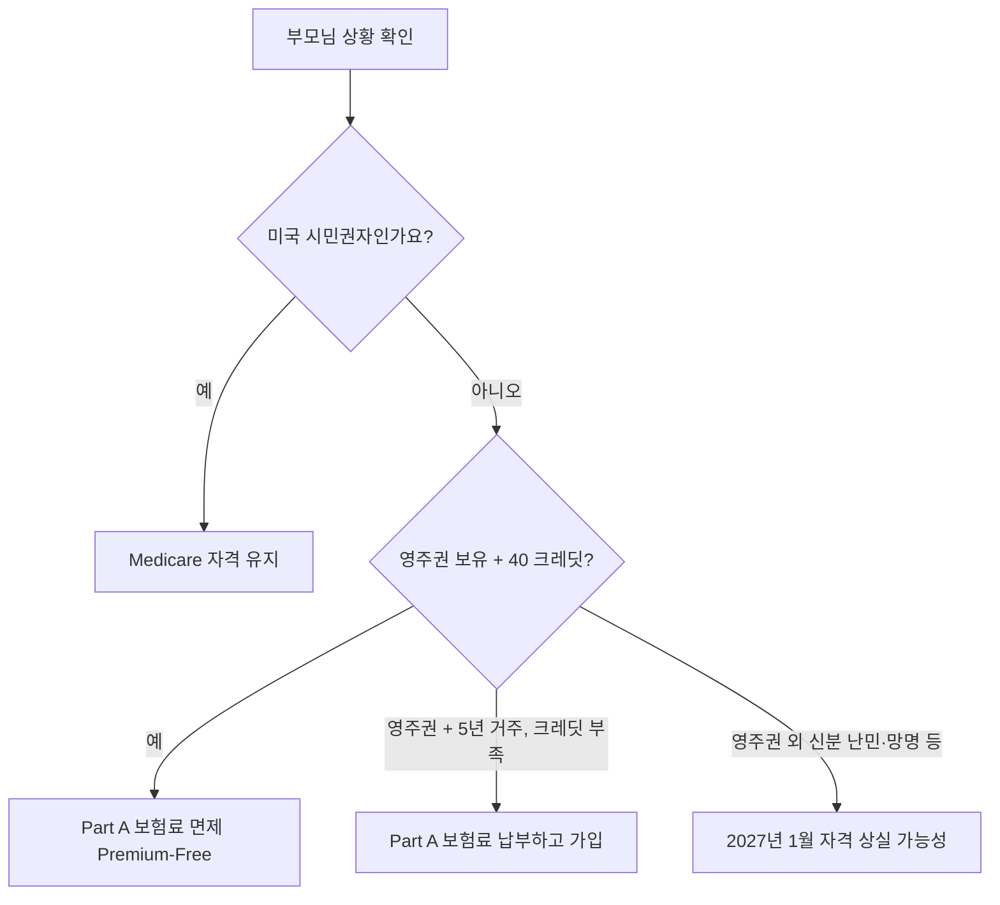

부모님께서 영주권자로 미국에 계신다면, 2026년과 2027년에 시행되는 **H.R. 1 (이른바 "Big Beautiful Bill")** 의 의료보험 관련 조항을 반드시 미리 확인하셔야 합니다. 이 법안은 비시민권자의 Medicare, Medicaid, 그리고 ACA Marketplace 보조금(Premium Tax Credit) 자격을 큰 폭으로 제한합니다.

특히 65세 이상이거나 곧 65세가 되시는 한국 부모님을 모시는 한국계 미국인 자녀라면, **40 크레딧 규정**, **2026년 1월 1일 변경**, **2027년 1월 1일 추가 제한**을 정확히 이해하고 가족 차원에서 준비해야 합니다. 이 글에서 핵심 변경 사항과 우리 가족이 지금 해야 할 일을 정리해 드리겠습니다.

## 1. 기존 Medicare 자격 요건 — 40 크레딧(40 Quarters) 규정

영주권자가 Medicare에 가입하려면 일반적으로 다음 두 가지 조건을 모두 충족해야 합니다.

- **65세 이상**
- **미국 영주권 보유 + 5년 이상 합법 거주** 또는 **40 work credits(약 10년 근로) 보유**

40 크레딧을 모두 채운 경우, **Part A(병원 입원 보험)** 를 보험료 없이(premium-free) 받을 수 있습니다. 크레딧이 부족하면 본인 또는 배우자의 근로 기록에 따라 다음과 같이 매월 보험료가 부과됩니다(2026년 기준 추정).

- **0~29 크레딧**: 약 $532/월
- **30~39 크레딧**: 약 $293/월
- **40 크레딧 이상**: $0 (premium-free)

부모님께서 한국에서만 일하셨다면 미국 크레딧이 거의 없으실 가능성이 높습니다. 이 경우에도 **5년 이상 영주권 + 합법 거주 요건**을 충족하면 보험료를 납부하고 Medicare에 "buy-in"하실 수 있었습니다. 그러나 이 부분이 2026년부터 영향을 받습니다.

## 2. 2026년 1월 1일부터 무엇이 바뀌나 — H.R. 1의 핵심 제한

H.R. 1은 비시민권자의 Medicare 자격을 다음과 같이 좁힙니다.

- **2025년 7월 4일 이후 새로 Medicare 자격 신청**: **미국 시민권자, 영주권자(LPR), 쿠바·아이티 입국자, COFA(자유연합협정) 이주자** 4개 그룹만 신청 가능
- **이미 Medicare에 가입한 비시민권자** 중 위 4개 그룹에 속하지 않는 분(난민, 망명자, 인신매매·가정폭력 피해자 등): **2027년 1월 4일자로 Medicare 종료**
- Justice in Aging은 약 **10만 명의 합법 체류 이민자**가 Medicare에서 제외될 것으로 추정합니다.

다행히 **영주권자(Green Card holder)** 는 여전히 위 4개 그룹에 포함됩니다. 즉, **한국 부모님이 영주권자이시라면 Medicare 자격 자체는 유지**됩니다. 다만 5년 거주 요건, 40 크레딧 여부에 따른 보험료 차이는 기존과 동일하게 적용됩니다.

## 3. 한국 부모님 의료보험 옵션 비교

영주권자 부모님께 적용 가능한 주요 옵션을 비교해 드립니다.

- **Medicare (Original/Advantage)**: 65세 이상 + 영주권 5년 + 크레딧 요건 충족 시. 가장 안정적이지만 Part B 보험료(2026년 약 $185 내외 예상)와 Medigap·Part D 별도 가입 필요.
- **Medicaid**: 소득·자산 기준 충족 시 주(state)별로 신청. 영주권자는 **5년 대기 기간(5-year bar)** 적용이 일반적입니다. 캘리포니아, 뉴욕, 일리노이 등 일부 주는 자체 예산으로 시니어 이민자에게 별도 프로그램 운영.
- **ACA Marketplace (Healthcare.gov)**: 65세 미만 영주권자에게 유효한 옵션. 다만 아래 4번에서 설명할 2026·2027년 보조금 변경 주의.
- **Private Insurance(민간 보험)**: 65세 이상 영주권자가 Medicare 가입 전 임시로 사용. 보험료가 매우 비쌈(월 $1,000~$2,000+).
- **한국 NHIS(국민건강보험) 복귀**: 부모님이 일정 기간 한국에 체류하시면 건강보험 재가입이 가능합니다. 만성질환 관리·치과·안과 비용이 미국 대비 현저히 낮아 **한국·미국을 오가시는 분들에게 현실적인 대안**입니다. 단, 영주권 유지를 위한 미국 체류 일수 관리는 별도로 챙겨야 합니다.

## 4. 2027년 추가 변경 — Marketplace 보조금 제외

ACA Marketplace 보조금(Premium Tax Credit, PTC)에도 큰 변화가 있습니다.

- **2026년 1월 1일부터**: 소득이 **연방빈곤선(FPL) 100% 미만**이면서 이민 신분 때문에 Medicaid를 못 받는 합법 체류자는 PTC 대상에서 제외됩니다. 영주권자의 5년 대기 기간 중인 분들이 직격탄을 맞습니다.
- **2027년 1월 1일부터**: PTC를 받을 수 있는 그룹이 **시민권자, 영주권자(LPR), 쿠바·아이티 입국자, COFA 이주자**로 축소됩니다. 난민·망명자·인신매매 피해자 등은 보조금 없이 전액 자비로 Marketplace 가입은 가능하지만, 월 보험료가 수배로 오를 수 있습니다.

다행히 **영주권자 신분 자체는 PTC 대상에 포함**됩니다. 그러나 5년 대기 기간 중인 저소득 부모님은 2026년부터 Marketplace 보조금이 끊겨 **사실상 보험 공백**이 생길 수 있습니다.

## 5. 우리 가족이 지금 해야 할 일 — 자녀 체크리스트

자녀로서 부모님을 위해 5월(2026년 봄) 중에 다음을 확인해 두시면 좋겠습니다.

- [ ] **부모님 영주권 카드와 입국일 확인** — 5년 거주 요건 충족 시점 계산
- [ ] **Social Security Statement 발급** (ssa.gov 또는 본인 SSA 계정) — 부모님 또는 배우자 명의로 누적된 크레딧 수 확인
- [ ] **65세 도달 3개월 전부터 Medicare 초기 가입 기간(IEP) 시작** — 늦으면 평생 보험료 가산
- [ ] **거주 주(state)의 Medicaid·시니어 의료 프로그램 확인** — CA, NY, IL, MA 등은 자체 보조 프로그램 존재
- [ ] **Marketplace 보조금 의존 중이라면 2026·2027년 영향 시뮬레이션** — Healthcare.gov 또는 보험 브로커 상담
- [ ] **공인 Medicare 보험 브로커(SHIP 무료 상담 포함) 예약** — 한국어 가능 브로커 우선
- [ ] **한국 NHIS 재가입·여행자 보험 등 백업 플랜 준비**

특히 **복잡한 케이스(영주권 5년 미만 + 65세 도달, 한국·미국 거주 병행, 저소득 등)** 는 반드시 **공인 보험 브로커 또는 변호사**의 1:1 상담을 받으시기 바랍니다. SHIP(State Health Insurance Assistance Program)은 주정부가 운영하는 **무료** Medicare 상담 서비스입니다.

## 자주 묻는 질문 (FAQ)

**Q1. 부모님이 영주권자이신데, 2026년 H.R. 1으로 Medicare에서 쫓겨나시나요?**
A. 아닙니다. 영주권자(LPR)는 H.R. 1이 인정하는 4개 적격 그룹에 포함되므로 Medicare 자격이 유지됩니다. 다만 5년 거주·40 크레딧 등 기존 요건은 그대로 적용됩니다.

**Q2. 부모님이 한국에서만 일하셨고 미국 크레딧이 0개입니다. Medicare 가입이 가능한가요?**
A. 영주권 + 5년 이상 합법 거주 요건을 충족하면 **Part A에 보험료를 내고(buy-in)** 가입하실 수 있습니다. 2026년 기준 월 약 $532이며, Part B 보험료는 별도입니다. 비용 부담이 크다면 Medigap·Part D·Medicaid 조합을 브로커와 상의하세요.

**Q3. 부모님이 한국과 미국을 오가시는데, 한국 NHIS와 Medicare를 동시에 유지할 수 있나요?**
A. 가능합니다. 두 보험은 서로 별개이며 충돌하지 않습니다. 다만 Medicare는 원칙적으로 **미국 내에서만** 적용되고, 한국 NHIS는 한국 내에서만 적용되므로 거주지에 따라 활용을 분리하시면 됩니다. 영주권 유지를 위한 미국 체류 일수(통상 1년 중 6개월 이상 또는 재입국 허가서)도 함께 관리하세요.

**Q4. 부모님 소득이 매우 낮은데 2026년부터 Marketplace 보조금이 끊긴다는 것이 무슨 뜻인가요?**
A. 영주권자가 **5년 대기 기간 중**이라 Medicaid를 못 받고, 소득이 FPL 100% 미만일 경우 2026년 1월 1일부터 ACA Marketplace 보조금(PTC)도 받을 수 없습니다. 이 경우 **거주 주의 자체 시니어 의료 프로그램**(예: CA Medi-Cal 확대, NY Essential Plan 등)을 확인하셔야 합니다.

**Q5. Medicare 가입을 65세에 안 하고 미루면 어떻게 되나요?**
A. 정당한 사유(예: 직장 단체보험 유지) 없이 늦으면 **Part B와 Part D에 평생 가산 보험료**가 붙습니다. Part B는 매 12개월 지연마다 10% 추가, Part D는 매월 약 1% 추가입니다. 늦지 않게 IEP 기간(생일 3개월 전~생일 후 3개월)에 가입을 마쳐주세요.

## 마무리

H.R. 1은 시니어 이민자 가족에게 상당한 영향을 주는 법안입니다. 다행히 **영주권자 부모님**은 Medicare와 Marketplace 보조금의 핵심 자격을 유지하시지만, **5년 대기 기간·40 크레딧·소득 수준**에 따라 실제 받는 혜택은 가족마다 크게 달라집니다.

서류 누락이나 가입 시기를 놓치면 **평생 보험료가 올라가거나, 보험 공백 기간 동안 큰 의료비를 떠안게 될 수 있습니다.** 부모님의 신분·소득·거주 상황이 조금이라도 복잡하시다면, 반드시 **한국어 가능 공인 Medicare 보험 브로커**, **이민 변호사**, 또는 거주 주의 **무료 SHIP 상담**을 활용하시기 바랍니다. 자녀가 미리 한 시간만 알아봐 드려도 부모님의 노후 의료 안정성은 크게 달라집니다.

---

**출처(Sources):**
- [Justice in Aging — Older Immigrants and Medicare](https://justiceinaging.org/older-immigrants-and-medicare/)
- [Justice in Aging — Understanding the Impact of H.R.1 on Older Immigrants' Access to Health Care](https://justiceinaging.org/understanding-the-impact-of-h-r-1-on-older-immigrants-access-to-health-care/)
- [State Health & Value Strategies — How H.R.1 Impacts Coverage for Non-Citizens](https://shvs.org/how-h-r-1-impacts-coverage-for-non-citizens/)
- [KFF — Can immigrants enroll in Medicare? (FAQ on new law)](https://www.kff.org/faqs/medicare-open-enrollment-faqs/enrollment-information-for-people-new-to-medicare/can-immigrants-enroll-in-medicare/)
- [Center for Medicare Advocacy — Still No Guidance Regarding Medicare Restriction for Noncitizens Under H.R. 1](https://medicareadvocacy.org/still-no-guidance-regarding-noncitizens-under-hr1/)
- [Commonwealth Fund — What Recent Policy Changes Mean for Immigrant Health Coverage](https://www.commonwealthfund.org/publications/explainer/2025/oct/what-recent-policy-changes-mean-immigrant-health-coverage)
- [NILC — 300,000 Lawfully Present Immigrants Newly Ineligible for Health Care Help](https://www.nilc.org/articles/300000-lawfully-present-immigrants-newly-ineligible-for-health-care-help-in-open-enrollment-period/)
- [Georgetown CCF — New Immigrant Eligibility Restrictions Coming to Federally-Funded Health Coverage](https://ccf.georgetown.edu/2025/10/01/new-immigrant-eligibility-restrictions-coming-to-federally-funded-health-coverage/)
