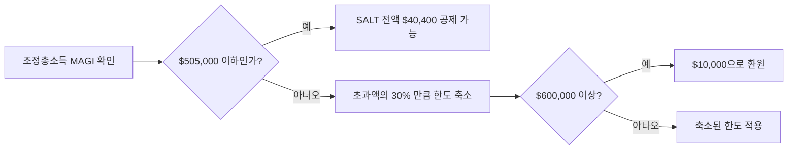

지난 2017년 트럼프 1기 세제개편(TCJA) 이후, 주(州)·지방 세금 공제(State and Local Tax Deduction, 이하 **SALT 공제**)는 연 $10,000으로 묶여 있었습니다. 캘리포니아·뉴저지·뉴욕처럼 세금이 높은 주에 사는 한인 가정 입장에서는 사실상 "사라진 공제"나 다름없었지요. 그런데 2025년 7월 통과된 **One Big Beautiful Bill Act(OBBBA)** 가 이 한도를 **$40,000(2025년 기준)** 까지 끌어올리면서, 2026년부터는 본격적인 절세 기회가 열렸습니다. 본 글에서는 캘리포니아·뉴저지에 거주하는 한인 자영업자와 직장인 가정이 알아두면 좋은 핵심을 정리해 드리겠습니다.

> 본 글은 일반 정보 제공 목적이며, 개별 사례에 대한 세무·법률 자문이 아닙니다. 실제 신고 전에는 반드시 **세무사 상담을 권장**드립니다.

## 1. SALT 공제란 무엇인가

SALT 공제는 연방 소득세 신고 시 다음 세 가지를 **항목별 공제(Itemized Deduction)** 로 차감할 수 있게 해주는 제도입니다.

- **주 소득세(State Income Tax)** — 캘리포니아 최고 13.3%, 뉴저지 최고 10.75%
- **지방 소득세(Local Income Tax)** — 뉴욕시·일부 카운티에 적용
- **재산세(Property Tax)** — 주택, 콘도, 차량 일부 포함

캘리포니아 LA 한인타운에 거주하면서 주 소득세 $25,000, 재산세 $12,000을 낸 가정이라면 합계가 $37,000이지만, 지난 8년간은 $10,000까지밖에 공제받지 못했습니다. OBBBA가 이 한도를 풀어준 셈입니다.

## 2. OBBBA가 바꾼 핵심

OBBBA의 SALT 관련 변경사항을 한눈에 정리하면 다음과 같습니다.

| 항목 | 2024년까지 | 2025년 | 2026년 | 2030년 이후 |
|---|---|---|---|---|
| SALT 한도 | $10,000 | **$40,000** | **$40,400** | $10,000으로 환원 |
| 인상률 | — | — | 매년 1% 인상 (2029년까지) | — |
| 소득 페이즈아웃 시작(MAGI) | 없음 | $500,000 | $505,000 | — |
| 최소 보장 한도 | $10,000 | $10,000 | $10,000 | $10,000 |

핵심은 **고소득 가구일수록 혜택이 줄어드는 페이즈아웃(phaseout)** 입니다. 조정총소득(MAGI)이 $500,000(2026년 기준 $505,000)을 넘는 순간부터 초과액의 **30%만큼 한도가 차감**되며, 차감 후에도 최소 $10,000은 보장됩니다. 즉 MAGI가 $600,000을 넘으면 사실상 예전 한도($10,000)로 되돌아갑니다.

## 3. 캘리포니아·뉴저지 한인 사례

### 사례 ① 캘리포니아 어바인 거주, 부부 합산 $250,000 가정
- 주 소득세 약 $18,000, 재산세 $11,000 → 합계 $29,000
- MAGI가 페이즈아웃 기준 이하이므로 **$29,000 전액 공제 가능**
- 기존 $10,000 대비 추가 공제 $19,000 → 세율 24% 적용 시 약 **$4,560 절세** 효과

### 사례 ② 뉴저지 버겐카운티 거주, 부부 합산 $450,000 가정
- 주 소득세 약 $32,000, 재산세 $18,000 → 합계 $50,000
- 한도 $40,400까지 공제 가능 → 추가 공제 $30,400 → 세율 32% 적용 시 약 **$9,700 절세**

### 사례 ③ 캘리포니아 자영업, MAGI $560,000 가정
- 페이즈아웃 적용: ($560,000 − $505,000) × 30% = $16,500 차감
- 적용 한도: $40,400 − $16,500 = **$23,900**
- 여전히 기존 $10,000보다는 $13,900 더 공제 가능

위 수치는 단순 예시이며, 실제 절세 효과는 표준공제(Standard Deduction) 비교, AMT 여부, 주택 모기지 이자, 자녀 세액공제 등에 따라 달라집니다. 정확한 계산은 **세무사 상담을 권장**드립니다.

## 4. PTET 활용 — 자영업·사업자 추가 절세

세탁소·식당·뷰티 살롱·부동산 LLC 등 **패스스루(pass-through) 사업체**를 운영하는 한인 사장님이라면 PTET(Pass-Through Entity Tax)도 함께 살펴볼 만합니다.

- **원리**: S-Corp·파트너십·LLC가 주 세금을 **개인이 아닌 사업체 명의로 납부**하면, 그 금액은 SALT $40,000 한도와 별개로 사업체 비용으로 인정됩니다.
- **2026년 현황**: 캘리포니아는 SB 132를 통해 PTET 제도를 2030년까지 연장했고, 뉴저지·뉴욕·코네티컷 등 30여 개 주도 유사한 제도를 운영하고 있습니다.
- **효과**: 사업체 소득이 클수록 SALT 한도와 PTET 공제를 **이중으로 활용**할 수 있어 절세 폭이 커집니다.

다만 PTET는 주별로 신청 마감일, 분기 납부 일정, 환급 처리 방식이 다르므로 반드시 **세무사 상담을 권장**드립니다.

## 5. 2026년 세금 신고 시 체크리스트

1. **항목별 공제 vs 표준공제 재계산** — SALT 한도가 늘었으므로, 그동안 표준공제만 쓰던 가정도 항목별 공제가 유리해질 수 있습니다.
2. **재산세 납부 영수증 보관** — 카운티 세무서 영수증, 모기지 회사 1098 양식 확인.
3. **주 소득세 원천징수 내역** — W-2 박스 17, 1099 박스 5 항목 점검.
4. **MAGI 추정** — 보너스·스톡옵션·임대소득 포함하여 $505,000 근접 여부 확인.
5. **PTET 신청 여부 결정** — 사업체가 있다면 6월 15일 분기 마감 전에 결정.
6. **세무사와 시뮬레이션** — 항목별 공제 + PTET 조합이 최적인지 확인.

## 자주 묻는 질문 (FAQ)

**Q1. 표준공제를 받던 가정도 SALT 공제를 활용할 수 있나요?**
A. SALT 공제는 항목별 공제(Itemized)를 선택해야 적용됩니다. 2026년 부부합산 표준공제(약 $31,500 추정)와 항목별 공제 합계를 비교해, 더 큰 쪽을 선택하시는 것이 유리합니다.

**Q2. 모기지 이자도 SALT 공제에 포함되나요?**
A. 모기지 이자는 별도의 **주택담보대출 이자 공제(Mortgage Interest Deduction)** 항목입니다. SALT 한도와는 별개로 함께 공제받을 수 있습니다.

**Q3. 캘리포니아 주택을 두 채 소유 중인데, 두 곳 재산세 모두 SALT에 포함되나요?**
A. 본인 명의 거주용·세컨드 홈 재산세는 모두 합산 가능하나, 임대 부동산은 사업 경비(Schedule E)로 따로 처리됩니다. 정확한 분류는 **세무사 상담을 권장**드립니다.

**Q4. 부부가 따로 신고(Married Filing Separately)할 경우 한도는 어떻게 되나요?**
A. 2026년 기준 각자 $20,200까지로 절반이 됩니다. 페이즈아웃 기준도 $252,500으로 낮아지므로 합산 신고가 유리한 경우가 많습니다.

**Q5. 2030년 이후에는 정말 다시 $10,000으로 돌아가나요?**
A. 현행법상 그렇습니다. 다만 정치 환경에 따라 추가 연장 가능성도 있으니, 2029년까지의 한시적 기회로 보고 활용 계획을 세우시길 권합니다.

## 마무리

OBBBA의 SALT 한도 확대는 캘리포니아·뉴저지·뉴욕에 거주하시는 한인 가정에게 **2029년까지 5년간의 한시적 절세 창구**입니다. 특히 부부합산 소득이 $200,000~$500,000 사이의 자가 주택 보유 가정이라면 즉시 효과를 체감할 수 있습니다. 다만 페이즈아웃 구간 진입 가구, 자영업자, PTET 활용 가능 사업체는 사례별 시뮬레이션이 필수입니다. 본 글은 일반 정보일 뿐이므로, 실제 신고 전에는 반드시 **한인 세무사 또는 CPA 상담을 권장**드립니다.

---

**출처(Sources):**
- [Bipartisan Policy Center — SALT Deduction Changes in the OBBBA](https://bipartisanpolicy.org/explainer/salt-deduction-changes-in-the-one-big-beautiful-bill-act/)
- [Tax Foundation — Senate Bill SALT Deduction Cap for Pass-Through Entities](https://taxfoundation.org/blog/senate-bill-state-pass-through-business-salt-deduction/)
- [TurboTax — Unlocking the New SALT Cap: How to Save Up to $40,000](https://turbotax.intuit.com/tax-tips/tax-deductions-and-credits/unlocking-the-new-salt-cap-how-to-save-up-to-40000-this-tax-season/c3JPyW2bC)
- [Thomson Reuters — OB3 SALT Cap Increase and PTET Elections](https://tax.thomsonreuters.com/news/ob3-salt-cap-increase-why-pass-through-entity-tax-elections-still-make-sense/)
- [Linkenheimer LLP — California SB 132 Extends PTET](https://www.linkcpa.com/california-sb-132-extends-the-pass-through-entity-elective-tax-and-changes-the-rules/)
- [Venable LLP — Final OBBBA Temporarily Expands SALT Cap](https://www.venable.com/insights/publications/2025/08/salt-alert-final-obbba-temporarily-expands-salt)
