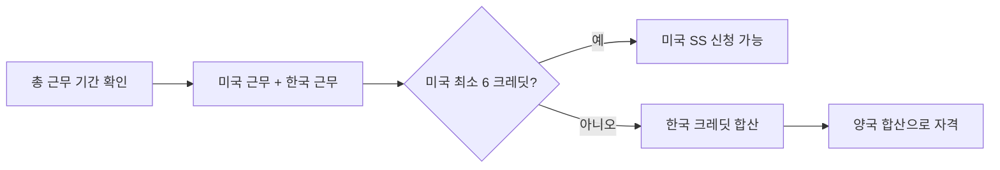

한국에서 일하다 미국으로 이민 오신 분들, 혹은 미국에서 일하다 한국으로 돌아가신 분들 중에서 "내가 양쪽 모두 짧게 일했는데 연금을 받을 수 있을까?" 하고 걱정하시는 분들이 많습니다. 결론부터 말씀드리면 **한미 사회보장협정(U.S.-Korea Totalization Agreement)** 덕분에 양국에서 일한 기간을 합산해 연금 수급 자격을 받을 수 있고, 경우에 따라 양국에서 동시에 연금을 받을 수도 있습니다. 이 글에서는 50대 이상 한국계 미국인분들이 꼭 알아야 할 핵심 내용을 정리해 드리겠습니다.

## 1. 한미 사회보장협정이란

한미 사회보장협정은 2000년 3월 13일 워싱턴에서 서명되어 **2001년 4월 1일부터 발효**된 양국 간 협정입니다. 이 협정의 두 가지 핵심 목적은 다음과 같습니다.

- **이중 납부 방지** — 한 사람이 같은 기간 동안 양국 사회보장세를 모두 내지 않도록 조정
- **가입 기간 합산(Totalization)** — 한쪽 국가의 가입 기간이 부족해도 다른 국가의 기간을 합산해 수급 자격을 인정

협정 대상은 미국의 Social Security(OASDI)와 한국의 **국민연금**입니다. 공무원연금·군인연금·사학연금 등 한국의 특수직역연금은 협정 적용 대상이 아니라는 점을 유의하셔야 합니다.

## 2. 핵심 혜택 — 크레딧 합산

미국 Social Security에서 노령연금을 받으려면 일반적으로 **40 크레딧(약 10년 근무)**이 필요합니다. 한국 국민연금은 **120개월(10년) 이상**을 채워야 노령연금 수급권이 생깁니다. 그런데 이민이나 주재원 생활로 어느 쪽도 10년을 채우지 못한 경우가 많지요.

이때 협정에 따른 합산 규칙은 다음과 같습니다.

- **미국**: 최소 **6 크레딧(약 1년 6개월)** 이상 미국에서 근무한 경우, 한국 국민연금 가입 기간을 합산해 자격을 인정합니다.
- **한국**: 국민연금 가입 기간이 **18개월 이상**이면 미국 근무 기간을 합산해 자격을 인정합니다.

단, 연금액 자체는 각국이 **자국 가입 기간에 비례**해서만 지급한다는 점을 꼭 기억해 두세요. 즉 합산은 "자격" 판정용이고, 금액은 본인이 실제로 그 나라에서 일한 만큼 받습니다.

**예시 1.** 미국 7년(28 크레딧) + 한국 5년 근무 → 미국 단독으로는 40 크레딧이 부족하지만, 협정 합산으로 미국 부분 연금 수령 가능, 한국 국민연금도 합산으로 자격 인정.

**예시 2.** 미국 2년(8 크레딧) + 한국 9년 근무 → 한국 국민연금은 합산으로 10년 자격 충족, 미국 SS도 최소 6 크레딧 이상이므로 부분 연금 수령 가능.

## 3. 양국 동시 수령 — 가능한가?

네, 가능합니다. 두 나라에서 모두 자격을 갖추면 **각각 따로 신청해 양쪽에서 동시에 수령**할 수 있습니다. 한쪽을 받는다고 다른 쪽이 깎이는 일은 원칙적으로 없습니다.

특히 2026년 현재 매우 중요한 변화가 있는데요, 과거에는 한국 국민연금을 받으면 미국 Social Security가 감액되는 **WEP(Windfall Elimination Provision)** 규정이 적용되었지만, **2025년 1월 5일 서명된 Social Security Fairness Act**에 의해 WEP와 GPO가 모두 폐지되었습니다. 2024년 1월분 급여부터 적용되어, 한국 국민연금을 받아도 미국 SS가 더 이상 감액되지 않습니다. 이미 감액받고 계셨던 분들은 SSA가 자동으로 재계산해 차액을 소급 지급하고 있습니다.

## 4. 신청 절차 — 한국에서 vs 미국에서

**미국에 거주 중이신 경우**

1. 가까운 **SSA 사무소** 방문 또는 [ssa.gov](https://www.ssa.gov) 온라인 신청
2. "한국 국민연금 가입 기간 합산 희망" 의사를 명확히 표시
3. SSA가 한국 국민연금공단에 자동으로 가입 이력 조회 요청

**한국에 거주 중이신 경우**

1. **국민연금공단** 지사 방문 또는 [www.nps.or.kr](https://www.nps.or.kr) 신청
2. "미국 사회보장 가입 기간 합산 신청서" 제출
3. 국민연금공단이 미국 SSA에 가입 이력 확인 요청

준비 서류는 여권, 미국 SSN 카드, 한국 국민연금 가입 증명서, 출입국 기록 등이 일반적입니다. 처리에는 보통 **3~6개월** 정도가 소요되므로, **희망 수령 시점보다 최소 6개월 전**에 신청을 시작하시는 것이 좋습니다.

해외 거주자도 협정국 국민이면 거주지에 관계없이 미국 SS를 받을 수 있고, 한국 국민연금도 해외 송금이 가능합니다.

## 5. 흔한 함정 — 알아둘 점

WEP/GPO가 폐지되어 큰 함정 하나는 사라졌지만, 여전히 주의할 부분이 있습니다.

- **세금 문제** — 미국 SS와 한국 국민연금 모두 미국 세법상 과세 대상이 될 수 있습니다. 한미 조세조약과 별개이므로 회계사 상담을 권합니다.
- **공무원·군인연금은 제외** — 한국 특수직역연금은 협정 적용을 받지 않습니다.
- **자영업·비공식 근로 기간** — 양국에서 사회보장세를 납부한 기록이 있어야만 합산됩니다. 미신고 소득은 합산 불가입니다.
- **부부 합산은 별개** — 협정 합산은 본인 개인 가입 기록에만 적용됩니다. 배우자 연금(spousal benefit)은 별도 규정입니다.
- **수령 개시 연령** — 한국은 출생연도별로 만 60~65세, 미국은 1960년 이후 출생자는 만 67세가 전액 수령 시점입니다.

## 자주 묻는 질문 (FAQ)

**Q1. 미국에서 5년만 일했는데 SS를 받을 수 있나요?**
A. 네, 가능합니다. 5년이면 약 20 크레딧으로 6 크레딧 이상 조건을 충족하므로, 한국 국민연금 가입 기간을 합산해 미국 부분 연금을 신청할 수 있습니다.

**Q2. 한국 국민연금을 일시금으로 받았는데 미국 SS 합산이 되나요?**
A. 반환일시금으로 환급받은 기간은 가입 기록이 소멸되어 합산에 사용할 수 없습니다. 합산을 원하시면 일시금 수령 전 신중히 결정하셔야 합니다.

**Q3. 한국 국민연금을 받으면 미국 SS가 깎이나요?**
A. 2024년 1월분부터 WEP 폐지로 감액되지 않습니다. 과거 감액받으셨던 분들은 자동 재계산 대상입니다.

**Q4. 영주권자나 시민권자만 가능한가요?**
A. 아닙니다. 협정은 국적이 아니라 양국 사회보장 가입 기록에 따라 적용됩니다. 비자 상태와 무관합니다.

**Q5. 사망 시 배우자와 자녀도 받을 수 있나요?**
A. 네. 유족연금(survivor benefits)도 협정 적용 대상이며, 양국 합산 규정이 동일하게 적용됩니다.

## 마무리

한미 사회보장협정은 양국에서 일한 우리 한국계 미국인 1세, 1.5세 세대에게 매우 중요한 제도입니다. 특히 2025년 WEP/GPO 폐지로 양국 연금을 온전히 받을 수 있게 된 만큼, 본인이 해당되는지 꼭 확인해 보시기 바랍니다.

실제 신청 전에는 반드시 **미국 사회보장국(SSA)**과 **한국 국민연금공단** 양쪽에 모두 상담을 받으시는 것을 권해드립니다. 본인의 가입 기록, 출생연도, 거주지에 따라 최적의 신청 시점이 달라질 수 있습니다.

- 미국 SSA: 1-800-772-1213 / [ssa.gov](https://www.ssa.gov)
- 한국 국민연금공단: 국번 없이 1355 / [www.nps.or.kr](https://www.nps.or.kr)

---

**출처(Sources):**
- [SSA — Totalization Agreement with Korea](https://www.ssa.gov/international/Agreement_Pamphlets/korea.html)
- [SSA — U.S.-Korean Social Security Agreement (Full Text)](https://www.ssa.gov/international/Agreement_Texts/korea.html)
- [SSA — Social Security Fairness Act (WEP/GPO Repeal)](https://www.ssa.gov/benefits/retirement/social-security-fairness-act.html)
- [국민연금공단 — 사회보장협정 안내](https://www.nps.or.kr)
- [주시애틀 대한민국 총영사관 — 한미 사회보장협정 10문10답](https://overseas.mofa.go.kr/us-seattle-ko/brd/m_4709/)
